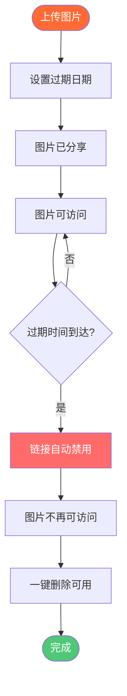

# 自动删除图片：图片过期和自动删除指南

  
需要在指定时间后<strong>自动删除图片</strong>？Maiimg允许您设置图片过期日期，在时间段后自动禁用链接，并控制何时删除图片。本完整指南展示如何使用自动删除和过期功能进行临时图片托管。

## 什么是自动删除图片？

**自动删除图片**是在指定时间段后自动删除或禁用图片链接的功能。这对于临时图片分享、隐私保护和图片存储管理很有用。

**自动删除的优势：**
- ✅ **隐私保护** - 图片自动删除
- ✅ **存储管理** - 无需手动清理
- ✅ **临时分享** - 适合限时内容
- ✅ **安全性** - 自动链接停用
- ✅ **合规性** - 满足数据保留要求

## 自动删除如何工作

### 过期流程

### 步骤1：上传图片

**上传流程：**
1. 访问 [Maiimg.com](https://maiimg.com)
2. 上传图片（最多25张）
3. 等待上传完成
4. 配置过期设置

**支持的格式：**
- 📸 PNG
- 🖼️ JPG/JPEG
- 🎭 GIF
- 🌐 WebP

### 步骤2：设置过期日期

**过期选项：**
- ⏰ **特定日期** - 设置确切过期日期
- ⏱️ **时间段** - 设置X天后过期
- 🔢 **查看限制** - X次查看后过期
- 🔄 **手动控制** - 随时一键禁用

**如何设置：**
1. 上传后打开设置
2. 找到"过期"选项
3. 设置过期日期/时间
4. 保存设置

### 步骤3：自动删除

**发生的情况：**
- 过期后链接变为非活动状态
- 图片不再可访问
- 访问尝试显示过期消息
- 一键永久删除可用

## 过期选项

### 1. 基于日期的过期

**使用场景：** 图片在特定日期过期

**设置：**
- 设置确切日期和时间
- 日期后自动禁用
- 适合活动
- 限时分享

**示例：**
- 活动照片在活动结束后过期
- 临时促销在截止日期过期
- 时效性内容自动过期

### 2. 时间段过期

**使用场景：** 图片在X天/小时后过期

**选项：**
- 小时（1-24小时）
- 天（1-30天）
- 周（1-4周）
- 月（1-6个月）

**示例：**
- 分享照片7天
- 临时访问24小时
- 限时优惠

### 3. 查看限制过期

**使用场景：** X次查看后过期

**设置：**
- 设置最大查看次数（例如：100）
- 达到限制后链接过期
- 控制分发
- 防止无限访问

**示例：**
- 活动照片：200次查看
- 产品预览：50次查看
- 有限分享：10次查看

### 4. 手动删除

**使用场景：** 需要时立即删除

**功能：**
- 一键禁用
- 即时链接停用
- 永久删除选项
- 完全控制

## 结论：自动删除图片

Maiimg提供最佳的**自动删除图片**功能：
- ✅ 灵活过期（日期、时间或查看限制）
- ✅ 自动（无需手动干预）
- ✅ 一键删除（即时删除）
- ✅ 访问控制（与其他控制结合）
- ✅ 追踪（查看图片何时过期）
- ✅ 免费（无成本）

**准备使用自动删除？**

访问 [Maiimg.com](https://maiimg.com) 上传图片并设置过期日期。自动删除、隐私保护和完全控制。无需注册，完全免费。

---

**相关文章:**
- [一键分享多张图片：图册分享](/blog/cn/one-click-share-multiple-images-gallery-sharing)
- [社交媒体图片图册分享：完整指南](/blog/cn/social-media-image-gallery-sharing-guide)
- [免费图片托管：完整指南](/blog/cn/free-image-hosting-maiimg-complete-guide)
