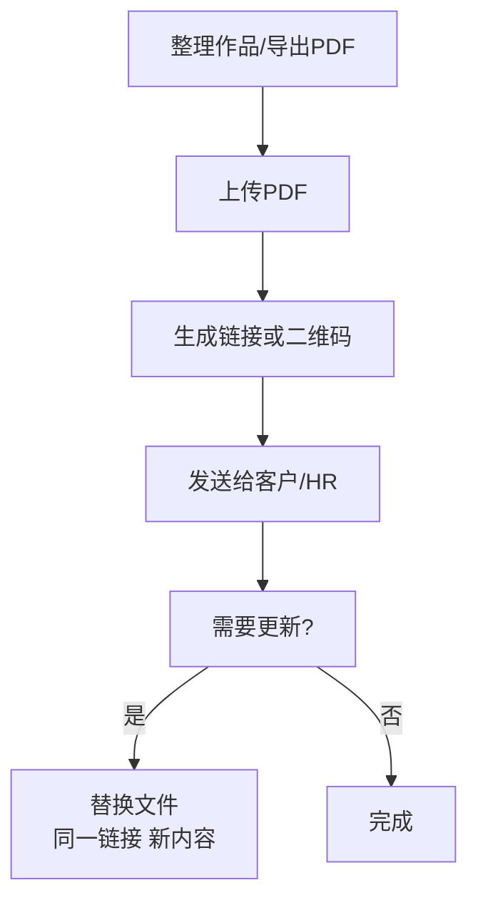

<!-- Auto-generated from GSC 404 export on 2026-01-15. -->
<!-- Keep this slug stable to avoid creating new 404s in the future. -->

# 用链接专业展示创意/艺术/设计作品集

  
把作品集做成<strong>可点击的链接</strong>，比发附件更专业：对方点开就能看；你更新内容时，也可以做到<strong>链接不变</strong>。

## ✅ 要点速览

- **目标**：让客户/HR “打开就能看”，减少来回沟通成本
- **展示**：用 3–6 个项目，按目标岗位排序
- **更新**：内容有错/要加新版本，用“替换文件”保持链接不变

## 1) 准备作品集（3–6 个项目就够）

  <h3 class="cp-links cp-card-title">推荐结构（精简版）</h3>
  <ul class="cp-links cp-list">
    <li><strong>封面</strong>：姓名 / 方向 / 联系方式</li>
    <li><strong>目录</strong>：3–6 个项目（按目标岗位排序）</li>
    <li><strong>项目页</strong>：背景 → 你的贡献 → 关键产出（配图）</li>
  </ul>

## 2) 上传并生成链接/二维码

## 3) 分享给客户/HR（邮件/微信都可以）

一句话模板（直接复制）：

> 这是我的作品集链接，点击即可查看。如果有更新我会保持链接不变，避免版本混乱。

## 4) 内容更新：用“替换文件”保持链接不变

如果你发出去后发现内容要改（错别字、补充项目、更新版本），不要重发新链接——用“替换文件”让对方继续用原链接即可看到新内容。

参考教程：[不换链接更新 PDF 文件（替换文件）](https://sendpdfonline.com/article/replace-pdf-without-changing-link-zh)

