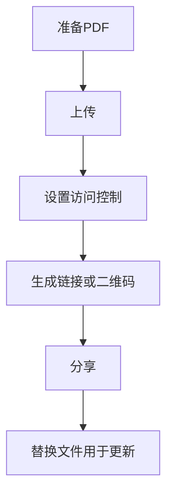

很多人遇到“PDF 打开慢”的问题，原因通常不是某一个按钮，而是 **文件体积、页面复杂度、以及分享方式**。

下面用一个更清晰的流程，把“更快、更稳定地分享 PDF”落到可执行的动作上。

## 推荐流程（保持简单）

1. **上传**
2. **设置访问控制**（按需要）
3. **生成链接 / 二维码**
4. **分享**
5. **更新内容时用“替换文件”**（链接保持不变）

> 注意：MaiPDF 在线版不强调“到期日期/自动过期”的设置，这里也不写这类功能。

## 让 PDF 打开更快：3 个常见做法

- **控制体积**：图片尽量压缩、避免把 30MB 的扫描件当作普通文档发出去。
- **拆分长文档**：超长手册可以按章节拆分成多个文件，体验通常更好。
- **版本更新用替换**：不要频繁换链接；内容变了就“替换文件”，对外分享更稳定。

## 对照截图（上传 / 设置 / 链接 / 记录）

## 更新内容但不换链接

当 PDF 内容需要更新时，使用 **替换文件** 可以在保持链接不变的前提下更新内容（避免反复通知所有人换地址）。

参考：`https://sendpdfonline.com/article/replace-pdf-without-changing-link-zh`

