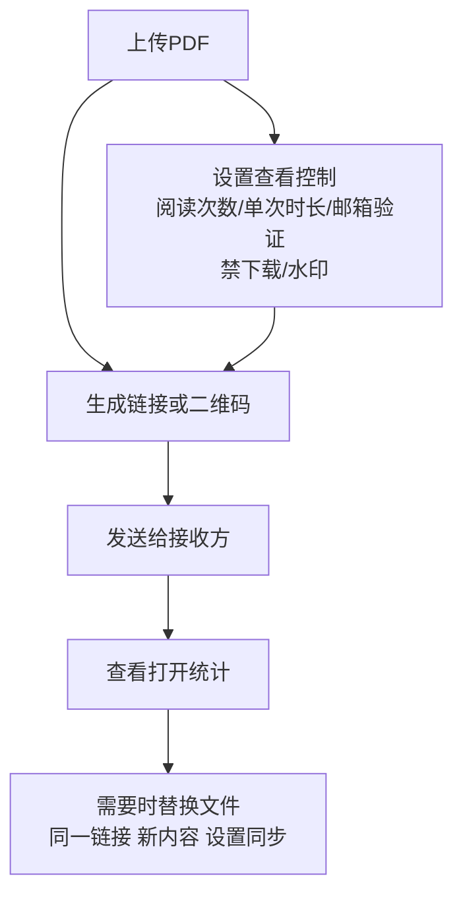

# 在线托管PDF：安全云端PDF共享完全指南

  
如果你经常把 PDF 当作“附件/网盘链接”发给客户、同事或合作方，通常会遇到两类问题：<strong>不够专业</strong>（对方打不开/流程复杂）和 <strong>不够可控</strong>（发出去就失控）。这篇只讲一条主线：<strong>上传 → 生成链接/二维码 → 设置查看控制 → 看记录 → 需要时用“替换文件”更新内容（链接不变）</strong>。

## ✅ 一句话结论

把 PDF 上传后生成链接/二维码，分享时“接收方只要打开就能看”，同时你能对访问进行控制和追踪；如果内容需要更新，就用<strong>替换文件</strong>实现“同一链接，新内容”。

## 🧭 你需要的流程（只保留真实可用的能力） {#how-to-host-pdfs}

### 1) 上传 PDF（上传就是上传）

### 2) 设置访问控制（注意：没有“到期日期”功能）

你可以使用这些更“可控”的规则来替代“到期日期”：

- **阅读次数**：限制最多能打开几次
- **单次时长**：限制每次阅读能看多久
- **邮箱验证**：要求验证后才能查看
- **下载/打印**：按需关闭下载（更适合只允许在线查看）
- **水印**：为内容增加可追溯性
- **替换文件**：如果你发出去后发现内容需要修正，可以“保持链接不变”更新文件内容（必要时也可同步更新设置）

### 3) 生成链接/二维码

### 4) 看打开统计（是否查看/看了多少次）

## 结尾（保持克制）

如果你只想要“接收方点开就能看 + 我这边能控制/能看到记录 + 内容可更新但链接不变”，上面这 4 步就够了。

## 参考阅读

- [不换链接更新 PDF 文件（替换文件）](https://sendpdfonline.com/article/replace-pdf-without-changing-link-zh)