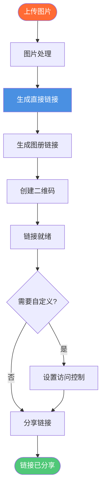

# 图片链接生成器：Maiimg免费图片URL生成器

<div class="intro-panel">
  <p>需要快速<strong>生成图片链接</strong>？Maiimg提供免费图片链接生成器，即时创建直接图片URL、图册链接和二维码。上传图片并立即获得可分享链接。无需注册。本完整指南展示如何使用Maiimg作为图片链接生成器。</p>
</div>


## 什么是图片链接生成器？

**图片链接生成器**是一种为在线上传的图片创建可分享URL的工具。无需分享大型图片文件，您可以分享一个简单的链接，其他人可以点击查看图片。

**图片链接生成器的优势：**
- ✅ **轻松分享** - 分享链接而不是文件
- ✅ **无文件大小限制** - 绕过电子邮件限制
- ✅ **快速访问** - 通过CDN快速加载
- ✅ **移动友好** - 在所有设备上工作
- ✅ **专业** - 干净、品牌化的链接

## 图片链接生成器如何工作

### 链接生成流程



### 步骤1：上传图片

**上传流程：**
1. 访问 [Maiimg.com](https://maiimg.com)
2. 选择要上传的图片
3. 一次上传最多25张图片
4. 等待处理

**支持的格式：**
- 📸 PNG
- 🖼️ JPG/JPEG
- 🎭 GIF
- 🌐 WebP

**文件大小：**
- ✅ 每张图片最多50MB
- ✅ 快速处理

### 步骤2：获取生成的链接

**生成的链接类型：**
- 🔗 **直接图片链接** - 单张图片URL
- 📁 **图册链接** - 图册视图URL
- 📱 **二维码** - 二维码图片
- 🔗 **分享链接** - 可分享图册链接

**链接特点：**
- 安全HTTPS
- 移动响应式
- 快速加载
- 专业外观

## 生成的链接类型

### 1. 直接图片链接

**格式：**
```
https://maiimg.com/image/xxxxx.jpg
```

**使用场景：**
- 嵌入网站
- 分享单张图片
- 在HTML中使用
- 直接访问

**特点：**
- 直接图片URL
- 快速加载
- 移动友好
- 无重定向

### 2. 图册链接

**格式：**
```
https://maiimg.com/gallery/xxxxx
```

**使用场景：**
- 分享多张图片
- 专业图册
- 作品集展示
- 活动照片

**特点：**
- 专业图册视图
- 多张图片
- 访问控制
- 启用追踪

## 结论：图片链接生成器

Maiimg提供最佳的**图片链接生成器**，具有：
- ✅ 即时链接生成
- ✅ 每张图片50MB
- ✅ 批量生成（25张图片）
- ✅ 多种链接类型
- ✅ 访问控制
- ✅ 实时追踪
- ✅ 二维码生成
- ✅ 无需注册
- ✅ 完全免费

**准备生成图片链接？**

访问 [Maiimg.com](https://maiimg.com) 上传图片并即时生成链接。无需注册，完全免费，专业链接。

---

**相关文章:**
- [免费图片托管：完整指南](/blog/cn/free-image-hosting-maiimg-complete-guide)
- [无需账户上传图片：完整指南](/blog/cn/image-upload-without-account-maiimg-guide)
- [图片嵌入代码生成器：如何嵌入图片](/blog/cn/image-embed-code-generator-maiimg-guide)
