# Maiimg完整介绍：专业图片分享平台，让图片分享变得简单安全

  
<strong>Maiimg</strong> 是一个专业的图片在线分享平台，让您无需注册即可快速生成分享链接，随时控制访问权限，实时追踪图片打开情况。无论是活动照片、产品图片还是设计作品，Maiimg都能让图片分享变得简单、安全、可控。

## 什么是Maiimg？

### 平台定位

Maiimg是一个**在线图片分享和管理平台**，专注于提供简单、安全、可控的图片分享解决方案。

**核心特点：**
- ✅ **无需注册** - 即传即用，零门槛
- ✅ **秒级生成** - 上传后立即生成链接
- ✅ **完全免费** - 基础功能完全免费使用
- ✅ **专业安全** - 访问控制、数据追踪、批量管理

### Maiimg vs 传统方式

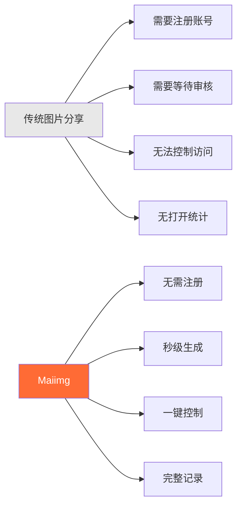

## 核心功能一览

### 功能架构图

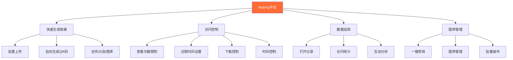

## 完整使用流程

### 从上传到分享的完整流程

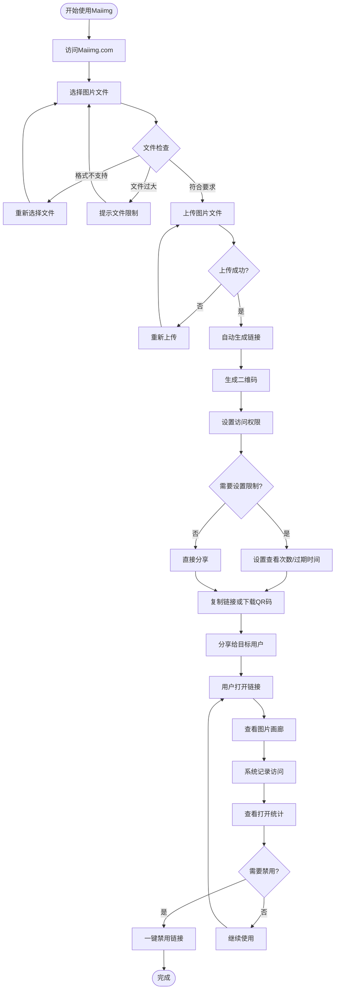

### 三步快速上手

**第一步：上传图片**
- 访问 Maiimg.com
- 拖拽或选择图片文件
- 支持批量上传（最多25张/图库）

**第二步：生成链接**
- 自动生成分享链接
- 自动生成二维码
- 可设置访问权限

**第三步：分享使用**
- 复制链接分享
- 或下载二维码分享
- 实时查看打开统计

## 核心功能详解

### 功能一：快速生成链接

**特点：**
- ⚡ 秒级生成（上传即生成）
- 🔗 自动生成唯一链接
- 📱 自动生成二维码
- 📦 支持批量上传（最多25张/图库）

**流程图：**

### 功能二：访问控制

**可设置的控制项：**

| 控制项 | 说明 | 应用场景 |
|--------|------|----------|
| 查看次数限制 | 限制图库可被打开的次数 | 活动照片、限量分享 |
| 过期时间 | 设置链接自动失效时间 | 临时分享、活动资料 |
| 下载控制 | 禁止或允许下载图片 | 保护版权、防止传播 |
| 时间控制 | 设置可访问的时间段 | 限时活动、定时发布 |

**访问控制流程图：**

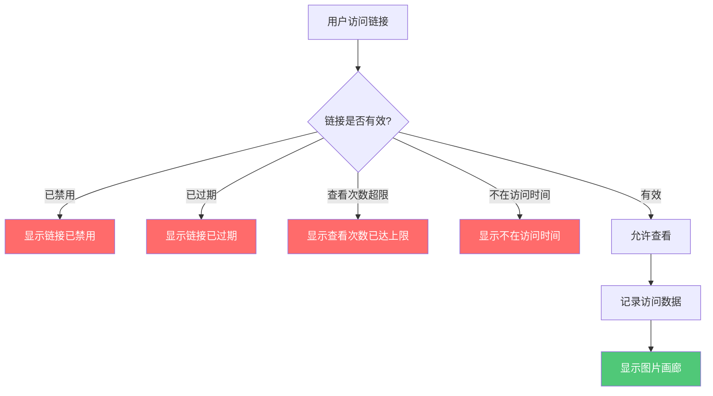

### 功能三：数据追踪

**追踪内容：**
- 📊 总打开次数
- ⏰ 每次打开的时间
- 📱 访问设备信息
- 📈 访问趋势分析
- 🎯 图片互动数据

**数据追踪流程图：**

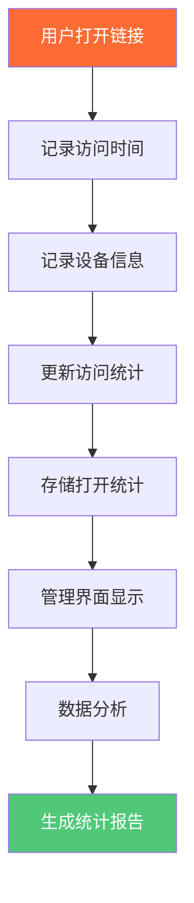

### 功能四：图库管理

**管理功能：**
- 🚫 一键禁用链接
- 📝 修改访问设置
- 📊 查看管理界面
- 🗑️ 删除图库

**图库管理流程图：**

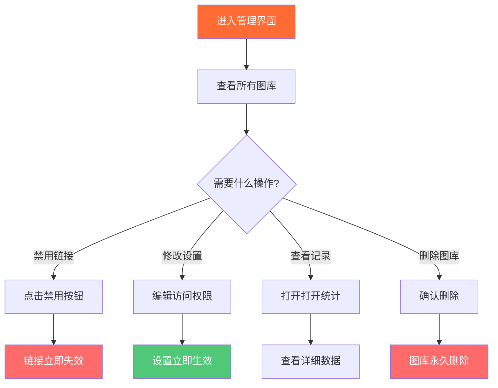

## 应用场景

### 场景分类图

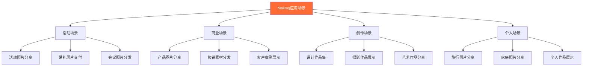

### 典型应用场景流程

**场景：活动照片分享**

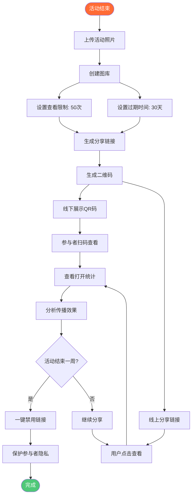

## 功能对比

### Maiimg vs 传统方式

| 对比项 | 传统图片分享 | Maiimg |
|--------|------------|--------|
| **注册要求** | ❌ 需要注册账号 | ✅ 无需注册 |
| **链接生成** | ❌ 需要等待审核 | ✅ 秒级生成 |
| **访问控制** | ❌ 无法控制 | ✅ 完整控制（次数、时间、下载） |
| **打开统计** | ❌ 无记录 | ✅ 完整记录（时间、设备、统计） |
| **链接管理** | ❌ 只能删除 | ✅ 一键禁用、设置修改 |
| **批量上传** | ❌ 单张上传 | ✅ 批量上传（25张/图库） |
| **使用成本** | 💰 可能收费 | ✅ 完全免费 |
| **操作复杂度** | 📋 步骤繁琐 | ✅ 简单直观 |

### 功能优势对比图

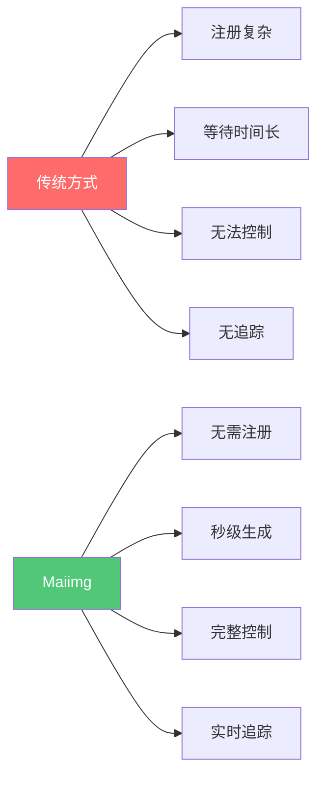

## 使用优势总结

### 核心优势

**1. 简单易用**
- 无需注册，即传即用
- 三步完成：上传 → 生成 → 分享
- 界面简洁，操作直观

**2. 快速高效**
- 秒级生成链接
- 自动生成二维码
- 支持批量上传（最多25张/图库）

**3. 安全可控**
- 完整的访问控制
- 实时打开统计
- 一键禁用链接
- 灵活的权限设置

**4. 完全免费**
- 基础功能完全免费
- 无隐藏费用
- 无使用限制

### 优势对比图

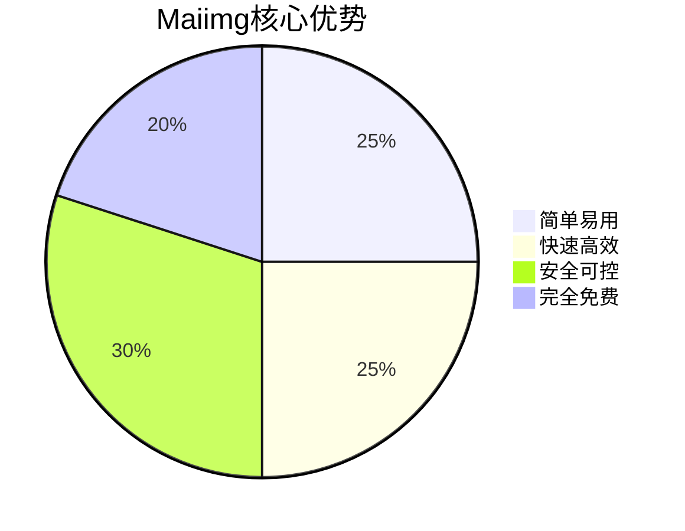

## 快速开始

### 三步开始使用

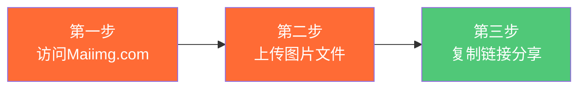

**立即体验：**
1. 访问 [Maiimg.com](https://maiimg.com)
2. 拖拽图片文件到上传区域
3. 复制生成的链接或下载二维码
4. 分享给目标用户

## 总结

Maiimg是一个**专业、简单、安全、免费**的图片分享平台，通过以下核心功能让图片分享变得轻松：

- ⚡ **快速生成** - 秒级生成链接，无需等待
- 🔒 **安全控制** - 完整的访问控制和权限管理
- 📊 **数据追踪** - 实时查看打开统计与分析
- 🎯 **简单易用** - 无需注册，三步完成分享
- 💰 **完全免费** - 基础功能完全免费使用

无论您是活动组织者、摄影师、设计师还是个人用户，Maiimg都能为您提供专业的图片分享解决方案。

**立即开始使用：** [访问 Maiimg.com](https://maiimg.com)

