# Maiimg完整工作流程指南：从上传到分享的详细图解

  
想要快速掌握Maiimg的使用方法？通过详细的流程图，您可以清晰地了解从图片上传到链接分享、从访问控制到数据追踪的完整流程。让图片分享变得简单直观。

## 一、Maiimg核心工作流程

### 完整流程图

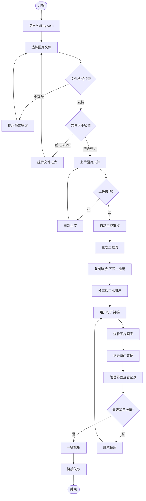

### 流程说明

**第一步：访问和上传**
- 访问 Maiimg.com
- 无需注册，直接使用
- 拖拽或选择图片上传
- 支持批量上传（最多25张）
- 每张图片最大50MB

**第二步：自动生成**
- 上传完成后自动处理
- 秒级生成分享链接
- 同时生成二维码
- 链接立即可用

**第三步：分享使用**
- 复制链接分享
- 或下载二维码分享
- 用户点击链接查看
- 系统自动记录访问

**第四步：管理和控制**
- 查看访问记录
- 根据需要禁用链接
- 删除图片画廊
- 设置访问权限

## 二、快速生成链接流程

### 链接生成流程图

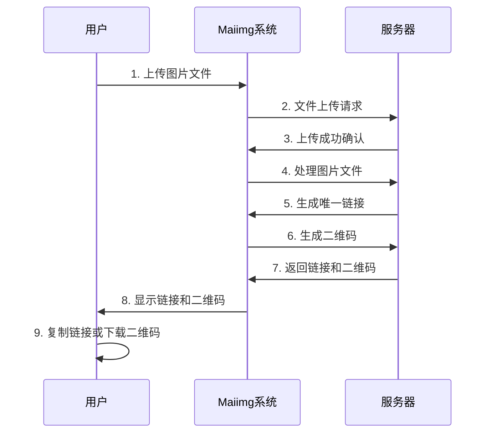

### 详细步骤说明

**步骤1：图片上传**
- 选择图片文件（支持PNG、JPG、JPEG、GIF、WebP）
- 拖拽到上传区域
- 或点击选择文件
- 支持批量选择（最多25张）
- 等待上传完成

**步骤2：自动处理**
- 系统自动处理文件
- 验证图片格式
- 生成唯一标识
- 创建图片画廊
- 生成分享链接

**步骤3：生成结果**
- 显示分享链接
- 显示二维码
- 提供复制按钮
- 提供下载选项
- 显示图片预览

## 三、一键禁用链接流程

### 禁用链接流程图

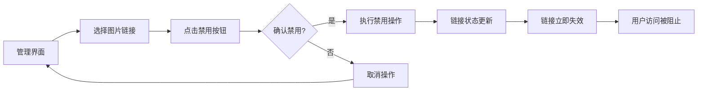

### 禁用操作说明

**操作前：**
- 链接正常可用
- 用户可以访问
- 可以查看图片
- 可以下载（如允许）

**操作中：**
- 进入管理界面
- 找到目标链接
- 点击禁用按钮
- 确认禁用操作

**操作后：**
- 链接立即失效
- 用户无法访问
- 显示"链接已禁用"
- 图片数据保留

## 四、查看打开记录流程

### 访问记录追踪流程图

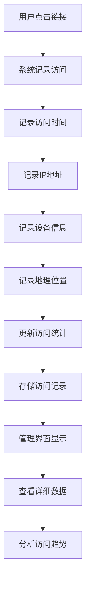

### 记录内容说明

**基本信息：**
- 总访问次数
- 访问时间列表
- 访问时间分布

**详细信息：**
- 访问者IP地址
- 访问设备类型
- 访问地理位置
- 访问来源

**数据分析：**
- 访问趋势分析
- 热门时段统计
- 地域分布统计
- 设备类型统计
- 图片受欢迎程度

## 五、完整使用场景流程

### 活动照片分享场景

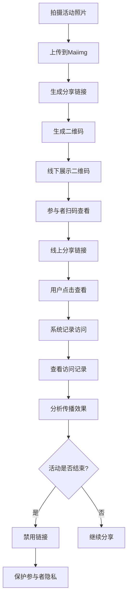

### 产品图片分享场景

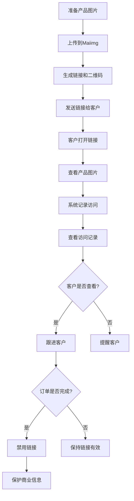

## 六、功能组合使用流程

### 安全分享组合流程

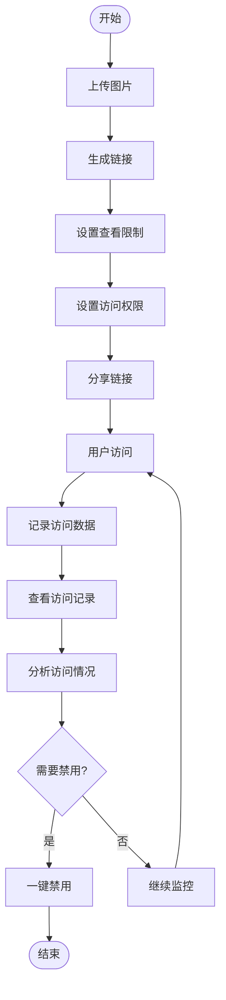

### 营销推广组合流程

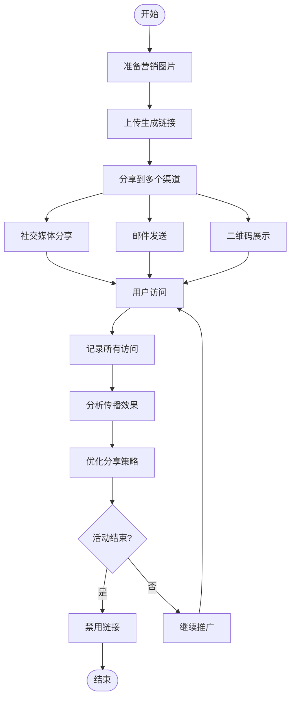

## 七、批量上传流程

### 批量图片上传流程图

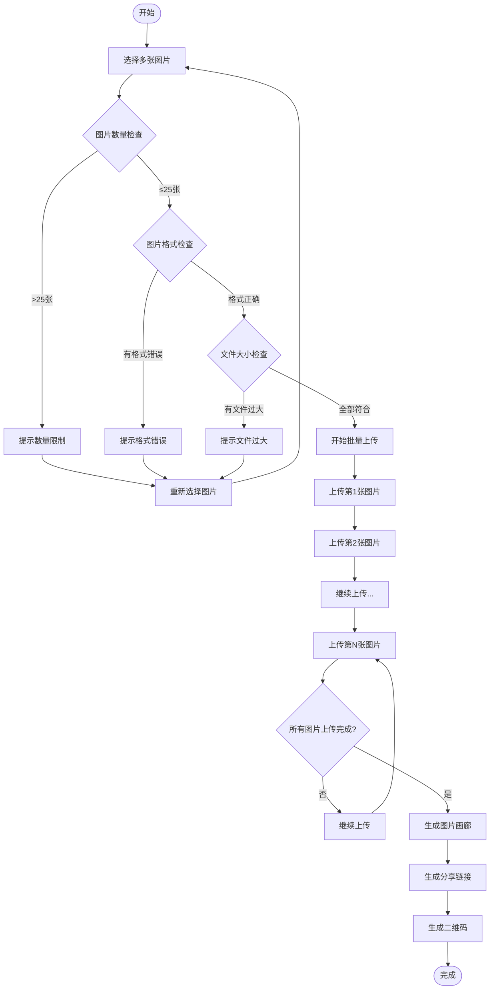

### 批量上传优势

**效率提升：**
- 一次上传多张图片
- 节省上传时间
- 统一管理图片
- 单个链接分享

**使用场景：**
- 产品图片集
- 活动照片集
- 作品集展示
- 营销素材包

## 八、操作时间线

### 完整操作时间线

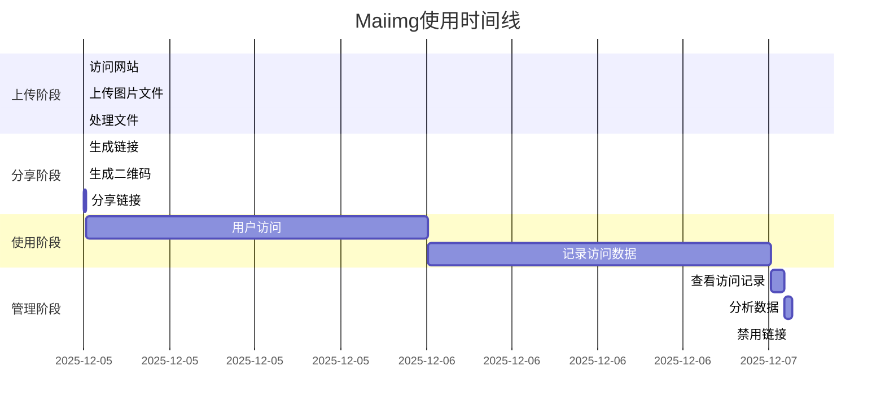

## 九、决策流程图

### 何时使用不同功能

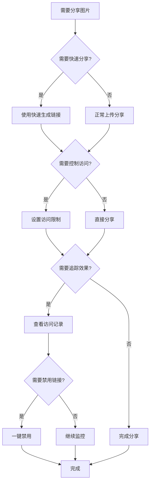

## 十、常见问题解决流程

### 链接无法访问问题排查

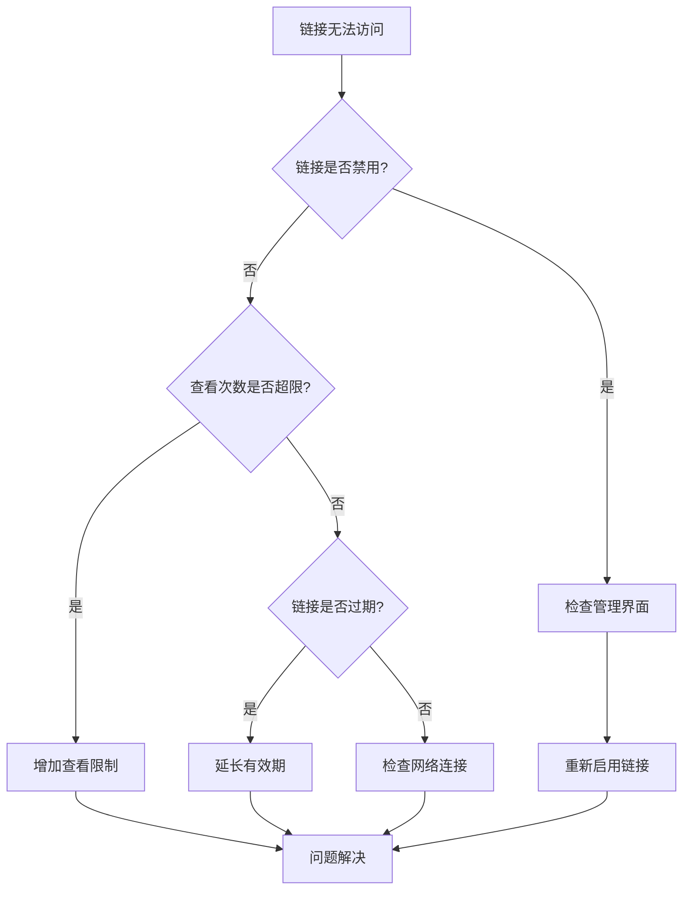

## 十一、最佳实践流程

### 推荐使用流程

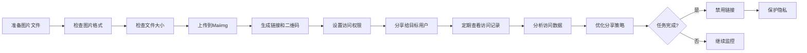

## 十二、图片格式支持流程

### 支持的图片格式

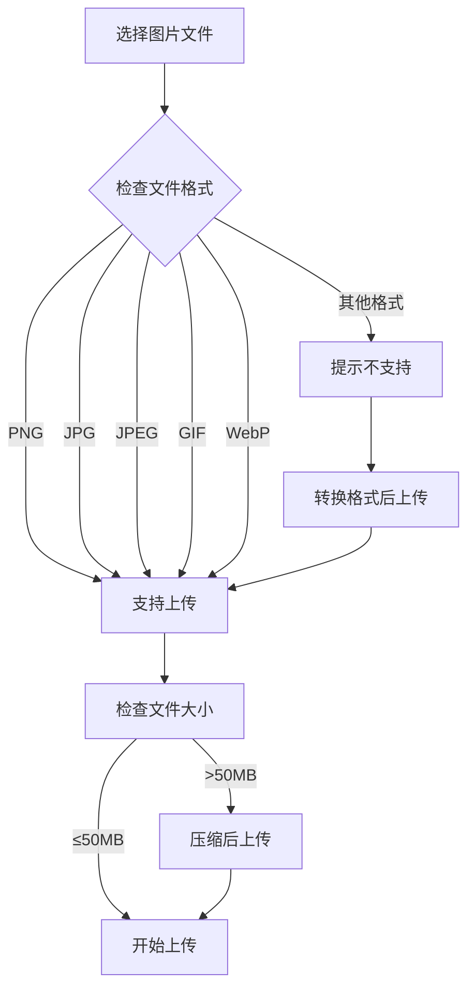

## 总结

通过以上详细的流程图，您可以清晰地了解：

1. **完整工作流程**：从上传到分享的每个步骤
2. **功能使用流程**：快速生成、禁用、追踪的具体操作
3. **场景应用流程**：不同场景下的使用方式
4. **批量上传流程**：高效处理多张图片的方法
5. **问题解决流程**：遇到问题时的排查方法

Maiimg的流程图设计让复杂的图片分享变得简单直观，无论是营销人员、摄影师还是个人用户，都能快速掌握使用方法。

**立即体验Maiimg：**
- 访问 Maiimg.com
- 按照流程图操作
- 享受便捷的图片分享体验

---

**相关指南：**
- [Maiimg快速生成链接、一键禁用、查看打开记录](/blog/cn/maiimg-quick-link-generation-one-click-disable-tracking)
- [Maiimg批量图片分享：完整指南](/blog/cn/maiimg-bulk-image-sharing-guide)
- [Maiimg二维码图片分享：完整指南](/blog/cn/maiimg-qr-code-sharing-guide)

