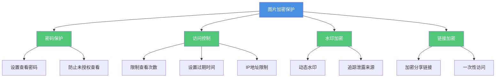
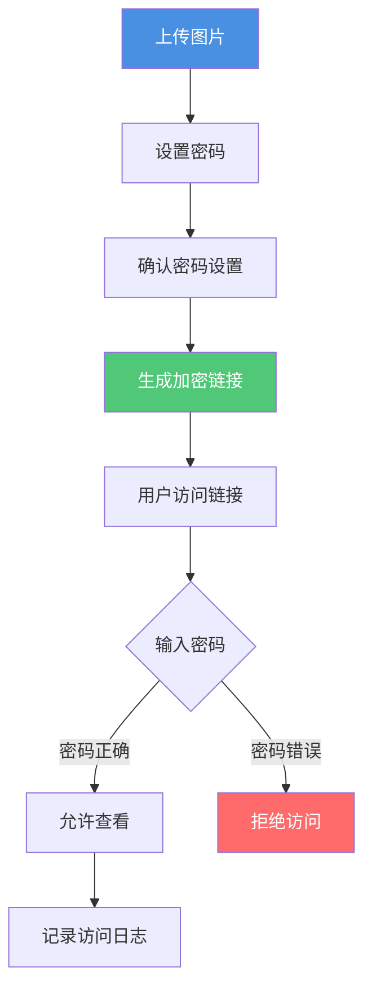
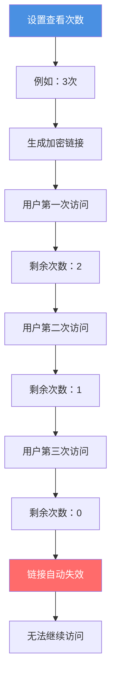
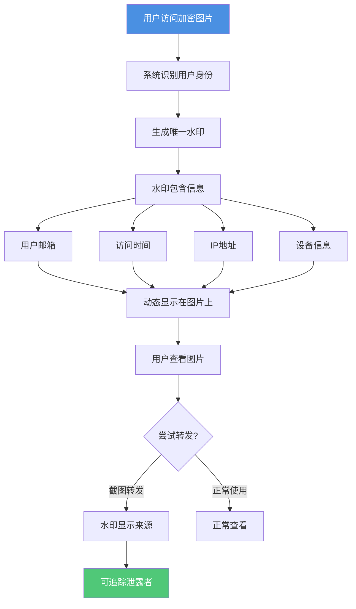
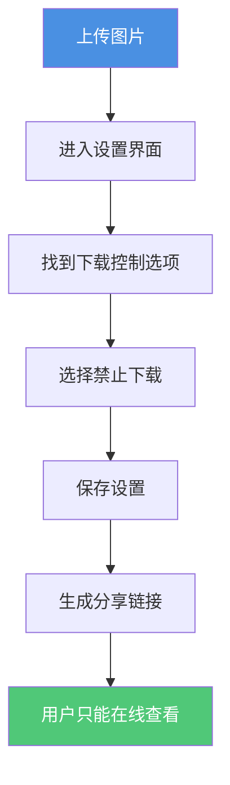
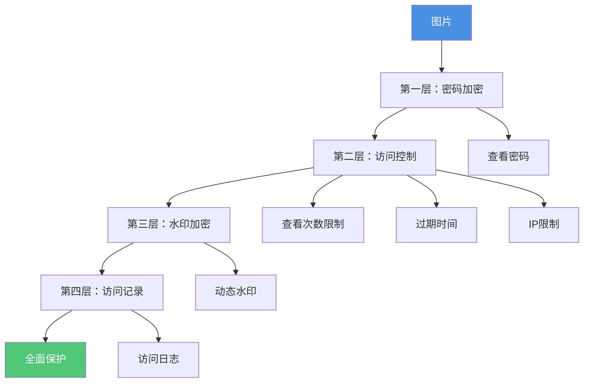

# 图片加密防止转发：全面保护图片安全的完整指南

  
在数字时代，图片的安全性至关重要。通过<strong>图片加密技术</strong>可以有效防止图片被转发和未授权访问。本文将详细介绍如何通过多种加密方法保护您的图片，确保只有授权人员能够访问，并防止图片被二次分享。

## 为什么需要图片加密防止转发？

### 加密保护的重要性

**1. 防止未授权访问**
- 只有知道密码的用户才能查看图片
- 防止链接被随意转发后他人访问
- 保护敏感图片不被泄露

**2. 控制图片传播**
- 即使链接被转发，没有密码也无法查看
- 限制图片的传播范围
- 保护商业机密和知识产权

**3. 法律合规要求**
- 满足数据保护法规要求
- 保护个人隐私信息
- 符合行业安全标准

**4. 追踪和审计**
- 记录加密图片的访问情况
- 追踪图片的传播路径
- 提供法律证据

### 图片加密防止转发的核心价值

## 图片加密防止转发的方法

### 方法1：密码加密保护

**原理：**
- 为图片分享链接设置查看密码
- 只有输入正确密码才能查看图片
- 即使链接被转发，没有密码也无法访问

**加密流程：**

**设置步骤：**

1. **上传图片**
   - 选择需要加密的图片
   - 支持单张或批量上传
   - 等待上传完成

2. **设置密码**
   - 进入安全设置界面
   - 选择"密码保护"选项
   - 输入强密码（建议8位以上，包含字母、数字和特殊字符）
   - 确认密码

3. **确认密码设置**
   - 确认密码输入正确
   - 检查密码强度提示
   - 保存密码设置

4. **生成加密链接**
   - 保存设置后生成分享链接
   - 将链接和密码分别发送给授权用户

**优势：**
- ✅ 双重保护：链接+密码
- ✅ 即使链接泄露，没有密码也无法访问
- ✅ 有效防止未授权访问
- ✅ 简单易用的安全保护

**注意事项：**
- ⚠️ 密码需要安全保管和传递
- ⚠️ 建议通过不同渠道发送链接和密码
- ⚠️ 定期更换密码

### 方法2：访问控制加密

**2.1 查看次数限制加密**

**工作原理：**
- 设置图片最大查看次数
- 达到限制后链接自动失效
- 防止链接被多次分享使用

**设置流程：**

**适用场景：**
- 机密图片一次性查看
- 限时活动图片
- 防止链接被滥用

**2.2 过期时间加密**

**工作原理：**
- 设置链接自动过期时间
- 过期后无法访问图片
- 时间到期自动加密锁定

**设置方法：**
- 选择过期时间（1小时、1天、1周等）
- 系统自动在到期时锁定图片
- 过期后需要重新授权才能访问

**2.3 IP地址限制加密**

**工作原理：**
- 限制访问的IP地址范围
- 只有指定IP才能访问
- 防止远程未授权访问

**设置步骤：**
1. 获取授权用户的IP地址
2. 在设置中添加允许的IP地址
3. 保存设置
4. 只有指定IP才能访问图片

### 方法3：动态水印加密

**原理：**
- 在图片上添加动态水印
- 水印包含访问者唯一信息
- 即使截图转发也能追踪来源

**水印加密流程：**

**水印内容选项：**
- 访问者邮箱地址
- 访问日期和时间
- IP地址
- 设备信息
- 自定义文本

**优势：**
- ✅ 强大的威慑作用
- ✅ 精确追踪泄露来源
- ✅ 提供法律证据
- ✅ 不影响正常查看体验

### 方法4：禁止下载保护

**原理：**
- 图片只能在线查看
- 无法下载到本地设备
- 防止图片文件被转发

**设置步骤：**

**优势：**
- ✅ 完全阻止图片下载
- ✅ 图片始终在服务器控制下
- ✅ 无法通过文件转发

**限制：**
- ⚠️ 无法完全防止截图
- ⚠️ 无法防止屏幕录制

### 方法5：组合加密策略

**多层次加密保护：**

**保护级别对比：**

| 保护级别 | 密码保护 | 访问控制 | 水印加密 | 禁止下载 | 访问记录 | 适用场景 |
|---------|---------|---------|---------|---------|---------|---------|
| 基础保护 | ✅ | - | - | - | ✅ | 一般图片 |
| 标准保护 | ✅ | ✅ | - | ✅ | ✅ | 重要图片 |
| 高级保护 | ✅ | ✅ | ✅ | ✅ | ✅ | 机密图片 |
| 最高保护 | ✅ | ✅ | ✅ | ✅ | ✅ | 绝密图片 |

## 图片加密防止转发的完整设置流程

### 步骤1：准备图片

1. 确保图片格式正确（支持JPG、PNG、WEBP等）
2. 检查图片内容完整性
3. 确定需要保护的信息范围

### 步骤2：选择加密方法

**根据图片重要性选择：**

- **一般图片**：基础密码保护
- **重要图片**：密码+访问控制
- **机密图片**：密码+访问控制+水印
- **绝密图片**：全功能保护

### 步骤3：设置加密参数

**密码设置：**
1. 进入安全设置
2. 启用密码保护
3. 设置强密码（建议12位以上，包含字母、数字和特殊字符）
4. 确认并保存密码设置

**访问控制设置：**
1. 设置查看次数（建议1-5次）
2. 设置过期时间
3. 添加IP地址限制（如需要）

**水印设置：**
1. 启用动态水印
2. 选择显示内容
3. 调整水印位置和透明度

**禁止下载设置：**
1. 启用禁止下载功能
2. 保存设置

### 步骤4：生成加密链接

1. 保存所有设置
2. 系统生成加密分享链接
3. 获取访问密码
4. 分别发送链接和密码

### 步骤5：监控访问情况

1. 查看访问记录
2. 监控异常访问
3. 追踪图片传播路径
4. 及时处理安全问题

## 最佳实践建议

### 密码管理

**密码设置原则：**
- 使用强密码（至少12位）
- 包含大小写字母、数字和特殊字符
- 避免使用个人信息
- 定期更换密码

**密码传递方式：**
- 链接和密码分开发送
- 使用加密通信渠道
- 避免在邮件中同时发送
- 考虑使用密码管理器

### 访问控制策略

**查看次数设置：**
- 一次性图片：1次
- 重要图片：2-3次
- 参考图片：5-10次

**过期时间设置：**
- 临时图片：1-24小时
- 短期图片：1-7天
- 长期图片：30-90天

### 安全监控

**定期检查：**
- 查看访问日志
- 检查异常访问
- 分析访问模式
- 及时处理安全问题

## 常见问题解答

### Q1: 图片加密会影响图片质量吗？

**A:** 不会。图片加密只是对访问权限进行控制，不会改变图片内容或质量。图片的清晰度、色彩等都不会受到影响。

### Q2: 忘记密码怎么办？

**A:** 如果使用在线图片加密服务，通常可以通过以下方式：
- 联系图片所有者重置密码
- 使用备用验证方式
- 查看密码提示（如果设置了）

### Q3: 加密的图片可以在手机上查看吗？

**A:** 可以。只要图片查看器支持密码输入，就可以在手机、平板等设备上查看加密的图片。

### Q4: 如何知道图片是否被转发？

**A:** 通过以下方式可以追踪：
- 查看访问记录和IP地址
- 检查水印信息
- 分析访问时间和地点
- 监控查看次数

### Q5: 加密会影响图片加载速度吗？

**A:** 影响很小。密码保护功能经过优化，对图片加载速度的影响几乎可以忽略不计。

### Q6: 禁止下载后还能截图吗？

**A:** 禁止下载功能只能阻止保存图片文件，无法完全防止截图。建议结合水印功能，即使截图也能追踪来源。

## 总结

图片加密是防止图片被转发的有效方法。通过密码保护、访问控制、水印加密、禁止下载等多种技术的组合使用，可以全面保护您的图片安全。记住：

- ✅ 根据图片重要性选择合适的保护级别
- ✅ 使用强密码并安全传递
- ✅ 定期监控访问情况
- ✅ 及时处理安全问题

通过合理的加密策略，您可以有效防止图片被转发，保护重要信息的安全。

