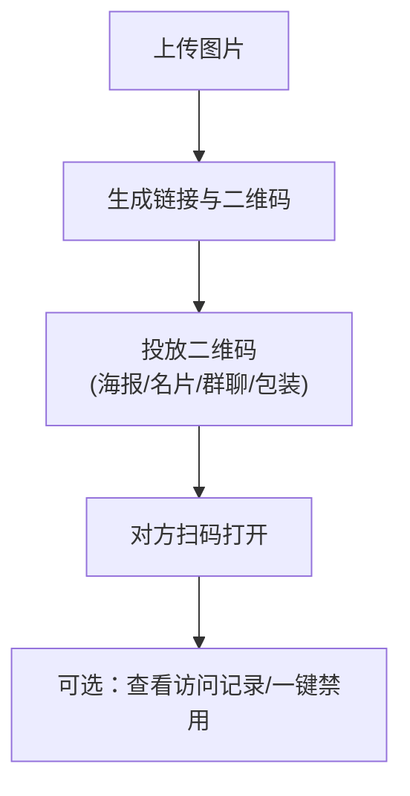

# 图片二维码分享怎么做：3步让对方扫码即看（Maiimg）

  
二维码的核心价值是“降低动作成本”：对方不需要复制链接、不需要输入地址，扫码就能打开。下面用两张图把最短路径讲清楚。

## 一、3步流程图（Mermaid）

## 二、SVG图解（步骤更直观）

## 三、适用场景（你会马上用上）

- 线下活动：海报贴二维码，扫码直接看图集
- 客户交付：把二维码放在交付文档/报价单里
- 社群传播：二维码比长链接更易转发

## 四、避免踩坑的小建议

- 打印前先在 iOS/Android 各扫一次，确认可打开
- 敏感图片建议加：有效期 / 限次 / 验证（选其一即可）
- 如果你担心被转发：分享后记得定期看访问记录，必要时直接禁用

