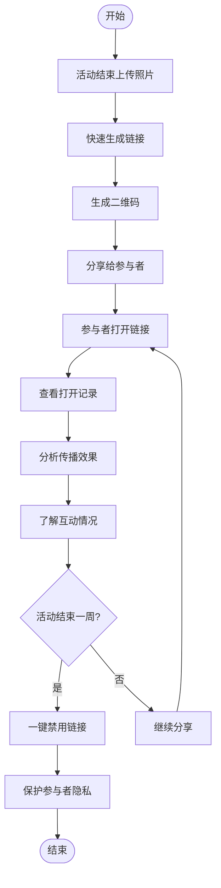
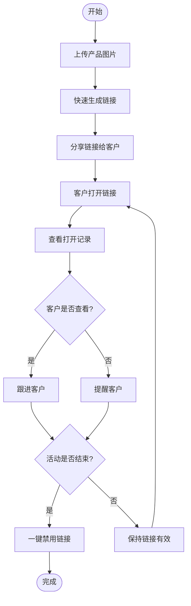
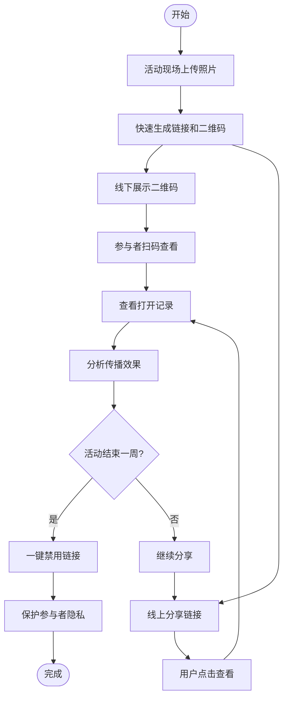

# Maiimg快速生成链接、一键禁用、查看打开记录：图片分享三大核心功能

  
图片分享需要什么？<strong>快速生成链接</strong>、<strong>一键禁用链接</strong>、<strong>查看打开记录</strong>。Maiimg将这三大核心功能完美结合，让图片分享变得简单、安全、可控。

## 核心功能一：快速生成链接分享

### 上传即生成，秒级完成

**无需等待，即时分享：**
- 上传图片后，链接立即生成
- 无需注册，无需等待审核
- 支持批量上传（最多25张）
- 自动生成二维码

**操作步骤：**
1. 访问 Maiimg.com
2. 拖拽或选择图片上传
3. **链接自动生成**，立即可用
4. 复制链接或下载二维码分享

### 为什么快速生成链接很重要？

**传统方式的问题：**
- ❌ 需要注册账号
- ❌ 需要等待审核
- ❌ 链接生成慢
- ❌ 操作步骤繁琐

**Maiimg的优势：**
- ✅ 无需注册，即传即用
- ✅ 秒级生成链接
- ✅ 一键复制分享
- ✅ 自动生成二维码

**实际应用场景：**
- 活动现场需要立即分享照片
- 客户需要快速查看产品图片
- 多人共享需要即时分享素材
- 营销活动需要快速分发图片

## 核心功能二：一键禁用链接

### 随时控制，立即生效

**一键操作，链接立即失效：**
- 点击"禁用"按钮，链接立即不可用
- 无需删除图片，只需禁用链接
- 已分享的链接立即失效
- 可以随时重新启用（如支持）

### 为什么需要一键禁用功能？

**常见场景：**
- 图片分享错误，需要立即停止访问
- 活动结束，需要关闭图片访问
- 隐私保护，需要临时禁用链接
- 内容更新，需要禁用旧链接

**Maiimg一键禁用的优势：**
- ✅ 操作简单，一键完成
- ✅ 立即生效，无需等待
- ✅ 不影响已上传的图片
- ✅ 可以随时重新启用

### 如何使用一键禁用功能？

**操作步骤：**
1. 进入Maiimg管理界面
2. 找到需要禁用的图片链接
3. 点击"禁用"按钮
4. 链接立即失效，无法访问

**禁用后的效果：**
- 已分享的链接无法打开
- 二维码扫描无效
- 访问者看到"链接已禁用"提示
- 图片数据保留，可重新启用

## 核心功能三：查看打开记录

### 实时追踪，数据透明

**完整的访问记录：**
- 查看总打开次数
- 查看每次打开的时间
- 查看打开者的IP地址（如支持）
- 查看打开设备信息（如支持）

### 为什么需要查看打开记录？

**了解分享效果：**
- 知道图片被查看了多少次
- 了解哪些图片最受欢迎
- 追踪营销活动的效果
- 分析用户行为

**实际应用场景：**
- **营销活动：** 追踪活动图片的传播效果
- **客户服务：** 确认客户是否查看了产品图片
- **多人共享：** 了解团队成员是否查看了共享素材
- **内容运营：** 分析哪些内容最受欢迎

### 打开记录包含哪些信息？

**基本数据：**
- 总打开次数
- 打开时间记录
- 打开时间分布

**高级数据（如支持）：**
- 访问者IP地址
- 访问设备类型
- 访问地理位置
- 访问来源

**如何使用打开记录？**
1. 上传图片并生成链接
2. 分享链接给目标用户
3. 在管理界面查看打开记录
4. 分析数据，优化分享策略

## 三大功能完美结合

### 完整的工作流程

**场景：活动照片分享**

**流程说明：**

1. **快速生成链接**
   - 活动结束，立即上传照片
   - 链接秒级生成
   - 分享给参与者

2. **查看打开记录**
   - 实时查看谁打开了链接
   - 了解照片的传播效果
   - 分析参与者的互动情况

3. **一键禁用链接**
   - 活动结束一周后
   - 一键禁用链接
   - 保护参与者隐私

### 功能对比表

| 功能 | 传统图片分享 | Maiimg |
|------|------------|--------|
| 链接生成速度 | 需要注册，等待审核 | 秒级生成，无需注册 |
| 链接控制 | 无法禁用，只能删除 | 一键禁用，随时控制 |
| 打开记录 | 无记录或记录不完整 | 完整记录，实时查看 |
| 使用成本 | 可能需要付费 | 完全免费 |
| 操作复杂度 | 步骤繁琐 | 简单直观 |

## 实际应用案例

### 案例一：电商产品图片分享

**需求：** 向客户快速分享产品图片，了解客户查看情况，活动结束后关闭访问

**解决方案：**
1. 上传产品图片，**快速生成链接**
2. 分享链接给客户
3. **查看打开记录**，了解客户查看情况
4. 活动结束后，**一键禁用链接**

### 案例二：活动照片即时分享

**需求：** 活动现场立即分享照片，追踪传播效果，活动结束后保护隐私

**解决方案：**
1. 活动现场上传照片，**快速生成链接和二维码**
2. 参与者扫描二维码查看
3. **查看打开记录**，了解照片传播效果
4. 活动结束一周后，**一键禁用链接**

### 案例三：多人共享素材分享

**需求：** 快速分享设计素材，了解团队成员查看情况，项目结束后关闭访问

**解决方案：**
1. 上传设计素材，**快速生成链接**
2. 分享到团队群组
3. **查看打开记录**，确认团队成员已查看
4. 项目结束后，**一键禁用链接**

## 使用技巧

### 技巧一：快速生成链接的最佳实践

- 提前准备好图片，减少上传时间
- 使用批量上传功能，一次上传多张
- 生成链接后立即复制，避免丢失
- 使用二维码功能，方便线下分享

### 技巧二：一键禁用的最佳时机

- 活动结束后1-7天
- 内容更新时禁用旧链接
- 发现分享错误时立即禁用
- 隐私保护需要时及时禁用

### 技巧三：查看打开记录的分析方法

- 关注总打开次数，了解整体效果
- 分析打开时间分布，了解用户活跃时段
- 对比不同图片的打开次数，优化内容
- 结合业务目标，评估分享效果

## 常见问题

### Q1: 链接生成需要多长时间？

**A:** 链接生成是即时的，上传完成后立即生成，通常不超过10秒。

### Q2: 禁用链接后可以恢复吗？

**A:** 取决于平台设置。有些平台支持重新启用，有些需要重新生成链接。建议在禁用前确认。

### Q3: 打开记录保存多长时间？

**A:** 打开记录会一直保存，直到您删除图片或禁用链接。可以随时查看历史记录。

### Q4: 可以同时使用这三个功能吗？

**A:** 当然可以！这三个功能是相互配合的。快速生成链接用于分享，查看打开记录用于分析，一键禁用用于控制。

### Q5: 这些功能需要付费吗？

**A:** Maiimg的核心功能完全免费，包括快速生成链接、一键禁用、查看打开记录。

## 结语

Maiimg的三大核心功能——**快速生成链接**、**一键禁用**、**查看打开记录**——让图片分享变得简单、安全、可控。

无论您是：
- 需要快速分享图片的营销人员
- 需要追踪效果的内容运营
- 需要保护隐私的个人用户
- 需要多人共享的设计师

Maiimg都能为您提供专业、便捷的图片分享解决方案。

**立即体验Maiimg：**
- 访问 Maiimg.com
- 上传图片，秒级生成链接
- 一键禁用，随时控制
- 查看记录，数据透明

---

**相关指南：**
- [Maiimg批量图片分享：完整指南](/blog/cn/maiimg-bulk-image-sharing-guide)
- [Maiimg二维码图片分享：完整指南](/blog/cn/maiimg-qr-code-sharing-guide)
- [Maiimg安全图片分享访问控制](/blog/cn/maiimg-secure-image-sharing-access-control)

