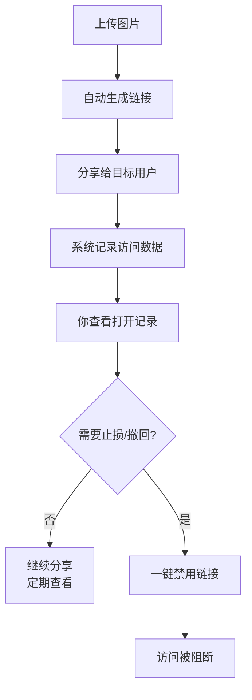

# 图片分享最实用的三大功能：链接、禁用、追踪（Maiimg）

  
如果你只想快速上手 Maiimg，不用学太多：记住三个能力就够了——<strong>生成链接</strong>、<strong>一键禁用</strong>、<strong>打开统计</strong>。下面用双重图解把逻辑串起来。

## 一、三功能串联流程（Mermaid）

## 二、SVG图解（更直观）

## 三、怎么把这三件事用到“最省心”

- **默认先设有效期**：让链接自动过期，降低“长期外传”风险
- **定期看打开记录**：只看“首次打开/重复打开/异常”三项就够
- **出现风险立即禁用**：先止损，再判断是否需要重新生成新链接

