# MaiPDF完整工作流程指南：从上传到分享的详细图解

  
想要快速掌握MaiPDF的使用方法？通过详细的流程图，您可以清晰地了解从PDF上传到链接分享、从访问控制到数据追踪的完整流程。让PDF分享变得简单直观。

## 一、MaiPDF核心工作流程

### 完整流程图

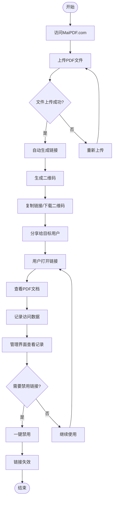

### 流程说明

**第一步：访问和上传**
- 访问 MaiPDF.com
- 无需注册，直接使用
- 拖拽或选择PDF文件上传
- 支持最大100MB文件

**第二步：自动生成**
- 上传完成后自动处理
- 10秒内生成分享链接
- 同时生成二维码
- 链接立即可用

**第三步：分享使用**
- 复制链接分享
- 或下载二维码分享
- 用户点击链接查看
- 系统自动记录访问

**第四步：管理和控制**
- 查看访问记录
- 根据需要禁用链接
- 替换PDF文件内容
- 设置访问权限

## 二、快速生成链接流程

### 链接生成流程图

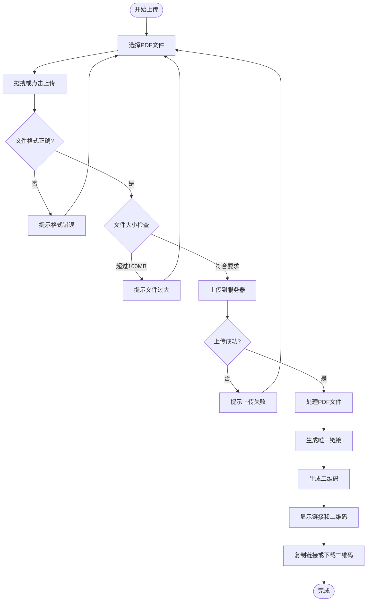

### 详细步骤说明

**步骤1：文件上传**
- 选择PDF文件
- 拖拽到上传区域
- 或点击选择文件
- 等待上传完成

**步骤2：自动处理**
- 系统自动处理文件
- 验证文件格式
- 生成唯一标识
- 创建分享链接

**步骤3：生成结果**
- 显示分享链接
- 显示二维码
- 提供复制按钮
- 提供下载选项

## 三、一键禁用链接流程

### 禁用链接流程图

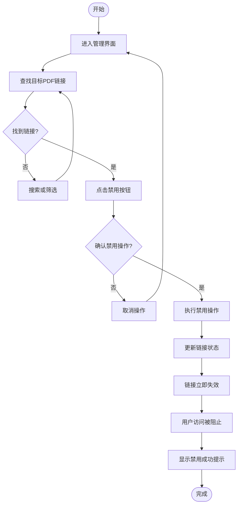

### 禁用操作说明

**操作前：**
- 链接正常可用
- 用户可以访问
- 可以查看PDF
- 可以下载（如允许）

**操作中：**
- 进入管理界面
- 找到目标链接
- 点击禁用按钮
- 确认禁用操作

**操作后：**
- 链接立即失效
- 用户无法访问
- 显示"链接已禁用"
- PDF数据保留

## 四、查看打开记录流程

### 访问记录追踪流程图

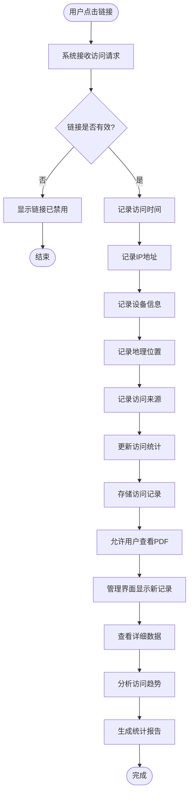

### 记录内容说明

**基本信息：**
- 总访问次数
- 访问时间列表
- 访问时间分布

**详细信息：**
- 访问者IP地址
- 访问设备类型
- 访问地理位置
- 访问来源

**数据分析：**
- 访问趋势分析
- 热门时段统计
- 地域分布统计
- 设备类型统计

## 五、完整使用场景流程

### 商务合同分享场景

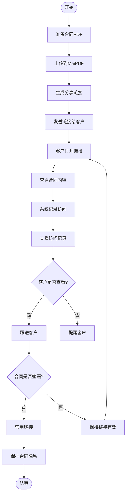

### 产品手册分享场景

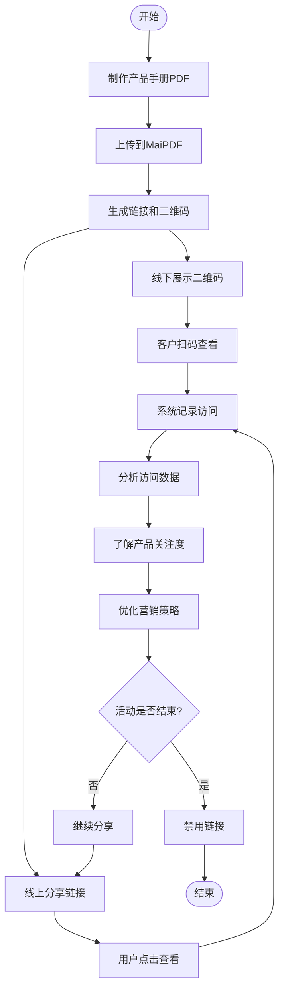

## 六、功能组合使用流程

### 安全分享组合流程

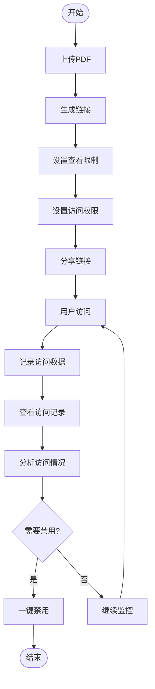

### 营销推广组合流程

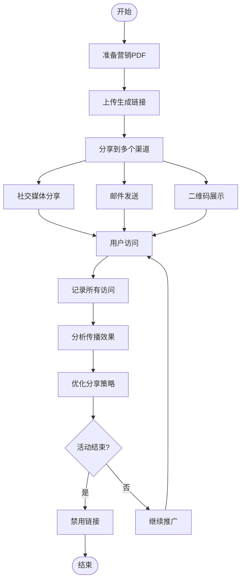

## 七、操作时间线

### 完整操作时间线

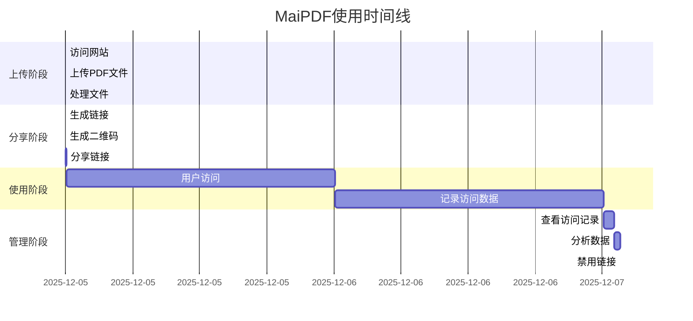

## 八、决策流程图

### 何时使用不同功能

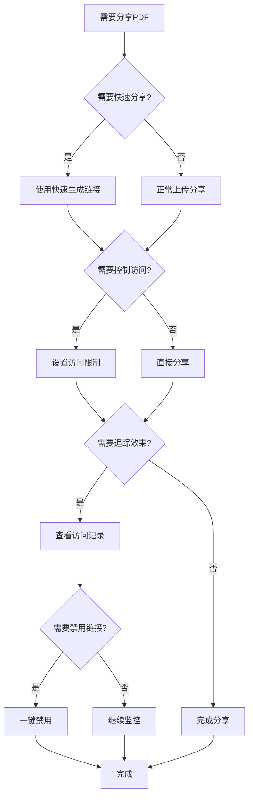

## 九、常见问题解决流程

### 链接无法访问问题排查

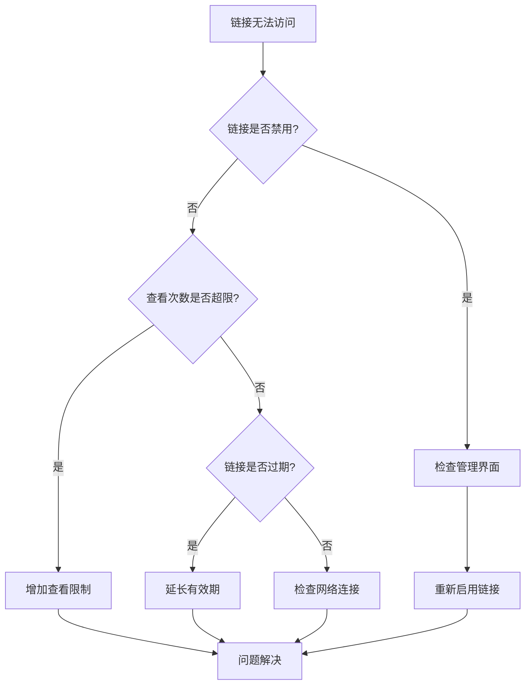

## 十、最佳实践流程

### 推荐使用流程

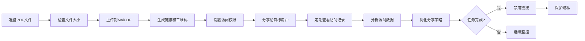

## 总结

通过以上详细的流程图，您可以清晰地了解：

1. **完整工作流程**：从上传到分享的每个步骤
2. **功能使用流程**：快速生成、禁用、追踪的具体操作
3. **场景应用流程**：不同场景下的使用方式
4. **问题解决流程**：遇到问题时的排查方法

MaiPDF的流程图设计让复杂的PDF分享变得简单直观，无论是商务人士还是个人用户，都能快速掌握使用方法。

**立即体验MaiPDF：**
- 访问 MaiPDF.com
- 按照流程图操作
- 享受便捷的PDF分享体验

---

**相关指南：**
- [MaiPDF快速生成链接、一键禁用、查看打开记录](/blog/cn/maipdf-quick-link-generation-one-click-disable-tracking)
- [MaiPDF秒级生成链接指南](/blog/cn/maipdf-instant-link-generation-guide)
- [MaiPDF链接生成完整指南](/blog/cn/maipdf-link-generation-guide)

