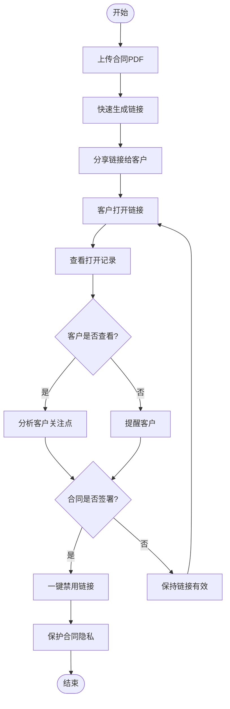
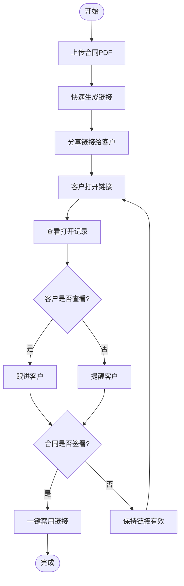
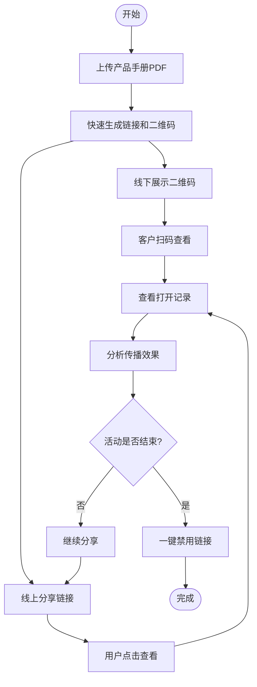

# MaiPDF快速生成链接、一键禁用、查看打开记录：PDF分享三大核心功能

  
PDF分享需要什么？<strong>快速生成链接</strong>、<strong>一键禁用链接</strong>、<strong>查看打开记录</strong>。MaiPDF将这三大核心功能完美结合，让PDF分享变得简单、安全、可控。

## 核心功能一：快速生成链接分享

### 上传即生成，秒级完成

**无需等待，即时分享：**
- 上传PDF后，链接立即生成
- 无需注册，无需等待审核
- 支持最大100MB文件
- 自动生成二维码

**操作步骤：**
1. 访问 MaiPDF.com
2. 拖拽或选择PDF文件上传
3. **链接自动生成**，立即可用
4. 复制链接或下载二维码分享

### 为什么快速生成链接很重要？

**传统方式的问题：**
- ❌ 需要注册账号
- ❌ 需要等待审核
- ❌ 链接生成慢
- ❌ 文件大小限制

**MaiPDF的优势：**
- ✅ 无需注册，即传即用
- ✅ 秒级生成链接（通常10秒内）
- ✅ 一键复制分享
- ✅ 自动生成二维码
- ✅ 支持最大100MB文件

**实际应用场景：**
- 商务会议需要立即分享合同文档
- 客户需要快速查看产品手册
- 团队协作需要即时分享报告
- 营销活动需要快速分发宣传资料

## 核心功能二：一键禁用链接

### 随时控制，立即生效

**一键操作，链接立即失效：**
- 点击"禁用"按钮，链接立即不可用
- 无需删除PDF，只需禁用链接
- 已分享的链接立即失效
- 可以随时重新启用（如支持）

### 为什么需要一键禁用功能？

**常见场景：**
- PDF分享错误，需要立即停止访问
- 合同签署完成，需要关闭文档访问
- 隐私保护，需要临时禁用链接
- 内容更新，需要禁用旧链接

**MaiPDF一键禁用的优势：**
- ✅ 操作简单，一键完成
- ✅ 立即生效，无需等待
- ✅ 不影响已上传的PDF
- ✅ 可以随时重新启用

### 如何使用一键禁用功能？

**操作步骤：**
1. 进入MaiPDF管理界面
2. 找到需要禁用的PDF链接
3. 点击"禁用"按钮
4. 链接立即失效，无法访问

**禁用后的效果：**
- 已分享的链接无法打开
- 二维码扫描无效
- 访问者看到"链接已禁用"提示
- PDF数据保留，可重新启用

## 核心功能三：查看打开记录

### 实时追踪，数据透明

**完整的访问记录：**
- 查看总打开次数
- 查看每次打开的时间
- 查看打开者的IP地址
- 查看打开设备信息
- 查看打开地理位置

### 为什么需要查看打开记录？

**了解分享效果：**
- 知道PDF被打开了多少次
- 了解哪些文档最受欢迎
- 追踪营销活动的效果
- 分析用户行为

**实际应用场景：**
- **商务合作：** 确认客户是否查看了合同文档
- **客户服务：** 追踪客户是否查看了使用手册
- **团队协作：** 了解团队成员是否查看了共享报告
- **内容运营：** 分析哪些文档最受欢迎

### 打开记录包含哪些信息？

**基本数据：**
- 总打开次数
- 打开时间记录
- 打开时间分布

**高级数据：**
- 访问者IP地址
- 访问设备类型
- 访问地理位置
- 访问来源

**如何使用打开记录？**
1. 上传PDF并生成链接
2. 分享链接给目标用户
3. 在管理界面查看打开记录
4. 分析数据，优化分享策略

## 三大功能完美结合

### 完整的工作流程

**场景：商务合同分享**

**流程说明：**

1. **快速生成链接**
   - 上传合同PDF
   - 链接秒级生成
   - 分享给客户

2. **查看打开记录**
   - 实时查看客户是否打开了链接
   - 了解合同的查看情况
   - 分析客户的关注点

3. **一键禁用链接**
   - 合同签署完成后
   - 一键禁用链接
   - 保护合同隐私

### 功能对比表

| 功能 | 传统PDF分享 | MaiPDF |
|------|------------|--------|
| 链接生成速度 | 需要注册，等待审核 | 秒级生成，无需注册 |
| 链接控制 | 无法禁用，只能删除 | 一键禁用，随时控制 |
| 打开记录 | 无记录或记录不完整 | 完整记录，实时查看 |
| 使用成本 | 可能需要付费 | 完全免费 |
| 操作复杂度 | 步骤繁琐 | 简单直观 |
| 文件大小限制 | 通常较小 | 最大100MB |

## 实际应用案例

### 案例一：商务合同分享

**需求：** 向客户快速分享合同，了解客户查看情况，签署完成后关闭访问

**解决方案：**
1. 上传合同PDF，**快速生成链接**
2. 分享链接给客户
3. **查看打开记录**，了解客户查看情况
4. 签署完成后，**一键禁用链接**

### 案例二：产品手册即时分享

**需求：** 向潜在客户快速分享产品手册，追踪查看效果，活动结束后保护隐私

**解决方案：**
1. 上传产品手册PDF，**快速生成链接和二维码**
2. 客户扫描二维码查看
3. **查看打开记录**，了解手册传播效果
4. 活动结束一周后，**一键禁用链接**

### 案例三：团队报告协作分享

**需求：** 快速分享月度报告，了解团队成员查看情况，项目结束后关闭访问

**解决方案：**
1. 上传月度报告PDF，**快速生成链接**
2. 分享到团队群组
3. **查看打开记录**，确认团队成员已查看
4. 项目结束后，**一键禁用链接**

## 使用技巧

### 技巧一：快速生成链接的最佳实践

- 提前准备好PDF，减少上传时间
- 使用清晰的文件名，便于管理
- 生成链接后立即复制，避免丢失
- 使用二维码功能，方便线下分享
- 合理设置访问权限，保护文档安全

### 技巧二：一键禁用的最佳时机

- 合同签署完成后1-3天
- 内容更新时禁用旧链接
- 发现分享错误时立即禁用
- 隐私保护需要时及时禁用
- 活动结束后及时禁用

### 技巧三：查看打开记录的分析方法

- 关注总打开次数，了解整体效果
- 分析打开时间分布，了解用户活跃时段
- 对比不同PDF的打开次数，优化内容
- 结合业务目标，评估分享效果
- 根据IP地址，识别异常访问

## 高级功能配合使用

### 功能组合策略

**安全分享组合：**
- 快速生成链接 + 设置查看限制 + 查看打开记录
- 适用于敏感文档分享

**营销推广组合：**
- 快速生成链接 + 查看打开记录 + 一键禁用
- 适用于营销活动文档

**团队协作组合：**
- 快速生成链接 + 查看打开记录 + 定期禁用
- 适用于内部文档分享

## 常见问题

### Q1: 链接生成需要多长时间？

**A:** 链接生成是即时的，上传完成后立即生成，通常不超过10秒，即使是大文件也能快速处理。

### Q2: 禁用链接后可以恢复吗？

**A:** 取决于平台设置。有些平台支持重新启用，有些需要重新生成链接。建议在禁用前确认。

### Q3: 打开记录保存多长时间？

**A:** 打开记录会一直保存，直到您删除PDF或禁用链接。可以随时查看历史记录。

### Q4: 可以同时使用这三个功能吗？

**A:** 当然可以！这三个功能是相互配合的。快速生成链接用于分享，查看打开记录用于分析，一键禁用用于控制。

### Q5: 这些功能需要付费吗？

**A:** MaiPDF的核心功能完全免费，包括快速生成链接、一键禁用、查看打开记录。

### Q6: 支持多大的PDF文件？

**A:** MaiPDF支持最大100MB的PDF文件，满足大多数商务文档的需求。

## 结语

MaiPDF的三大核心功能——**快速生成链接**、**一键禁用**、**查看打开记录**——让PDF分享变得简单、安全、可控。

无论您是：
- 需要快速分享文档的商务人士
- 需要追踪效果的内容运营
- 需要保护隐私的个人用户
- 需要团队协作的职场人士

MaiPDF都能为您提供专业、便捷的PDF分享解决方案。

**立即体验MaiPDF：**
- 访问 MaiPDF.com
- 上传PDF，秒级生成链接
- 一键禁用，随时控制
- 查看记录，数据透明

---

**相关指南：**
- [MaiPDF链接生成完整指南](/blog/cn/maipdf-link-generation-guide)
- [MaiPDF二维码生成指南](/blog/cn/maipdf-qrcode-generation-guide)
- [MaiPDF安全高效分享](/blog/cn/maipdf-secure-efficient-sharing)

