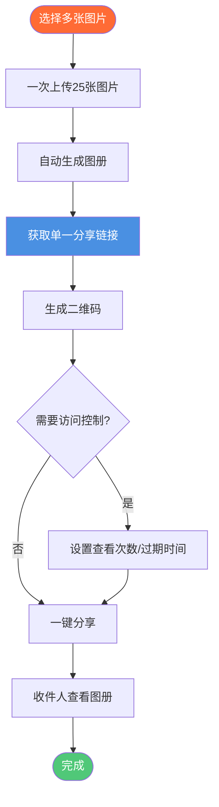

# 一键分享多张图片：图册分享简单快捷

  
需要<strong>快速分享多张图片</strong>？Maiimg让您一次上传最多25张图片，生成一个分享链接，创建二维码，一键分享整个图册。适合活动照片、作品集、产品图册和批量图片分享。无需注册。

## 什么是一键分享多张图片？

**一键分享多张图片**允许您一次上传多张图片，然后用一个链接分享所有图片。无需一张一张分享，创建一个图册，一键分享所有内容。

**优势：**
- ✅ **节省时间** - 瞬间分享25张图片
- ✅ **单一链接** - 一个链接包含所有图片
- ✅ **专业展示** - 精美的图册视图
- ✅ **轻松分享** - 通过链接或二维码分享
- ✅ **访问控制** - 控制谁可以看到图片

## 一键分享如何工作

### 完整分享流程

### 步骤1：上传多张图片

**上传流程：**
1. 访问 [Maiimg.com](https://maiimg.com)
2. 选择最多25张图片
3. 一次上传所有图片
4. 自动创建图册

**支持的格式：**
- 📸 PNG
- 🖼️ JPG/JPEG
- 🎭 GIF
- 🌐 WebP

**文件大小：**
- ✅ 每张图片最多50MB
- ✅ 快速批量上传

### 步骤2：获取分享链接

**您将获得：**
- ✅ **单一图册链接** - 一个链接包含所有图片
- ✅ **二维码** - 自动生成的二维码
- ✅ **图册视图** - 专业展示
- ✅ **直接链接** - 单张图片链接

**链接特点：**
- 简洁专业的URL
- 移动端友好
- 快速加载
- 易于分享

### 步骤3：一键分享

**分享方式：**
- 📧 **邮件** - 复制粘贴链接
- 💬 **消息** - WhatsApp、Slack、Teams
- 🌐 **社交媒体** - 发布链接
- 📱 **二维码** - 打印或展示

## 使用场景

### 1. 活动照片分享

**场景：** 与参与者分享活动照片

**流程：**
1. 上传20-25张活动照片
2. 获取单一图册链接
3. 生成二维码
4. 在活动现场或线上分享

**优势：**
- 所有照片一个链接
- 专业图册
- 轻松访问
- 追踪查看

### 2. 作品集展示

**场景：** 分享设计作品集

**流程：**
1. 上传作品集图片
2. 创建图册
3. 分享单一链接
4. 客户查看所有作品

**优势：**
- 专业展示
- 轻松分享
- 访问控制
- 追踪参与度

### 3. 产品图册

**场景：** 分享产品图片

**流程：**
1. 上传产品照片
2. 创建图册
3. 与客户分享
4. 追踪查看

**优势：**
- 多个产品，一个链接
- 专业展示
- 轻松分享
- 数据分析

### 4. 婚礼照片交付

**场景：** 交付婚礼照片

**流程：**
1. 上传婚礼照片
2. 创建图册
3. 与新人分享
4. 设置访问控制

**优势：**
- 所有照片集中一处
- 专业图册
- 隐私控制
- 轻松分享

## 高级功能

### 访问控制

**控制选项：**
- 🔢 **查看次数限制** - 设置最大打开次数
- ⏰ **过期时间** - 设置过期日期后自动失效
- ⬇️ **下载控制** - 启用/禁用下载
- ⏱️ **时间控制** - 设置可访问时间段

**优势：**
- 隐私保护
- 受控分享
- 安全性
- 合规性

### 二维码生成

**二维码特点：**
- 每个图册自动生成
- 移动端友好
- 易于打印
- 适合离线分享

**使用场景：**
- 活动材料
- 名片
- 营销材料
- 实体展示

### 追踪与分析

**您可以追踪：**
- 📊 图册总查看次数
- ⏰ 查看时间
- 📱 设备信息
- 📈 访问趋势

**优势：**
- 了解参与度
- 追踪分发情况
- 监控使用情况
- 衡量效果

## 对比：一键分享 vs 传统分享

### 一键分享（Maiimg）

**优势：**
- ✅ 一次上传25张图片
- ✅ 所有图片一个链接
- ✅ 专业图册
- ✅ 包含二维码
- ✅ 访问控制
- ✅ 实时追踪

### 传统分享

**劣势：**
- ❌ 一次分享一张图片
- ❌ 需要管理多个链接
- ❌ 没有图册视图
- ❌ 没有二维码
- ❌ 控制有限
- ❌ 没有追踪

## 最佳实践

### 1. 上传前整理

**提示：**
- 将相关图片分组
- 使用描述性名称
- 检查文件大小
- 验证格式

### 2. 设置适当的控制

**公开图册：**
- 最小限制
- 轻松访问
- 长期有效

**私密图册：**
- 查看次数限制
- 短期过期
- 禁用下载

### 3. 使用二维码

**最佳实践：**
- 生成二维码
- 在活动中打印
- 显著展示
- 轻松移动端访问

### 4. 监控使用情况

**定期检查：**
- 查看访问记录
- 检查查看次数
- 监控趋势
- 更新设置

## 常见问题

### 我可以分享多少张图片？

**最多25张：**
- 一次上传25张
- 自动创建图册
- 分享一个链接
- 专业展示

### 真的是一键吗？

**是的！** 简单流程：
1. 上传图片
2. 自动获取链接
3. 复制并分享
4. 完成！

### 我可以控制访问吗？

**可以！** 完全控制：
- 查看次数限制
- 过期日期
- 下载控制
- 时间限制

### 包含二维码吗？

**是的！** 自动生成：
- 每个图册都有二维码
- 移动端友好
- 易于打印
- 适合离线

## 结论：一键分享多张图片

Maiimg让**一键分享多张图片**变得简单：
- ✅ 上传最多25张图片
- ✅ 单一图册链接
- ✅ 包含二维码
- ✅ 访问控制
- ✅ 实时追踪
- ✅ 无需注册
- ✅ 完全免费

**准备分享多张图片？**

访问 [Maiimg.com](https://maiimg.com) 上传图片，一键分享图册。无需注册，完全免费。

---

**相关文章：**
- [社交媒体图片图册分享：完整指南](/blog/cn/social-media-image-gallery-sharing-guide)
- [安全私密图片分享：客户图片交付](/blog/cn/secure-private-image-sharing-client-delivery)
- [免费图片托管：完整指南](/blog/cn/free-image-hosting-maiimg-complete-guide)
