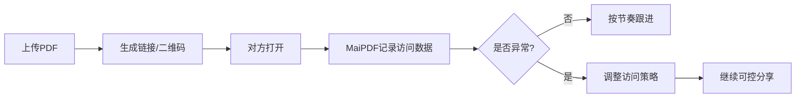

# PDF访问追踪入门：分享后到底发生了什么

  
把文件发出去只是开始。真正让分享“可控”的，是你能看见：谁看了、什么时候看、有没有异常。

## MaiPDF怎么解决这个问题

你要解决的是“分享后是否被看见、是否被误传、何时该跟进”。MaiPDF把这些变成可视化数据，并且可以直接在分享后调整策略：

- **可见性**：记录首次打开时间、总打开次数、重复打开次数
- **可判断**：看到异常地区/设备后，及时判断是否要收紧权限
- **可行动**：随时调整访问策略，让分享从“不可控”变“可控”

## 你最该先看三件事

- **首次打开时间**：决定跟进的最佳时机
- **重复打开次数**：判断对方是认真读还是反复找重点
- **基础环境信息**：做简单的风险判断（比如异常地区/设备）

## 怎么用（最简单的一套）

1. 发出链接/二维码
2. 看到首次打开后再跟进
3. 如果出现异常访问，立即调整分享策略（比如收紧权限）

