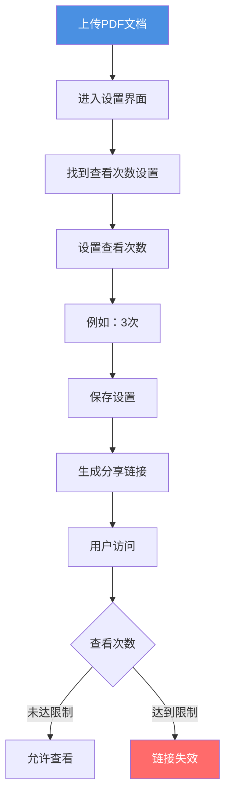
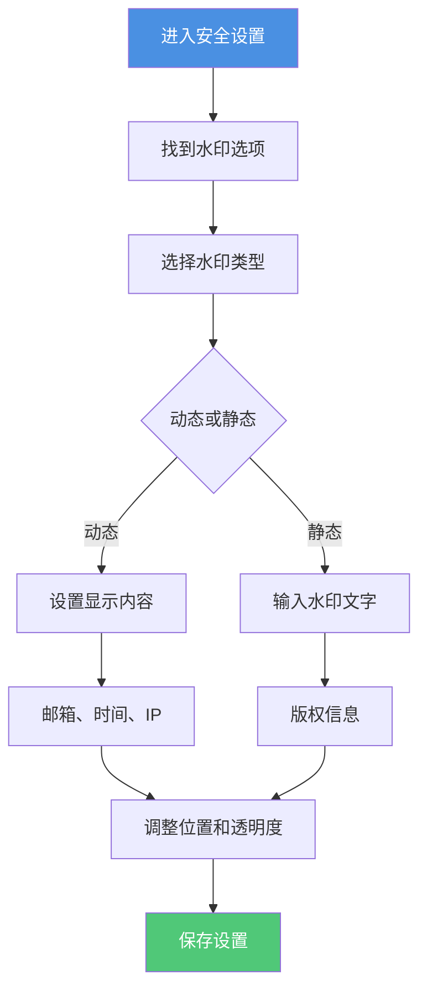
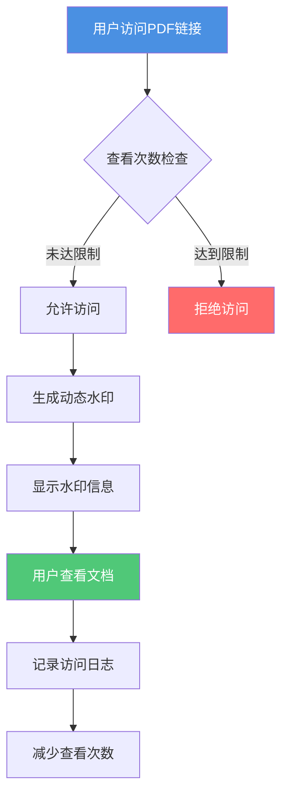

# PDF链接查看限制和水印：双重保护文档安全

  
分享PDF文档时，如何既限制访问次数，又能追踪泄露来源？<strong>查看次数限制</strong>和<strong>水印保护</strong>是两种有效的文档保护方法。本文将介绍如何同时使用这两种功能，为您的PDF文档提供双重保护。

## 为什么需要查看限制和水印？

### 查看限制的作用

**1. 控制访问次数**
- 限制文档的查看次数（如1-5次）
- 达到限制后链接自动失效
- 防止链接被多次分享使用

**2. 保护一次性文档**
- 适合机密文档、临时分享
- 确保文档只被查看指定次数
- 减少文档泄露风险

### 水印保护的作用

**1. 追踪泄露来源**
- 水印包含访问者唯一信息
- 即使截图转发也能识别来源
- 提供法律证据

**2. 威慑作用**
- 明确显示访问者身份
- 降低转发意愿
- 保护文档安全

## 如何设置查看限制

### 设置步骤

**详细操作：**

1. **进入设置界面**
   - 上传PDF后点击"设置"
   - 找到"访问控制"或"查看限制"

2. **设置查看次数**
   - 输入允许的查看次数（1-100次）
   - 建议设置：机密文档1-3次，一般文档5-10次

3. **保存设置**
   - 确认查看次数设置
   - 保存后生成分享链接

4. **监控查看情况**
   - 查看访问记录
   - 了解剩余查看次数
   - 及时处理异常访问

## 如何设置水印

### 水印类型

**1. 动态水印**
- 自动显示访问者信息
- 包含邮箱、访问时间、IP地址
- 每次访问显示不同内容

**2. 静态水印**
- 固定的文字或图片
- 显示版权信息或警告
- 适用于所有访问者

### 设置步骤

**详细操作：**

1. **启用水印功能**
   - 在设置中找到"水印"选项
   - 选择"启用水印"

2. **选择水印内容**
   - 动态水印：选择显示的信息（邮箱、时间、IP等）
   - 静态水印：输入要显示的文字

3. **调整水印样式**
   - 设置水印位置（居中、四角等）
   - 调整透明度（建议30-50%）
   - 选择字体大小和颜色

4. **保存并应用**
   - 预览水印效果
   - 保存设置
   - 水印将自动应用到文档

## 查看限制和水印的组合使用

### 双重保护流程

### 适用场景

**1. 机密文档**
- 查看限制：1-3次
- 水印：动态水印，显示访问者邮箱和时间
- 目的：严格控制访问，追踪泄露来源

**2. 商业提案**
- 查看限制：3-5次
- 水印：动态水印，显示公司名称和访问时间
- 目的：限制查看次数，保护商业机密

**3. 设计作品**
- 查看限制：5-10次
- 水印：静态水印，显示版权信息
- 目的：保护知识产权，防止未授权使用

## 最佳实践

### 查看次数设置建议

**根据文档重要性：**
- 绝密文档：1次
- 机密文档：2-3次
- 重要文档：5次
- 一般文档：10-20次

**根据使用场景：**
- 一次性查看：1次
- 临时分享：3-5次
- 长期分享：10-50次

### 水印设置建议

**动态水印内容：**
- 必选：访问时间
- 推荐：访问者邮箱
- 可选：IP地址、设备信息

**水印样式：**
- 位置：建议居中或四角
- 透明度：30-50%，不影响阅读
- 字体：清晰易读，大小适中

## 常见问题

### Q1: 查看次数限制是累计的吗？

**A:** 是的。查看次数是所有访问者的累计次数，达到设定值后链接就会失效。

### Q2: 水印会影响文档阅读吗？

**A:** 不会。水印通常设置为半透明，不会影响正常阅读，但能清晰显示信息。

### Q3: 可以同时设置查看限制和到期日期（仅离线版）吗？

**A:** 可以。两种限制可以同时使用，任一条件达到都会使链接失效。

### Q4: 动态水印会显示什么信息？

**A:** 可以根据需要选择显示：访问者邮箱、访问时间、IP地址、设备信息等。

### Q5: 如何知道谁查看了文档？

**A:** 可以通过访问记录查看所有访问信息，包括访问者、时间、IP地址等。

## 总结

PDF链接的查看限制和水印功能是保护文档安全的有效工具：

- ✅ **查看限制**：控制访问次数，防止链接被滥用
- ✅ **水印保护**：追踪泄露来源，提供法律证据
- ✅ **组合使用**：双重保护，全面保障文档安全

建议根据文档的重要性和使用场景，合理设置查看次数和水印内容，构建完善的文档保护体系。

