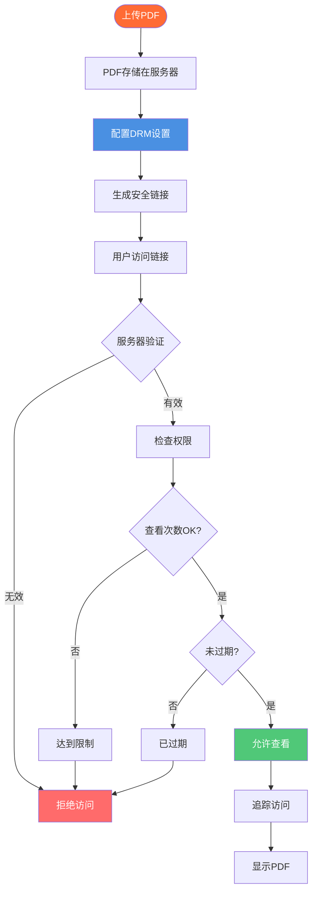

# PDF在线DRM：在线PDF数字版权管理完整指南

  
需要在线保护您的PDF文档？<strong>PDF在线DRM</strong>（数字版权管理）允许您控制访问、防止下载、限制查看次数并追踪PDF使用情况。本完整指南解释在线DRM的工作原理、功能特性，以及如何为您的文档实施PDF在线DRM保护。

## 什么是PDF在线DRM？

**PDF在线DRM**（数字版权管理）是一种通过控制PDF文档的访问、查看和分发方式来保护PDF文档的技术。与依赖密码或加密的传统PDF保护不同，在线DRM提供基于服务器的控制和实时管理。

**核心特点：**
- ✅ **基于服务器的控制** - 权限在服务器上管理
- ✅ **实时管理** - 即时更改设置
- ✅ **访问追踪** - 监控谁查看了文档
- ✅ **无需软件** - 任何浏览器可用
- ✅ **可撤销访问** - 随时禁用链接

## PDF在线DRM如何工作

### 在线DRM架构

### 步骤1：上传和配置

**流程：**
1. 上传PDF到在线平台
2. 配置DRM设置
3. 设置访问控制
4. 生成安全链接

**可用的DRM设置：**
- 查看次数限制
- 过期日期
- 下载防护
- 打印防护
- 访问控制

### 步骤2：服务器验证

**工作原理：**
- 用户访问链接
- 服务器验证权限
- 检查查看次数
- 验证过期时间
- 强制执行限制

**优势：**
- 实时控制
- 无法绕过
- 集中管理
- 审计追踪

### 步骤3：访问控制

**控制机制：**
- 仅查看模式
- 阻止下载
- 防止打印
- 防止复制
- 屏幕截图检测

## PDF在线DRM功能

### 1. 访问控制

**邮箱验证：**
- 访问前需要邮箱
- 限制特定邮箱
- 域名限制
- 基于邮箱的认证

**密码保护：**
- 设置访问密码
- 单独分享密码
- 额外安全层
- 访问控制

**手机验证：**
- 短信验证
- 双因素认证
- 增强安全性
- 移动端验证

### 2. 查看次数限制

**工作原理：**
- 设置最大查看次数（例如：10次）
- 服务器追踪每次查看
- 达到限制后链接失效
- 防止无限访问

**使用场景：**
- 机密文档：1-3次
- 客户预览：5-10次
- 培训材料：20-50次

### 3. 过期控制

**基于时间的过期：**
- 设置过期日期
- 过期后自动禁用
- 限时访问
- 自动清理

**优势：**
- 临时分享
- 隐私保护
- 合规支持
- 自动管理

### 4. 下载防护

**下载控制：**
- 禁用下载按钮
- 阻止右键保存
- 防止文件保存
- 仅查看模式

**为什么重要：**
- 保护版权
- 防止分发
- 控制访问
- 维护安全

### 5. 打印防护

**打印控制：**
- 阻止打印功能
- 防止物理副本
- 保护文档
- 增强安全性

### 6. 动态水印

**水印功能：**
- 查看者邮箱地址
- IP地址
- 时间戳
- 自定义文本

**优势：**
- 追踪谁访问了
- 阻止未授权分享
- 提供问责
- 支持合规

### 7. 访问追踪

**追踪能力：**
- 📊 总查看次数
- ⏰ 查看时间
- 📱 设备信息
- 🌍 IP地址
- 📧 邮箱地址
- 📈 访问模式

**优势：**
- 监控使用情况
- 检测未授权访问
- 追踪参与度
- 审计合规

## PDF在线DRM vs 传统保护

### 在线DRM优势

**实时控制：**
- ✅ 即时更改设置
- ✅ 立即撤销访问
- ✅ 随时更新权限
- ✅ 无需重新分发文件

**基于服务器的安全：**
- ✅ 无法绕过
- ✅ 集中管理
- ✅ 审计追踪
- ✅ 可扩展

**无需软件：**
- ✅ 任何浏览器可用
- ✅ 无需安装
- ✅ 跨平台
- ✅ 轻松访问

### 传统保护局限性

**密码保护：**
- ❌ 可能被分享
- ❌ 无查看限制
- ❌ 无过期
- ❌ 无追踪

**加密：**
- ❌ 一旦解密，无法控制
- ❌ 无访问限制
- ❌ 无追踪
- ❌ 设置复杂

## PDF在线DRM使用场景

### 1. 机密文档分享

**场景：** 分享敏感商业文档

**DRM设置：**
- 查看次数限制：3次
- 过期时间：7天
- 下载：禁用
- 打印：禁用
- 水印：启用

**优势：**
- 最大安全性
- 受控访问
- 访问追踪
- 合规

### 2. 客户文档交付

**场景：** 向客户交付文档

**DRM设置：**
- 查看次数限制：10次
- 过期时间：30天
- 下载：禁用
- 邮箱验证：必需

**优势：**
- 专业交付
- 访问控制
- 追踪参与度
- 保护内容

### 3. 培训材料分发

**场景：** 分享培训材料

**DRM设置：**
- 查看次数限制：20次
- 过期时间：90天
- 下载：启用
- 追踪：启用

**优势：**
- 受控分发
- 追踪完成情况
- 限时访问
- 数据分析

### 4. 电子书分发

**场景：** 分发电子书

**DRM设置：**
- 查看次数限制：无限制
- 过期时间：无
- 下载：禁用
- 打印：禁用

**优势：**
- 保护版权
- 防止盗版
- 追踪读者
- 控制分发

## 实施指南

### 步骤1：选择在线DRM平台

**关键功能：**
- ✅ 查看次数限制
- ✅ 过期控制
- ✅ 下载防护
- ✅ 访问追踪
- ✅ 轻松管理
- ✅ 无需软件

### 步骤2：上传PDF

**上传流程：**
1. 选择PDF文件
2. 上传到平台
3. 等待处理
4. 准备配置

### 步骤3：配置DRM设置

**基本设置：**
1. **设置查看次数限制**
   - 选择最大查看次数
   - 考虑文档敏感性
   - 设置适当限制

2. **设置过期时间**
   - 选择过期日期
   - 考虑使用场景
   - 设置时间限制

3. **禁用下载**
   - 关闭下载开关
   - 保护内容
   - 保持控制

4. **启用追踪**
   - 启用访问日志
   - 监控使用情况
   - 追踪参与度

### 步骤4：生成安全链接

**链接生成：**
1. 检查设置
2. 生成链接
3. 复制链接
4. 安全分享

### 步骤5：监控和管理

**持续管理：**
- 查看访问日志
- 检查查看次数
- 监控趋势
- 根据需要更新设置

## 最佳实践

### 1. 设置适当的限制

**机密文档：**
- 查看次数限制：1-3次
- 过期时间：1-7天
- 下载：禁用
- 打印：禁用

**客户交付：**
- 查看次数限制：5-10次
- 过期时间：14-30天
- 下载：禁用
- 追踪：启用

### 2. 使用访问控制

**最佳实践：**
- 启用邮箱验证
- 为敏感文档设置密码
- 使用域名限制
- 要求认证

### 3. 启用水印

**敏感文档：**
- 完整水印
- 邮箱 + IP + 时间戳
- 高可见性
- 阻止未授权分享

### 4. 定期监控

**定期检查：**
- 每日查看访问日志
- 检查未授权访问
- 监控查看次数
- 更新设置

### 5. 需要时撤销

**立即行动：**
- 一键禁用
- 即时撤销
- 保护文档
- 维护安全

## 常见问题

### 什么是PDF在线DRM？

**答案：** PDF在线DRM是一种通过基于服务器的管理控制访问、防止下载、限制查看次数并追踪使用情况来保护PDF文档的技术。

### 在线DRM如何工作？

**答案：** PDF存储在带有DRM设置的服务器上。用户访问链接时，服务器验证权限、强制执行限制并实时追踪访问。

### 在线DRM安全吗？

**答案：** 是的，在线DRM非常安全，因为：
- 基于服务器的控制无法绕过
- 实时验证
- 集中管理
- 审计追踪

### 用户可以下载受保护的PDF吗？

**答案：** 您控制这个。在线DRM允许您禁用下载，确保用户只能在线查看PDF，无法保存。

### 需要特殊软件吗？

**答案：** 不需要。PDF在线DRM在任何网页浏览器中都可以使用。查看者无需安装软件。

### 分享后可以更改设置吗？

**答案：** 可以！在线DRM的关键优势之一是您可以随时更改设置、撤销访问或更新权限，即使在分享之后也可以。

## 对比：在线DRM vs 离线DRM

### 在线DRM

**优势：**
- ✅ 实时控制
- ✅ 即时撤销
- ✅ 无需文件分发
- ✅ 集中管理
- ✅ 轻松更新

**适合：**
- 频繁更新
- 需要实时控制
- 访问追踪
- 基于云的工作流

### 离线DRM

**优势：**
- ✅ 离线工作
- ✅ 无需互联网
- ✅ 本地控制
- ✅ 可携带

**适合：**
- 离线环境
- 隔离系统
- 便携分发
- 有限连接

## 结论：PDF在线DRM

PDF在线DRM提供强大的文档保护功能：
- ✅ 实时访问控制
- ✅ 查看次数限制和过期
- ✅ 下载和打印防护
- ✅ 动态水印
- ✅ 全面追踪
- ✅ 即时撤销
- ✅ 无需软件
- ✅ 轻松管理

**准备用在线DRM保护您的PDF？**

MaiPDF提供免费的PDF在线DRM，包含所有这些功能。上传您的PDF，配置DRM设置，生成安全链接，保护您的文档。无需注册。

---

**相关文章：**
- [离线PDF DRM：企业解决方案](/blog/cn/offline-pdf-drm-enterprise-solution)
- [PDF访问控制：完整指南](/blog/cn/pdf-access-control-complete-guide)
- [PDF加密在线分享：完整指南](/blog/cn/pdf-encryption-online-sharing-complete-guide)
