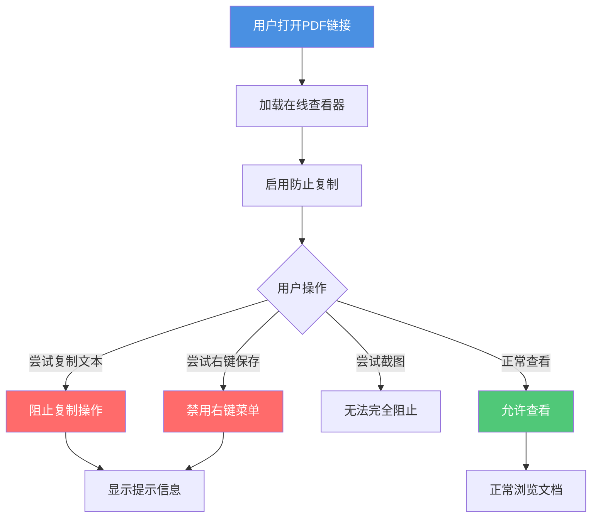
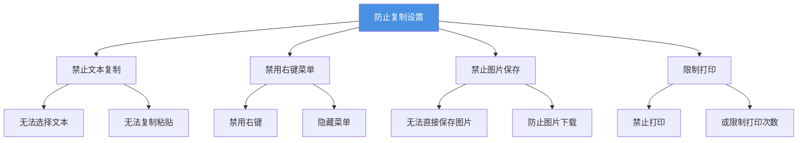

# PDF在线查看器防止复制：保护文档内容不被复制

  
分享PDF文档时，如何防止接收者复制文档内容？<strong>防止复制功能</strong>可以有效阻止文本复制、图片保存等操作，保护文档内容安全。本文将介绍如何设置PDF在线查看器的防止复制功能。

## 为什么需要防止复制？

### 常见使用场景

**1. 版权内容保护**
- 原创文章、研究报告
- 防止内容被复制后重新发布
- 保护知识产权

**2. 商业机密保护**
- 产品方案、商业计划
- 防止内容被复制给竞争对手
- 保护商业机密

**3. 教育内容管理**
- 课程材料、考试题目
- 防止学生复制答案
- 保护教学资源

**4. 设计作品保护**
- 设计稿、创意方案
- 防止设计被复制使用
- 保护创意成果

## 防止复制的工作原理

### 保护机制

**保护内容：**
- ✅ 禁止文本选择和复制
- ✅ 禁用右键菜单
- ✅ 防止图片直接保存
- ✅ 限制打印功能

## 如何设置防止复制

### 设置步骤

**1. 上传PDF文档**
   - 选择需要保护的PDF文件
   - 等待上传完成

**2. 进入安全设置**
   - 点击"设置"或"安全设置"
   - 找到"内容保护"选项

**3. 启用防止复制**
   - 选择"禁止复制"选项
   - 可以同时禁用右键菜单
   - 确认设置

**4. 生成分享链接**
   - 保存设置后生成链接
   - 将链接分享给接收者

### 设置选项

## 防止复制的效果

### 用户可以做什么

- ✅ 正常查看文档内容
- ✅ 翻页浏览
- ✅ 放大缩小查看
- ✅ 搜索文档内容（如果允许）

### 用户无法做什么

- ❌ 选择和复制文本
- ❌ 使用右键菜单
- ❌ 直接保存图片
- ❌ 打印文档（如果设置禁止）

## 防止复制的限制

### 无法完全防止的情况

**1. 截图**
- 用户仍可以使用截图工具
- 无法完全阻止屏幕截图
- 建议配合水印使用

**2. 屏幕录制**
- 可以使用录屏工具记录
- 无法阻止视频录制
- 需要其他保护措施

**3. 手动输入**
- 用户可能手动输入内容
- 无法阻止人工复制
- 适合保护大量内容

### 建议配合使用

**1. 水印保护**
- 添加动态水印
- 即使截图也能追踪来源
- 提供法律证据

**2. 访问控制**
- 设置查看次数限制
- 限制访问时间
- 控制访问范围

**3. 禁止下载**
- 禁止下载PDF文件
- 只能在线查看
- 减少内容泄露风险

## 最佳实践

### 适用场景

**适合使用防止复制：**
- 版权内容、原创文章
- 商业机密、内部资料
- 教育内容、考试题目
- 设计作品、创意方案

**不适合使用防止复制：**
- 需要用户复制引用的文档
- 公开分享的参考资料
- 需要打印的文档
- 需要编辑的文档

### 设置建议

**1. 明确告知用户**
- 说明文档禁止复制
- 解释保护原因
- 提供必要的使用指导

**2. 合理设置权限**
- 根据文档重要性选择保护级别
- 平衡安全性和可用性
- 避免过度限制影响使用

**3. 配合其他措施**
- 结合水印、访问控制等功能
- 构建多层次保护体系
- 定期检查打开统计

## 常见问题

### Q1: 防止复制后，用户还能查看文档吗？

**A:** 可以。防止复制只是阻止复制操作，用户仍然可以正常查看文档内容。

### Q2: 可以只禁止复制文本，允许打印吗？

**A:** 可以。在设置中可以分别控制复制、打印等不同权限。

### Q3: 防止复制会影响文档加载速度吗？

**A:** 影响很小。防止复制功能对文档加载速度的影响几乎可以忽略。

### Q4: 如何知道是否有人尝试复制？

**A:** 可以通过打开统计查看用户行为，但无法完全检测到所有复制尝试。

### Q5: 可以临时允许复制吗？

**A:** 可以。在设置中可以随时修改复制权限，允许或禁止复制。

## 总结

PDF在线查看器的防止复制功能是保护文档内容安全的重要工具：

- ✅ **防止文本复制**：阻止内容被复制和滥用
- ✅ **保护知识产权**：保护原创内容和创意
- ✅ **控制内容传播**：减少内容泄露风险
- ✅ **配合其他功能**：构建完善的保护体系

记住，防止复制不是万能的，建议结合水印、访问控制、禁止下载等功能，构建多层次的文档保护体系，全面保障文档安全。

