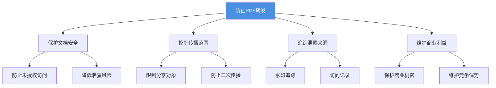
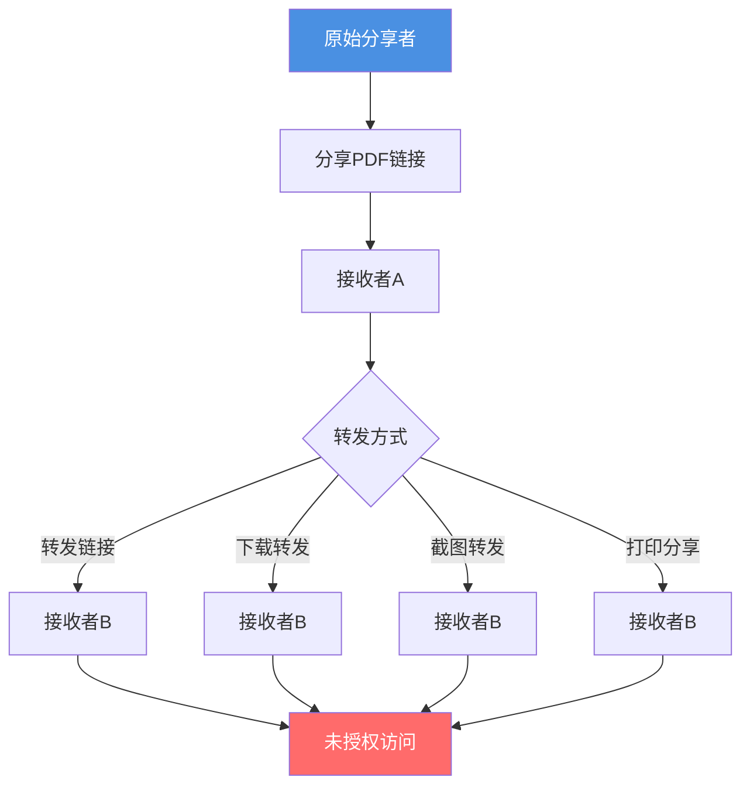
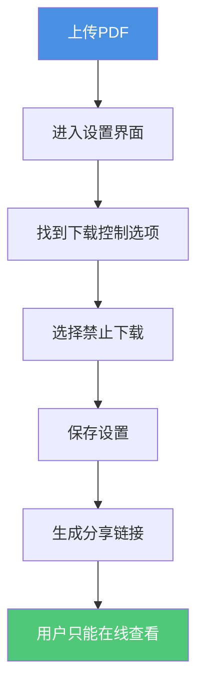
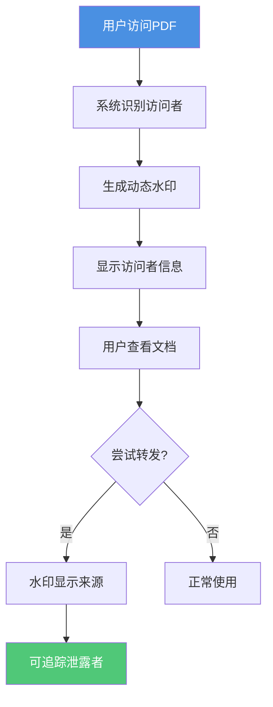
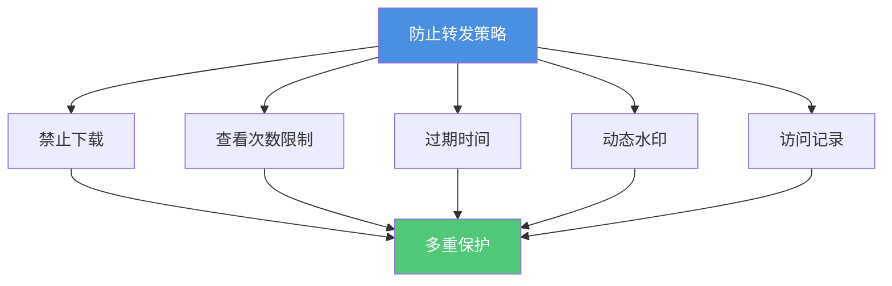
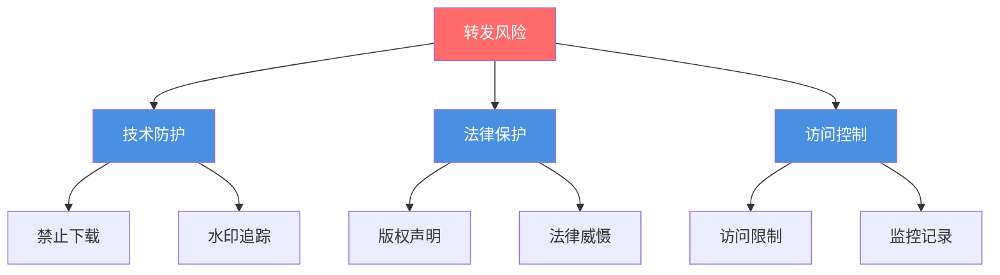

# PDF防止转发：如何阻止文档被二次分享的完整指南

  
分享PDF文档时，您是否担心文档被接收者转发给其他人？<strong>防止转发</strong>是保护文档安全的关键措施。本文将详细介绍如何通过多种方法防止PDF文档被二次分享，确保您的文档只在授权范围内传播。

## 为什么需要防止PDF转发？

### 转发带来的安全风险

**1. 未经授权传播**
- 文档被转发给未授权人员
- 无法控制文档的传播范围
- 机密信息可能泄露给竞争对手

**2. 版权和知识产权风险**
- 原创内容被非法传播
- 设计作品被未经授权使用
- 商业机密被泄露

**3. 隐私信息泄露**
- 个人资料被广泛传播
- 敏感信息被恶意分享
- 无法追踪泄露来源

**4. 商业损失**
- 产品方案被提前泄露
- 价格信息被竞争对手获取
- 商业策略被分析

### 防止转发的必要性

## PDF转发的常见方式

### 转发方式分析

**1. 直接转发链接**
- 复制分享链接发送给他人
- 通过社交媒体分享
- 通过邮件转发

**2. 下载后转发文件**
- 下载PDF文件
- 通过邮件附件转发
- 通过云盘分享

**3. 截图转发**
- 截取PDF页面
- 通过图片形式分享
- 通过社交媒体传播

**4. 打印后分享**
- 打印PDF文档
- 扫描成电子版
- 重新分享

### 转发流程图

## 防止PDF转发的方法

### 方法1：禁止下载

**原理：**
- 文档只能在线查看
- 无法下载到本地
- 防止文件被转发

**设置步骤：**

**优势：**
- ✅ 完全阻止文件下载
- ✅ 文档始终在服务器控制下
- ✅ 无法通过文件转发

**限制：**
- ⚠️ 无法完全防止截图
- ⚠️ 无法防止打印

### 方法2：设置访问限制

**2.1 查看次数限制**

**设置方法：**
- 限制文档查看次数（如1-5次）
- 达到限制后链接失效
- 防止链接被多次分享

**适用场景：**
- 机密文档
- 一次性访问
- 临时分享

**2.2 过期时间设置**

**设置方法：**
- 设置链接自动过期时间
- 过期后无法访问
- 限制文档的有效期

**适用场景：**
- 临时分享
- 限时活动
- 定期更新文档

**2.3 IP地址限制**

**设置方法：**
- 限制特定IP地址访问
- 防止异地访问
- 增强安全性

### 方法3：动态水印保护

**原理：**
- 在PDF上添加动态水印
- 显示访问者信息
- 追踪泄露来源

**水印内容：**
- 访问者邮箱
- 访问时间
- IP地址
- 访问者姓名

**优势：**
- ✅ 威慑作用
- ✅ 追踪泄露来源
- ✅ 法律证据

**流程图：**

### 方法4：访问记录和监控

**功能：**
- 记录每次访问
- 追踪访问者信息
- 监控异常访问

**记录内容：**
- 访问时间
- IP地址
- 设备信息
- 地理位置

**优势：**
- ✅ 及时发现异常
- ✅ 追踪转发行为
- ✅ 提供证据

### 方法5：组合使用多种方法

**最佳实践：**

**组合方案：**

| 安全级别 | 禁止下载 | 查看次数 | 过期时间 | 水印 | 访问记录 |
|---------|---------|---------|---------|------|---------|
| 基础 | ✅ | - | - | - | ✅ |
| 标准 | ✅ | ✅ | ✅ | - | ✅ |
| 高级 | ✅ | ✅ | ✅ | ✅ | ✅ |
| 最高 | ✅ | ✅ | ✅ | ✅ | ✅ |

## 防止转发的完整设置流程

### 步骤1：上传PDF文件

1. 访问PDF分享平台
2. 拖拽或选择PDF文件
3. 等待上传完成

### 步骤2：设置安全选项

**禁止下载设置：**
1. 进入设置界面
2. 找到"下载控制"选项
3. 选择"禁止下载"
4. 保存设置

**查看次数限制：**
1. 找到"查看次数限制"选项
2. 设置合适的查看次数（建议1-5次）
3. 保存设置

**过期时间设置：**
1. 找到"过期时间"选项
2. 设置合适的过期时间
3. 保存设置

**动态水印设置：**
1. 找到"水印"选项
2. 启用动态水印
3. 选择显示内容
4. 保存设置

### 步骤3：生成分享链接

1. 确认所有设置
2. 生成分享链接
3. 复制链接
4. 发送给授权用户

### 步骤4：监控访问情况

1. 定期查看访问记录
2. 监控异常访问
3. 及时发现转发行为
4. 采取相应措施

## 防止转发的应用场景

### 场景1：商业合同分享

**需求：**
- 防止合同被转发
- 保护商业机密
- 追踪访问记录

**设置方案：**
- ✅ 禁止下载
- ✅ 查看次数限制：3-5次
- ✅ 过期时间：7-14天
- ✅ 动态水印
- ✅ 访问记录

### 场景2：产品方案展示

**需求：**
- 防止方案泄露
- 控制查看范围
- 追踪泄露来源

**设置方案：**
- ✅ 禁止下载
- ✅ 查看次数限制：1-3次
- ✅ 过期时间：3-7天
- ✅ 动态水印（必须）
- ✅ 访问记录

### 场景3：培训资料分享

**需求：**
- 防止资料被转发
- 控制使用范围
- 保护版权

**设置方案：**
- ✅ 禁止下载（可选）
- ✅ 查看次数限制：10-20次
- ✅ 过期时间：30天
- ✅ 水印（可选）
- ✅ 访问记录

## 防止转发的局限性

### 无法完全防止的情况

**1. 截图转发**
- 无法完全防止截图
- 可以通过水印追踪
- 法律威慑作用

**2. 打印后分享**
- 无法防止打印
- 可以禁止打印功能
- 配合水印使用

**3. 屏幕录制**
- 无法防止录屏
- 可以通过水印追踪
- 法律保护

### 应对策略

## 最佳实践建议

### 1. 多层防护

**建议组合：**
- 禁止下载 + 查看次数限制
- 过期时间 + 动态水印
- 访问记录 + IP限制

### 2. 根据重要性设置

**机密文档：**
- 禁止下载（必须）
- 查看次数：1-3次
- 过期时间：3-7天
- 动态水印（必须）

**重要文档：**
- 禁止下载
- 查看次数：3-10次
- 过期时间：7-30天
- 水印（可选）

**一般文档：**
- 下载控制（可选）
- 查看次数：10-50次
- 过期时间：30-90天
- 访问记录

### 3. 定期监控

**监控要点：**
- 定期查看访问记录
- 关注异常访问行为
- 及时发现转发行为
- 采取相应措施

## 常见问题解答

### Q1: 禁止下载后，用户还能转发吗？

**A:** 可以转发链接，但无法转发文件。建议配合查看次数限制和过期时间使用。

### Q2: 动态水印会影响阅读体验吗？

**A:** 现代水印技术可以做到不影响阅读，同时起到威慑和追踪作用。

### Q3: 如何知道文档被转发了？

**A:** 通过访问记录可以查看异常访问，动态水印可以追踪泄露来源。

### Q4: 可以完全防止转发吗？

**A:** 无法100%防止，但通过多重防护措施可以大大降低转发风险。

## 总结

防止PDF转发需要综合使用多种方法：

- ✅ **禁止下载** - 防止文件被转发
- ✅ **访问限制** - 控制查看次数和过期时间
- ✅ **动态水印** - 追踪泄露来源
- ✅ **访问记录** - 监控异常行为
- ✅ **组合使用** - 多重防护更安全

**立即开始使用：** 上传您的PDF文档，设置防止转发选项，保护您的文档安全！

