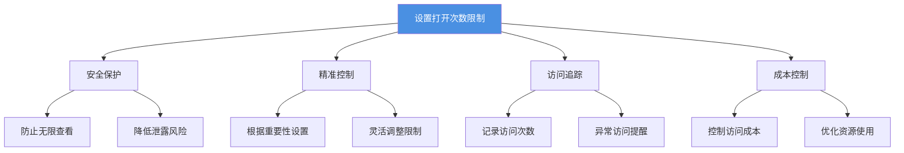
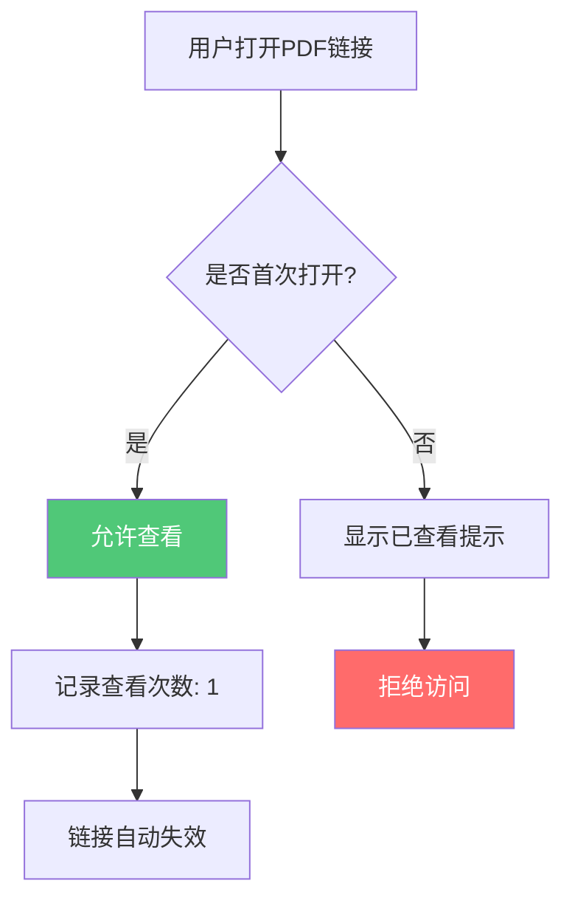
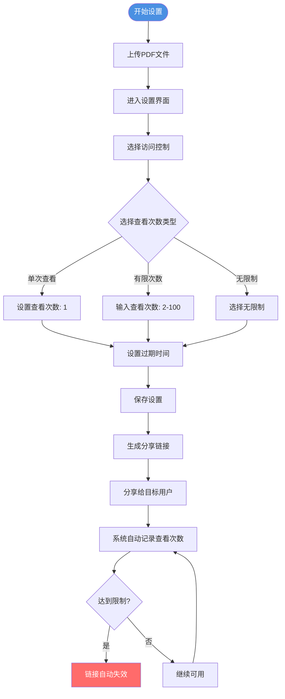
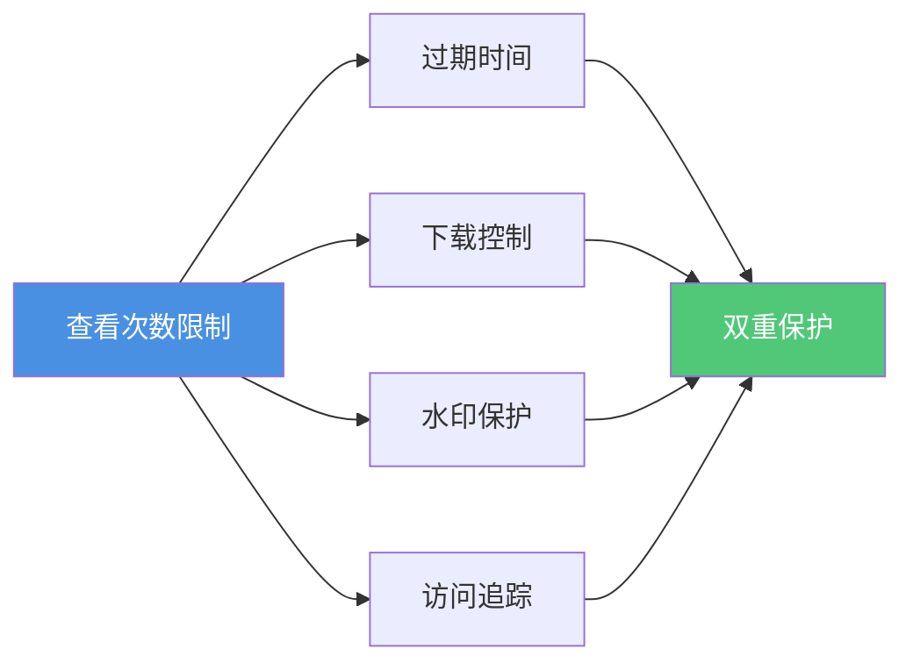
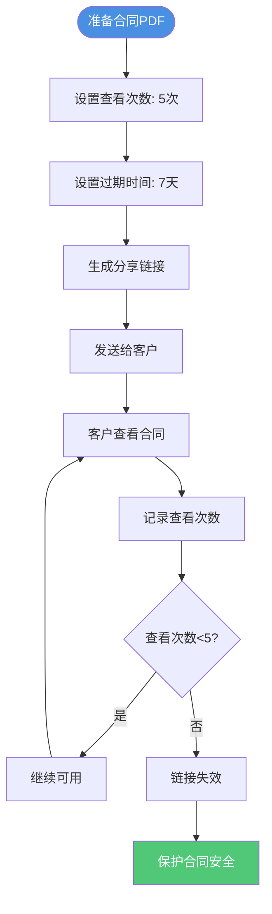

# PDF设置打开次数限制：精准控制文档访问权限的完整指南

  
分享重要PDF文档时，您是否担心文档被无限次查看？<strong>设置打开次数限制</strong>是保护文档安全的关键功能。本文将详细介绍如何设置PDF文档的查看次数限制，帮助您实现对文档访问的精准控制。

## 为什么需要设置PDF打开次数限制？

### 常见安全问题

**1. 无限访问风险**
- PDF分享后，任何人都可以无限次查看
- 无法控制文档的访问频率
- 重要信息可能被反复研究

**2. 机密资料泄露**
- 商业机密被多次查看
- 竞争对手可能反复分析文档内容
- 无法追踪异常访问行为

**3. 隐私信息暴露**
- 个人资料被恶意传播
- 敏感信息被多次访问
- 无法收回已分享的文档

**4. 商业损失**
- 产品方案被多次查看
- 价格信息被反复研究
- 商业策略可能泄露

### 设置打开次数限制的优势

## PDF打开次数限制的类型

### 1. 单次查看（一次性访问）

**适用场景：**
- 极度敏感的机密文档
- 一次性报价单
- 临时访问凭证
- 阅后即焚文档

**特点：**
- 文档只能被打开一次
- 查看后链接自动失效
- 最高级别的安全保护

**流程图：**

### 2. 有限次数查看

**适用场景：**
- 商业合同（3-5次）
- 产品手册（5-10次）
- 培训资料（10-20次）
- 活动资料（20-50次）

**特点：**
- 可设置2-100次查看限制
- 达到限制后链接失效
- 实时显示剩余次数

**设置选项：**

| 查看次数 | 适用场景 | 安全级别 |
|---------|---------|---------|
| 2-5次 | 机密合同、报价单 | ⭐⭐⭐⭐⭐ |
| 5-10次 | 产品手册、方案书 | ⭐⭐⭐⭐ |
| 10-20次 | 培训资料、报告 | ⭐⭐⭐ |
| 20-50次 | 活动资料、宣传册 | ⭐⭐ |
| 50-100次 | 公开资料、参考文档 | ⭐ |

### 3. 无限制查看

**适用场景：**
- 公开资料
- 长期有效的文档
- 参考文档
- 宣传材料

**特点：**
- 不限制查看次数
- 适合长期分享
- 配合过期时间使用

## 如何设置PDF打开次数限制

### 完整设置流程

### 详细操作步骤

**步骤1：上传PDF文件**
1. 访问PDF分享平台
2. 拖拽或选择PDF文件上传
3. 等待上传完成

**步骤2：进入设置界面**
1. 点击"设置"或"访问控制"
2. 找到"查看次数限制"选项
3. 选择限制类型

**步骤3：设置查看次数**

**单次查看设置：**
- 选择"单次查看"选项
- 系统自动设置为1次
- 查看后链接立即失效

**有限次数设置：**
- 选择"有限次数"选项
- 输入具体查看次数（2-100）
- 建议根据文档重要性设置

**无限制设置：**
- 选择"无限制"选项
- 可配合过期时间使用
- 适合长期分享的文档

**步骤4：保存并分享**
1. 确认设置无误
2. 保存设置
3. 复制分享链接
4. 发送给目标用户

## 查看次数限制的最佳实践

### 根据文档类型设置

**机密文档（1-3次）**
- 商业合同
- 报价单
- 机密方案
- 个人隐私资料

**重要文档（3-10次）**
- 产品手册
- 项目方案
- 培训资料
- 财务报告

**一般文档（10-50次）**
- 活动资料
- 宣传册
- 参考文档
- 公开资料

### 配合其他安全措施

**组合使用：**
- **查看次数 + 过期时间**：双重时间控制
- **查看次数 + 下载禁止**：防止本地保存
- **查看次数 + 水印**：追踪泄露来源
- **查看次数 + 访问记录**：完整的安全监控

## 查看次数限制的应用场景

### 场景1：商业合同分享

**设置建议：**
- 查看次数：3-5次
- 过期时间：7-14天
- 配合下载禁止
- 启用访问记录

### 场景2：产品手册分发

**设置建议：**
- 查看次数：10-20次
- 过期时间：30天
- 允许下载（可选）
- 启用水印

### 场景3：培训资料分享

**设置建议：**
- 查看次数：20-50次
- 过期时间：60天
- 允许下载
- 访问统计

## 查看次数限制的监控和管理

### 实时访问监控

**查看访问记录：**
- 总查看次数
- 剩余查看次数
- 每次查看时间
- 访问者信息

### 异常访问提醒

**监控指标：**
- 短时间内多次访问
- 异常IP地址访问
- 达到查看次数限制
- 过期前频繁访问

### 管理操作

**可执行操作：**
- 查看详细访问记录
- 修改查看次数限制
- 重置查看次数（如支持）
- 提前禁用链接

## 常见问题解答

### Q1: 查看次数限制会影响用户体验吗？

**A:** 不会。合理的查看次数设置既能保护文档安全，又不会影响正常使用。建议根据文档重要性设置适当的次数。

### Q2: 可以修改已设置的查看次数吗？

**A:** 可以。大多数平台支持在文档分享后修改查看次数限制，但已查看的次数不会重置。

### Q3: 查看次数达到限制后，链接会怎样？

**A:** 链接会自动失效，用户无法再访问文档。您可以生成新链接或修改限制继续分享。

### Q4: 如何选择合适的查看次数？

**A:** 建议根据以下因素：
- 文档重要性
- 分享对象
- 使用场景
- 安全要求

## 总结

设置PDF打开次数限制是保护文档安全的重要措施：

- ✅ **精准控制** - 根据文档重要性设置合适的查看次数
- ✅ **安全保护** - 防止文档被无限次查看和传播
- ✅ **灵活管理** - 支持单次、有限次数、无限制等多种模式
- ✅ **实时监控** - 记录每次访问，追踪异常行为
- ✅ **组合使用** - 配合过期时间、下载控制等实现全面保护

**立即开始使用：** 上传您的PDF文档，设置查看次数限制，保护您的文档安全！

