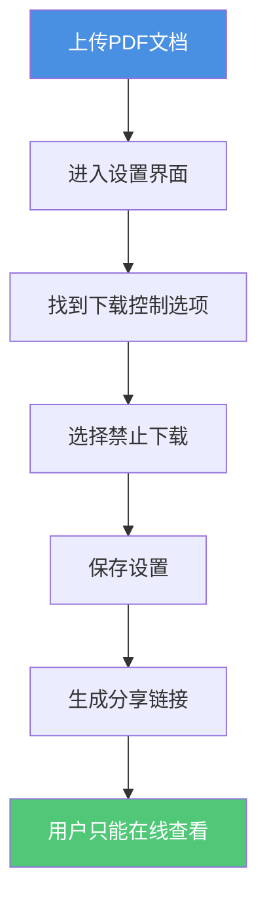

# PDF分享链接禁止下载：如何设置仅在线查看

  
分享PDF文档时，您是否希望接收者只能在线查看，而不能下载保存？<strong>禁止下载功能</strong>可以有效防止文档被保存和转发。本文将介绍如何设置PDF分享链接的禁止下载功能，确保文档安全。

## 为什么需要禁止下载？

### 常见使用场景

**1. 商业文档保护**
- 合同、提案等重要文档
- 防止文档被保存后转发给竞争对手
- 控制文档的传播范围

**2. 教育内容管理**
- 课程材料、作业答案
- 学生可以查看但不能保存
- 防止内容被广泛传播

**3. 敏感信息保护**
- 财务报告、内部资料
- 限制文档的保存和分发
- 保护商业机密

**4. 临时文档分享**
- 草稿文档、待审核内容
- 避免旧版本被保存
- 确保查看最新版本

## 如何设置禁止下载

### 设置步骤

**详细操作：**

1. **上传PDF文档**
   - 选择需要分享的PDF文件
   - 等待上传完成

2. **进入设置界面**
   - 点击"设置"或"安全设置"
   - 找到"下载控制"选项

3. **启用禁止下载**
   - 选择"禁止下载"选项
   - 确认设置

4. **生成分享链接**
   - 保存设置后生成链接
   - 将链接分享给接收者

## 禁止下载的效果

### 用户可以做什么

- ✅ 在线查看完整文档
- ✅ 翻页浏览所有内容
- ✅ 放大缩小查看细节
- ✅ 在任何设备上查看（手机、平板、电脑）

### 用户无法做什么

- ❌ 下载文件到本地
- ❌ 保存PDF文件
- ❌ 通过文件转发给他人
- ❌ 离线查看文档

## 禁止下载的优势

**1. 防止文件转发**
- 文档无法被保存为文件
- 减少文档被转发的风险
- 保持对文档的控制

**2. 保护文档安全**
- 文档始终在服务器控制下
- 可以随时撤销访问权限
- 记录访问日志

**3. 简化文档管理**
- 无需担心多个文件版本
- 确保查看的是最新版本
- 便于更新和维护

## 注意事项

### 限制说明

**无法完全防止的情况：**
- ⚠️ 截图：用户仍可以截图保存内容
- ⚠️ 屏幕录制：可以使用录屏工具记录

**注意：** 禁止下载功能会自动禁止打印，因为打印到PDF等同于下载保存。因此设置禁止下载后，用户无法通过打印方式保存文档。

**建议配合使用：**
- 结合水印功能，即使截图也能追踪来源
- 设置查看次数限制，防止链接被滥用
- 设置过期时间，限制文档的有效期

## 最佳实践

**1. 明确告知接收者**
- 说明文档只能在线查看
- 解释禁止下载的原因
- 提供必要的查看指导

**2. 选择合适的文档**
- 适合临时分享的文档
- 需要定期更新的内容
- 不需要长期保存的资料

**3. 配合其他安全措施**
- 设置访问密码
- 限制查看次数
- 添加动态水印

## 常见问题

### Q1: 禁止下载后，用户还能查看文档吗？

**A:** 可以。禁止下载只是阻止保存文件，用户仍然可以在线查看完整文档内容。

### Q2: 如何知道是否有人尝试下载？

**A:** 可以通过访问记录查看用户的访问行为，但无法完全检测到所有下载尝试。

### Q3: 禁止下载会影响文档加载速度吗？

**A:** 不会。禁止下载功能对文档加载速度没有影响。

### Q4: 设置禁止下载后，可以临时允许下载吗？

**A:** 不可以。一旦设置了禁止下载，就无法再修改这个属性。如果需要允许下载，需要重新上传PDF并生成新的分享链接。

### Q5: 禁止下载后还能打印吗？

**A:** 不能。禁止下载功能会自动禁止打印。因为如果允许打印，用户可以通过"打印到PDF"的方式将文档保存为PDF文件，这等同于下载保存。因此，禁止下载和禁止打印是关联的，无法单独设置。

## 总结

PDF分享链接的禁止下载功能是保护文档安全的重要工具。通过设置禁止下载，您可以：

- ✅ 防止文档被保存和转发
- ✅ 保持对文档的控制
- ✅ 简化文档管理流程
- ✅ 保护敏感信息

记住，禁止下载不是万能的，建议结合其他安全措施，如密码保护、访问限制、水印等，构建多层次的文档保护体系。

