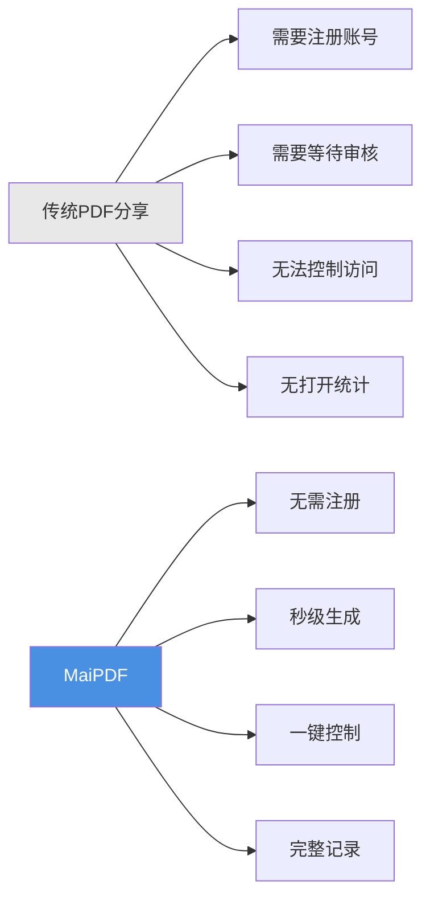
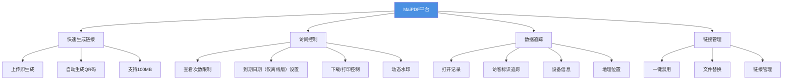
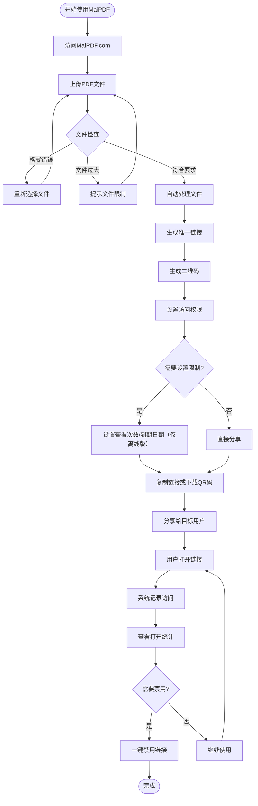
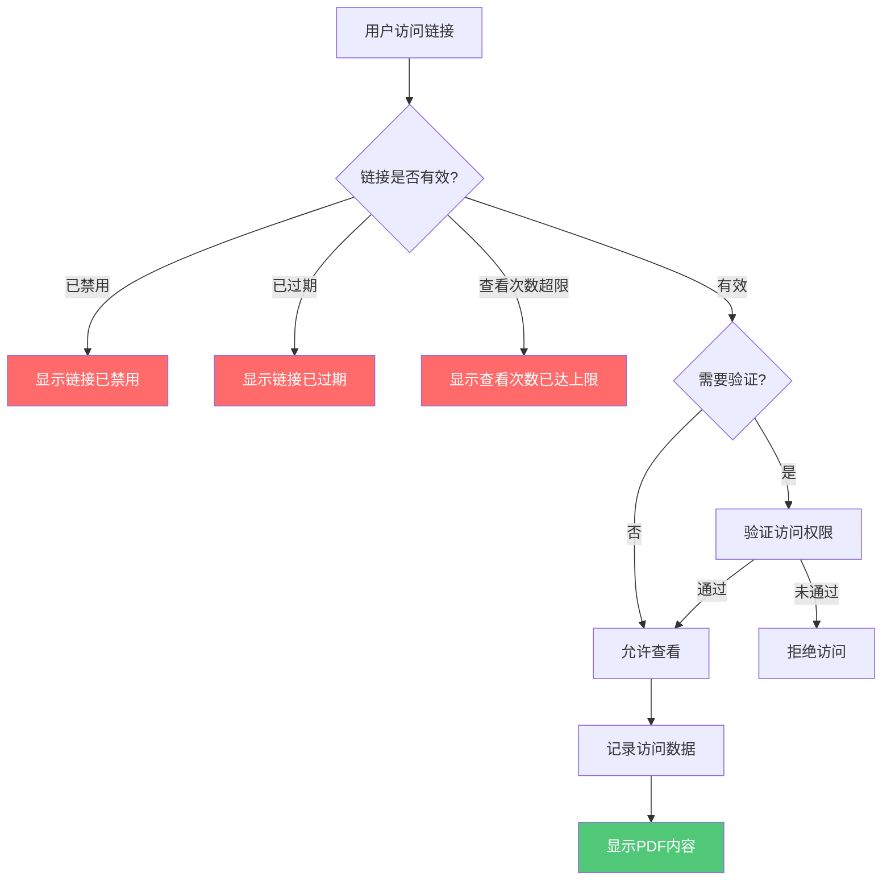
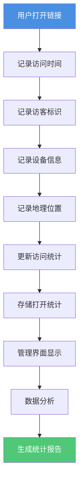
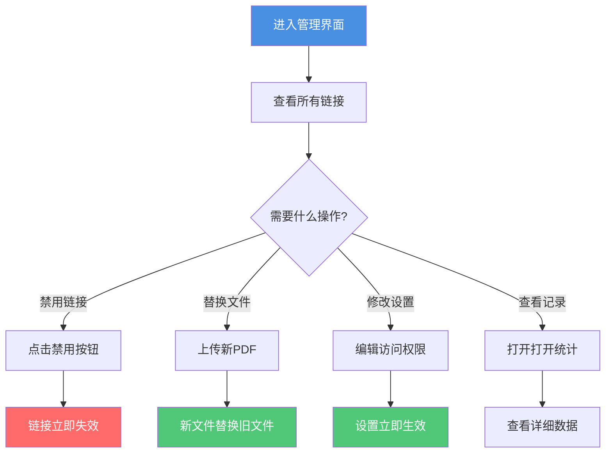
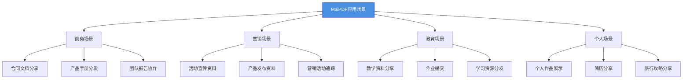
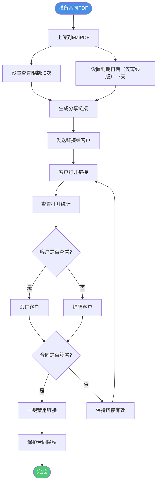
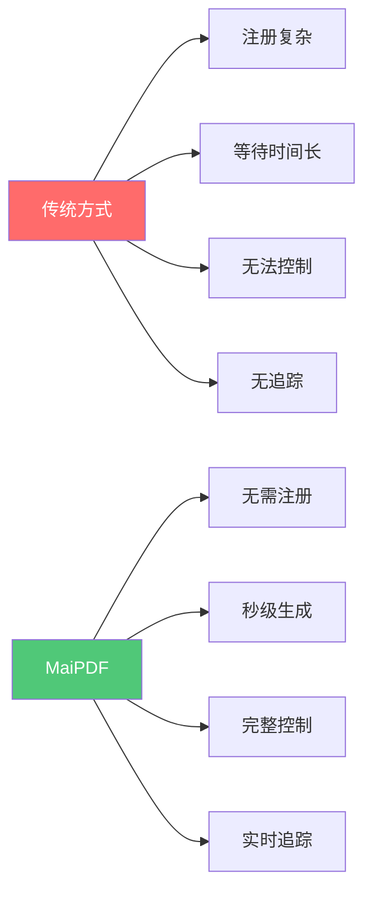
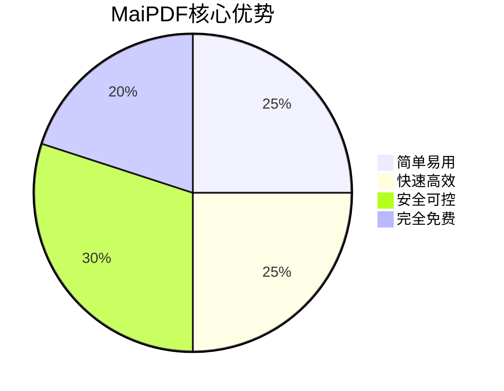

# MaiPDF完整介绍：专业PDF分享平台，让文档分享变得简单安全

  
<strong>MaiPDF</strong> 是一个专业的PDF在线分享平台，让您无需注册即可快速生成分享链接，随时控制访问权限，实时追踪文档打开情况。无论是商务合同、产品手册还是团队报告，MaiPDF都能让文档分享变得简单、安全、可控。

## 什么是MaiPDF？

### 平台定位

MaiPDF是一个**在线PDF分享和管理平台**，专注于提供简单、安全、可控的文档分享解决方案。

**核心特点：**
- ✅ **无需注册** - 即传即用，零门槛
- ✅ **秒级生成** - 上传后10秒内生成链接
- ✅ **完全免费** - 基础功能完全免费使用
- ✅ **专业安全** - 访问控制、水印保护、数据追踪

### MaiPDF vs 传统方式

## 核心功能一览

### 功能架构图

## 完整使用流程

### 从上传到分享的完整流程

### 三步快速上手

**第一步：上传PDF**
- 访问 MaiPDF.com
- 拖拽或选择PDF文件
- 支持最大100MB

**第二步：生成链接**
- 自动生成分享链接
- 自动生成二维码
- 可设置访问权限

**第三步：分享使用**
- 复制链接分享
- 或下载二维码分享
- 实时查看打开统计

## 核心功能详解

### 功能一：快速生成链接

**特点：**
- ⚡ 秒级生成（通常10秒内）
- 🔗 自动生成唯一链接
- 📱 自动生成二维码
- 💾 支持最大100MB文件

**流程图：**

### 功能二：访问控制

**可设置的控制项：**

| 控制项 | 说明 | 应用场景 |
|--------|------|----------|
| 查看次数限制 | 限制PDF可被打开的次数 | 合同文档、机密资料 |
| 到期日期（仅离线版） | 设置链接自动失效时间 | 临时分享、活动资料 |
| 下载控制 | 禁止或允许下载PDF | 保护版权、防止传播 |
| 打印控制 | 禁止或允许打印PDF | 防止复制、保护内容 |
| 动态水印 | 显示访问者信息的水印 | 追踪泄露、身份识别 |

**访问控制流程图：**

### 功能三：数据追踪

**追踪内容：**
- 📊 总打开次数
- ⏰ 每次打开的时间
- 🌐 访问者访客标识
- 📱 访问设备信息
- 📍 访问地理位置
- 🔗 访问来源

**数据追踪流程图：**

### 功能四：链接管理

**管理功能：**
- 🚫 一键禁用链接
- 🔄 替换PDF文件
- 📝 修改访问设置
- 📊 查看管理界面

**链接管理流程图：**

## 应用场景

### 场景分类图

### 典型应用场景流程

**场景：商务合同分享**

## 功能对比

### MaiPDF vs 传统方式

| 对比项 | 传统PDF分享 | MaiPDF |
|--------|------------|--------|
| **注册要求** | ❌ 需要注册账号 | ✅ 无需注册 |
| **链接生成** | ❌ 需要等待审核 | ✅ 秒级生成（10秒内） |
| **访问控制** | ❌ 无法控制 | ✅ 完整控制（次数、时间、下载） |
| **打开统计** | ❌ 无记录 | ✅ 完整记录（时间、访客标识、设备） |
| **链接管理** | ❌ 只能删除 | ✅ 一键禁用、文件替换 |
| **水印保护** | ❌ 不支持 | ✅ 动态水印（在线模式） |
| **使用成本** | 💰 可能收费 | ✅ 完全免费 |
| **文件大小** | 📦 通常较小 | ✅ 最大100MB |

### 功能优势对比图

## 使用优势总结

### 核心优势

**1. 简单易用**
- 无需注册，即传即用
- 三步完成：上传 → 生成 → 分享
- 界面简洁，操作直观

**2. 快速高效**
- 秒级生成链接（通常10秒内）
- 自动生成二维码
- 支持大文件（最大100MB）

**3. 安全可控**
- 完整的访问控制
- 实时打开统计
- 一键禁用链接
- 动态水印保护（在线模式）

**4. 完全免费**
- 基础功能完全免费
- 无隐藏费用
- 无使用限制

### 优势对比图

## 快速开始

### 三步开始使用

**立即体验：**
1. 访问 [MaiPDF.com](https://maipdf.com)
2. 拖拽PDF文件到上传区域
3. 复制生成的链接或下载二维码
4. 分享给目标用户

## 总结

MaiPDF是一个**专业、简单、安全、免费**的PDF分享平台，通过以下核心功能让文档分享变得轻松：

- ⚡ **快速生成** - 秒级生成链接，无需等待
- 🔒 **安全控制** - 完整的访问控制和权限管理
- 📊 **数据追踪** - 实时查看打开统计与分析
- 🎯 **简单易用** - 无需注册，三步完成分享
- 💰 **完全免费** - 基础功能完全免费使用

无论您是商务人士、营销人员、教育工作者还是个人用户，MaiPDF都能为您提供专业的PDF分享解决方案。

**立即开始使用：** [访问 MaiPDF.com](https://maipdf.com)

