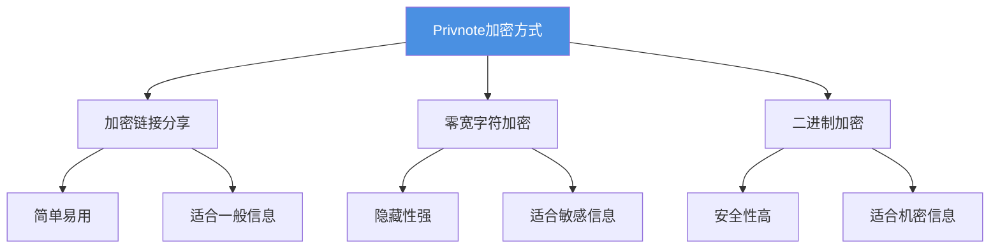
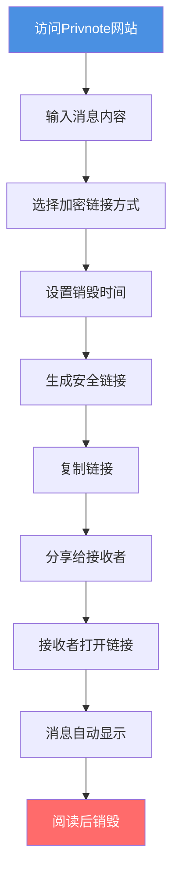

# Privnote加密笔记分享完整指南：安全分享敏感信息的实用方法

  
需要安全分享敏感信息，但担心信息泄露？<strong>Privnote加密笔记</strong>提供了多种加密方式，可以安全地分享敏感信息。本文将详细介绍Privnote的各种加密功能和使用方法，帮助您安全地分享信息。

## Privnote加密方式概述

### 三种主要加密方式

Privnote提供三种不同的加密方式，每种方式都有其特点和适用场景：

## 方式一：加密链接分享

### 工作原理

**加密链接分享**是Privnote最常用的加密方式：

1. **消息加密**：输入的消息内容经过加密处理
2. **生成链接**：系统生成包含加密内容的安全链接
3. **链接分享**：通过链接访问加密的消息内容
4. **自动销毁**：消息阅读后自动删除

### 使用步骤

**详细操作：**

1. **访问网站**
   - 打开 privnote.chat
   - 选择"加密链接"选项

2. **输入内容**
   - 在文本框中输入要分享的信息
   - 支持多行文本
   - 可以输入任意长度的内容

3. **生成链接**
   - 点击"创建笔记"按钮
   - 系统自动生成加密链接
   - 链接包含加密的消息内容

4. **分享链接**
   - 复制生成的链接
   - 通过安全渠道发送给接收者
   - 建议不要公开分享链接

### 优势与限制

**优势：**
- ✅ 操作简单，易于使用
- ✅ 无需安装任何软件
- ✅ 支持多种设备访问
- ✅ 自动销毁功能

**限制：**
- ⚠️ 链接可能被转发
- ⚠️ 需要网络连接
- ⚠️ 无法完全防止截图

## 方式二：零宽字符加密

### 工作原理

**零宽字符加密**是一种隐藏性更强的加密方式：

1. **零宽字符**：使用不可见的零宽字符隐藏消息
2. **文本隐藏**：消息对肉眼完全不可见
3. **特殊解码**：需要特殊工具才能读取
4. **增强安全**：提供额外的安全保护层

### 使用场景

**适合使用零宽字符加密：**
- 需要高度隐藏的信息
- 防止消息被截屏保存
- 在公开场合分享敏感信息
- 需要额外安全保护的内容

### 设置方法

1. **选择加密方式**
   - 在Privnote中选择"零宽字符加密"
   - 了解加密原理和限制

2. **输入消息内容**
   - 输入要加密的信息
   - 系统自动进行零宽字符处理

3. **生成加密文本**
   - 系统生成包含零宽字符的文本
   - 文本看起来是空的或普通的
   - 实际包含隐藏的消息内容

4. **分享加密文本**
   - 复制加密后的文本
   - 可以嵌入到普通文本中
   - 接收者使用工具解码

### 注意事项

- ⚠️ 需要接收者了解如何解码
- ⚠️ 某些平台可能过滤零宽字符
- ⚠️ 需要配合解码工具使用
- ⚠️ 不适合所有使用场景

## 方式三：二进制加密

### 工作原理

**二进制加密**将消息转换为二进制形式：

1. **文本转换**：将消息内容转换为二进制（0和1）
2. **加密处理**：对二进制数据进行加密
3. **生成密文**：生成加密后的二进制文本
4. **解码还原**：接收者解码后还原原始消息

### 使用步骤

**详细操作：**

1. **选择二进制加密**
   - 在Privnote中选择"二进制加密"
   - 了解二进制加密的特点

2. **输入消息内容**
   - 输入要加密的信息
   - 系统自动转换为二进制

3. **生成二进制密文**
   - 系统生成二进制形式的密文
   - 密文由0和1组成
   - 可以安全地分享

4. **解码消息**
   - 接收者使用解码工具
   - 将二进制还原为原始消息
   - 查看消息内容

### 适用场景

**适合使用二进制加密：**
- 需要高安全性的机密信息
- 技术性较强的用户
- 需要额外加密保护的内容
- 对安全性要求极高的场景

## 安全特性对比

### 三种加密方式对比

| 特性 | 加密链接 | 零宽字符 | 二进制 |
|------|---------|---------|--------|
| 易用性 | ⭐⭐⭐⭐⭐ | ⭐⭐⭐ | ⭐⭐ |
| 安全性 | ⭐⭐⭐⭐ | ⭐⭐⭐⭐ | ⭐⭐⭐⭐⭐ |
| 隐藏性 | ⭐⭐⭐ | ⭐⭐⭐⭐⭐ | ⭐⭐⭐ |
| 适用性 | ⭐⭐⭐⭐⭐ | ⭐⭐⭐ | ⭐⭐ |

### 选择建议

**一般信息分享：**
- 推荐：加密链接分享
- 原因：简单易用，适合大多数场景

**敏感信息分享：**
- 推荐：零宽字符加密
- 原因：隐藏性强，不易被发现

**机密信息分享：**
- 推荐：二进制加密
- 原因：安全性最高，适合高安全要求

## 最佳实践

### 使用建议

**1. 根据信息重要性选择加密方式**
- 一般信息：使用加密链接
- 敏感信息：使用零宽字符或二进制
- 机密信息：使用二进制加密

**2. 安全分享链接或密文**
- 通过加密渠道发送
- 避免在公开场合分享
- 不要将链接发布到社交媒体
- 建议设置访问密码

**3. 配合其他安全措施**
- 设置消息销毁时间
- 限制访问次数
- 使用访问追踪功能
- 定期检查访问记录

### 注意事项

**1. 消息销毁后无法恢复**
- 确保接收者已阅读重要信息
- 重要信息建议备份
- 不要依赖自毁消息作为唯一记录

**2. 无法完全防止截图**
- 接收者仍可能截图保存
- 建议配合其他安全措施
- 不要分享过于敏感的信息

**3. 链接和密文的安全性**
- 链接本身可能被转发
- 建议设置访问密码
- 限制链接的有效期

## 常见问题

### Q1: 哪种加密方式最安全？

**A:** 二进制加密安全性最高，但使用相对复杂。对于大多数用户，加密链接分享已经足够安全。

### Q2: 零宽字符加密的消息会被过滤吗？

**A:** 某些平台可能会过滤零宽字符，建议在使用前测试兼容性。

### Q3: 二进制加密的消息如何解码？

**A:** 需要使用相应的解码工具，Privnote通常提供在线解码功能。

### Q4: 可以同时使用多种加密方式吗？

**A:** 通常一次只能选择一种加密方式，但可以结合其他安全功能使用。

### Q5: 加密的消息会被保存到服务器吗？

**A:** 消息在销毁后会从服务器删除，不会长期保存。

## 总结

Privnote提供了多种加密方式，可以满足不同安全需求：

- ✅ **加密链接分享**：简单易用，适合一般信息
- ✅ **零宽字符加密**：隐藏性强，适合敏感信息
- ✅ **二进制加密**：安全性高，适合机密信息

根据信息的重要性和使用场景，选择合适的加密方式，配合其他安全措施，构建完善的信息安全保护体系。

