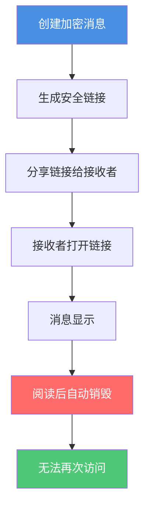
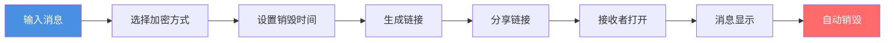

# Privnote安全自毁消息使用指南：如何发送阅后即焚的加密消息

  
需要发送敏感信息，但担心消息被保存或转发？<strong>Privnote</strong>是一款安全的自毁消息服务，可以让您发送阅后即焚的加密消息。本文将详细介绍如何使用Privnote发送安全自毁消息，保护您的隐私和信息安全。

## 什么是Privnote？

### 核心功能

**Privnote**是一款在线安全消息服务，主要特点包括：

- ✅ **自动销毁**：消息在被阅读后自动删除
- ✅ **加密保护**：使用加密技术保护消息内容
- ✅ **安全链接**：生成唯一的安全链接分享消息
- ✅ **打开统计**：记录消息的访问时间和设备信息

### 工作原理

## 为什么使用Privnote？

### 适用场景

**1. 发送敏感信息**
- 密码、验证码
- 银行账号信息
- 个人隐私数据
- 临时访问凭证

**2. 商业机密分享**
- 临时授权码
- 一次性密码
- 机密文件链接
- 内部信息传递

**3. 个人隐私保护**
- 不想被保存的对话
- 临时分享的信息
- 需要保密的联系方式
- 敏感的个人资料

## 如何使用Privnote

### 基本使用步骤

**1. 访问Privnote网站**
   - 打开 privnote.chat
   - 无需注册，直接使用

**2. 输入消息内容**
   - 在文本框中输入要发送的消息
   - 支持纯文本内容
   - 可以输入多行文本

**3. 设置销毁时间（可选）**
   - 选择消息销毁时间
   - 选项：阅读后立即销毁、1小时后、24小时后等
   - 默认：阅读后立即销毁

**4. 生成安全链接**
   - 点击"创建笔记"或"生成链接"
   - 系统生成唯一的安全链接
   - 链接包含加密的消息内容

**5. 分享链接**
   - 复制生成的链接
   - 通过邮件、即时消息等方式发送
   - 建议通过安全渠道发送链接

**6. 接收者查看**
   - 接收者打开链接
   - 消息内容显示
   - 阅读后自动销毁

### 使用流程图

## Privnote的加密方式

### 1. 加密链接分享

**工作原理：**
- 消息内容经过加密处理
- 生成包含加密内容的安全链接
- 只有通过链接才能访问消息
- 链接具有唯一性和时效性

**优势：**
- ✅ 简单易用
- ✅ 安全性高
- ✅ 无需安装软件

### 2. 零宽字符加密

**工作原理：**
- 利用零宽字符隐藏消息
- 消息对肉眼不可见
- 需要特殊工具才能读取
- 增加额外的安全层

**适用场景：**
- 需要更高安全性的消息
- 防止消息被截屏保存
- 隐藏敏感信息

### 3. 二进制加密

**工作原理：**
- 将消息转换为二进制形式（0和1）
- 提供额外的加密保护
- 需要解码才能阅读
- 增强消息安全性

## 安全特性

### 自动销毁机制

**销毁时机：**
- 阅读后立即销毁（默认）
- 设定时间后自动销毁
- 达到访问次数后销毁
- 手动触发销毁

**销毁效果：**
- 消息内容完全删除
- 链接失效，无法再次访问
- 服务器上不留痕迹
- 确保信息不被保存

### 打开统计

**记录信息：**
- 访问时间
- 访问设备信息
- 访客标识
- 访问次数

**用途：**
- 确认消息是否被阅读
- 追踪消息访问情况
- 发现异常访问
- 提供安全审计

## 最佳实践

### 使用建议

**1. 选择合适的销毁时间**
- 敏感信息：阅读后立即销毁
- 一般信息：1-24小时后销毁
- 参考信息：7天后销毁

**2. 安全分享链接**
- 通过加密渠道发送链接
- 避免在公开场合分享
- 不要将链接发布到社交媒体
- 建议通过私密消息发送

**3. 保护链接安全**
- 不要将链接保存到不安全的地方
- 避免在多个地方使用同一链接
- 及时删除不需要的链接
- 定期检查打开统计

### 注意事项

**1. 消息一旦销毁无法恢复**
- 确保接收者已阅读重要信息
- 重要信息建议备份
- 不要依赖自毁消息作为唯一记录

**2. 无法完全防止截图**
- 接收者仍可能截图保存
- 建议配合其他安全措施
- 不要分享过于敏感的信息

**3. 链接安全性**
- 链接本身可能被转发
- 建议设置访问密码
- 限制链接的有效期

## 常见问题

### Q1: Privnote是免费的吗？

**A:** 是的，Privnote提供免费的基础服务。部分高级功能可能需要付费。

### Q2: 消息销毁后还能恢复吗？

**A:** 不能。消息一旦销毁就无法恢复，这是为了确保信息安全。

### Q3: 可以设置消息的访问密码吗？

**A:** 部分版本支持设置访问密码，增加额外的安全保护。

### Q4: 如何知道消息是否被阅读？

**A:** 可以通过访问日志查看消息的访问时间和设备信息。

### Q5: Privnote支持哪些语言？

**A:** Privnote支持多种语言，包括中文、英文、西班牙文、法文、日文和德文等。

### Q6: 消息会被保存到服务器吗？

**A:** 消息在销毁后会从服务器删除，不会长期保存。

## 总结

Privnote是一款实用的安全自毁消息服务，适合需要发送敏感信息的场景：

- ✅ **自动销毁**：消息阅读后自动删除
- ✅ **加密保护**：多种加密方式保护消息安全
- ✅ **简单易用**：无需注册，直接使用
- ✅ **打开统计**：记录消息访问情况

记住，自毁消息不是万能的，建议结合其他安全措施，如使用强密码、加密通信等，构建完善的信息安全体系。

