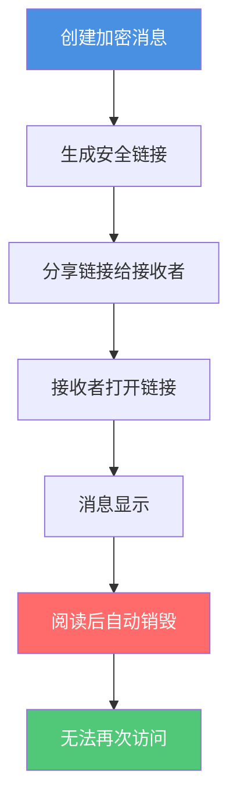

# Privnote 自毁消息完整指南：加密方式、使用场景与最佳实践

  
需要分享敏感信息，但担心内容被长期保存或转发？<strong>Privnote 类自毁消息服务</strong>可以让信息在阅读后自动销毁。本文整合了加密方式对比、常见使用场景和安全操作建议，帮你判断什么时候该用、该怎么用。

## 核心功能

- **自动销毁**：消息在被阅读后自动删除，不留痕迹
- **加密保护**：使用加密技术保护消息内容
- **安全链接**：生成唯一的安全链接分享消息
- **打开统计**：记录消息的访问时间和设备信息

```mermaid
flowchart TD
    A[创建加密消息] --> B[生成安全链接]
    B --> C[分享链接给接收者]
    C --> D[接收者打开链接]
    D --> E[消息显示]
    E --> F[阅读后自动销毁]
    F --> G[无法再次访问]

    style A fill:#4A90E2,color:#fff
    style F fill:#FF6B6B,color:#fff
    style G fill:#50C878,color:#fff
```

## 三种加密方式对比

| 特性 | 加密链接分享 | 零宽字符加密 | 二进制加密 |
|------|---------|---------|--------|
| 易用性 | ⭐⭐⭐⭐⭐ | ⭐⭐⭐ | ⭐⭐ |
| 安全性 | ⭐⭐⭐⭐ | ⭐⭐⭐⭐ | ⭐⭐⭐⭐⭐ |
| 隐藏性 | ⭐⭐⭐ | ⭐⭐⭐⭐⭐ | ⭐⭐⭐ |
| 适用场景 | 一般信息，简单易用 | 敏感信息，需要隐藏在公开场合 | 机密信息，技术性用户 |

**加密链接分享**：消息加密后生成安全链接，通过链接访问，阅读后自动销毁——最常用、最简单的方式，适合大多数场景。

**零宽字符加密**：用不可见字符隐藏消息，肉眼看不出文本包含内容，需要专门工具解码——适合需要在公开场合传递、又不想被一眼看穿的信息，但部分平台可能过滤零宽字符。

**二进制加密**：把消息转换成二进制后再加密，安全性最高，但操作门槛也最高——适合对安全性要求极高、且接收者能配合解码的场景。

## 基本使用步骤

1. **访问服务网站**，无需注册即可使用
2. **输入消息内容**，支持多行文本
3. **设置销毁时间**（可选）：阅读后立即销毁 / 1 小时后 / 24 小时后
4. **生成安全链接**，系统生成唯一的加密链接
5. **通过安全渠道分享链接**，避免公开场合分享
6. **接收者打开链接查看**，阅读后自动销毁，无法再次访问

## 常见适用场景

**密码与验证码分享**：临时密码、登录验证码、一次性访问凭证——用后即焚，避免长期保存在聊天记录里。

**商业机密与内部信息**：商业提案链接、内部会议记录、临时授权信息——建议配合限制访问次数和密码保护使用。

**个人隐私信息**：临时分享电话号码、地址、证件号等——阅读后自动删除，减少长期留存的泄露风险。

**临时授权凭证**：API 密钥、临时访问码——一次性使用，用后失效。

**不适合的场景**：需要长期保存的合同/法律文件、需要反复查看的参考资料、需要多人协作编辑的文档——这些应该用有访问控制和版本记录的托管分享平台，不是自毁消息。

## 最佳实践

- 根据信息重要性选择销毁时间：敏感信息立即销毁，一般信息可设 1-24 小时
- 通过加密/私密渠道分享链接，不要发到社交媒体等公开场合
- 尽量配合访问密码、限制访问次数等功能一起用
- 消息销毁后无法恢复，重要信息发送前先确认接收方能及时查看
- 自毁消息不能完全防止截图，别把它当成绝对安全的保证，只是降低留存风险

## 常见问题

**Q: 哪种加密方式最安全？**
二进制加密安全性最高，但操作相对复杂；对大多数场景，加密链接分享已经足够。

**Q: 消息销毁后还能恢复吗？**
不能。这是自毁消息机制的核心，销毁即不可逆。

**Q: 消息会被长期保存在服务器上吗？**
不会，销毁后会从服务器删除。

**Q: 可以设置访问密码吗？**
部分服务支持设置访问密码，作为额外的安全层。

## 总结

Privnote 类自毁消息服务适合**临时性、一次性**的敏感信息传递——密码、验证码、临时凭证、不想被长期保存的隐私信息。它不是万能的：不能完全防截图，也不适合需要长期保存或多人协作的内容。根据信息的重要性选择合适的加密方式和销毁时间，配合密码保护和访问限制，才能构建起完整的使用习惯。
