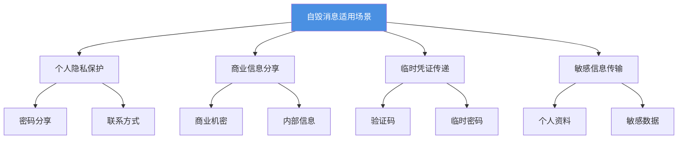
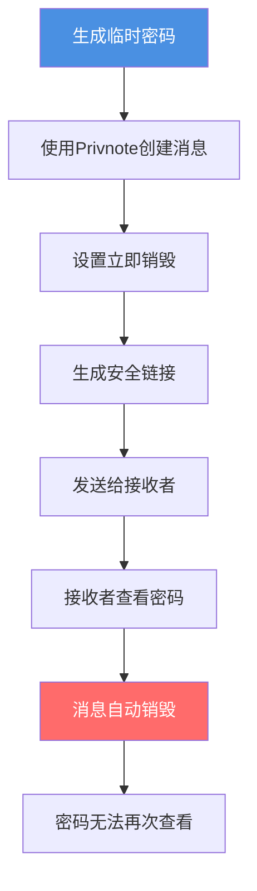
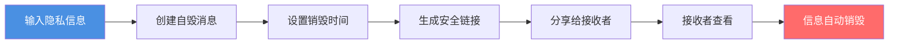

# Privnote自毁消息使用场景：哪些情况适合使用阅后即焚消息

  
自毁消息服务适合哪些场景？<strong>Privnote自毁消息</strong>可以在消息阅读后自动删除，保护信息不被保存和转发。本文将介绍自毁消息的适用场景，帮助您了解何时使用自毁消息服务。

## 自毁消息的核心价值

### 为什么需要自毁消息？

自毁消息服务的主要价值在于：

- ✅ **自动删除**：消息阅读后自动销毁，不留痕迹
- ✅ **防止保存**：无法保存消息内容，减少泄露风险
- ✅ **隐私保护**：保护敏感信息不被长期保存
- ✅ **临时分享**：适合分享临时性、一次性的信息

### 适用场景分类

## 场景一：密码和验证码分享

### 使用场景

**1. 临时密码分享**
- 为新用户设置临时密码
- 密码使用后需要立即更改
- 不希望密码被保存

**2. 验证码传递**
- 发送登录验证码
- 一次性使用的验证信息
- 使用后立即失效

**3. 账户信息分享**
- 临时分享账户密码
- 不希望密码被长期保存
- 使用后需要更改密码

### 使用流程

### 优势

- ✅ 密码不会被保存
- ✅ 使用后自动删除
- ✅ 减少密码泄露风险
- ✅ 适合临时密码分享

## 场景二：商业机密和内部信息

### 使用场景

**1. 商业提案分享**
- 发送商业计划书链接
- 不希望提案被保存
- 限制访问次数

**2. 内部信息传递**
- 分享内部会议记录
- 临时授权信息
- 机密文件链接

**3. 客户信息分享**
- 临时分享客户联系方式
- 不希望信息被长期保存
- 使用后立即删除

### 使用建议

**设置建议：**
- 设置较短的销毁时间（1-24小时）
- 限制访问次数（1-3次）
- 使用访问追踪功能
- 配合密码保护使用

### 注意事项

- ⚠️ 重要信息建议备份
- ⚠️ 无法完全防止截图
- ⚠️ 建议配合其他安全措施
- ⚠️ 定期检查访问记录

## 场景三：个人隐私信息保护

### 使用场景

**1. 个人联系方式**
- 临时分享电话号码
- 不希望被保存到通讯录
- 使用后自动删除

**2. 个人地址信息**
- 分享临时地址
- 不希望地址被长期保存
- 使用后立即删除

**3. 个人资料分享**
- 临时分享身份证号
- 银行账号信息
- 其他敏感个人信息

### 隐私保护流程

### 保护措施

- ✅ 信息阅读后自动删除
- ✅ 无法再次访问
- ✅ 减少信息泄露风险
- ✅ 保护个人隐私

## 场景四：临时授权和访问凭证

### 使用场景

**1. 临时访问码**
- 分享临时系统访问码
- 一次性使用的凭证
- 使用后立即失效

**2. API密钥分享**
- 临时分享API密钥
- 不希望密钥被保存
- 使用后需要更换

**3. 临时授权链接**
- 分享临时授权链接
- 限制访问次数
- 使用后自动失效

### 使用流程

1. **创建临时凭证**
   - 生成临时访问码或密钥
   - 设置有效期

2. **使用自毁消息分享**
   - 创建自毁消息
   - 设置立即销毁
   - 生成安全链接

3. **接收者使用**
   - 接收者查看凭证
   - 使用凭证访问系统
   - 消息自动销毁

4. **凭证失效**
   - 凭证使用后失效
   - 消息无法再次查看
   - 确保安全性

## 场景五：敏感文档链接分享

### 使用场景

**1. 机密文档链接**
- 分享机密文档的访问链接
- 不希望链接被保存
- 限制访问次数

**2. 临时文件分享**
- 分享临时文件的下载链接
- 文件使用后删除
- 链接自动失效

**3. 受限内容访问**
- 分享受限内容的访问链接
- 限制访问时间
- 使用后立即失效

### 安全设置

**推荐设置：**
- 销毁时间：阅读后立即销毁
- 访问次数：1-3次
- 访问密码：设置访问密码
- 访问追踪：启用访问日志

## 不适合使用自毁消息的场景

### 不适合的场景

**1. 需要长期保存的信息**
- 重要合同、协议
- 法律文件
- 需要存档的记录

**2. 需要多次查看的内容**
- 参考资料
- 学习材料
- 需要反复查看的信息

**3. 需要编辑的文档**
- 需要修改的内容
- 协作编辑的文档
- 需要保存的草稿

### 替代方案

对于不适合使用自毁消息的场景，可以考虑：

- 使用加密存储服务
- 使用访问控制功能
- 使用水印保护功能
- 使用其他安全分享方式

## 最佳实践

### 使用建议

**1. 明确使用目的**
- 确定信息是否需要自毁
- 评估信息的重要性
- 选择合适的销毁时间

**2. 安全分享链接**
- 通过安全渠道发送链接
- 避免在公开场合分享
- 不要将链接发布到社交媒体

**3. 配合其他安全措施**
- 设置访问密码
- 限制访问次数
- 使用访问追踪功能
- 定期检查访问记录

### 注意事项

**1. 消息无法恢复**
- 确保接收者已阅读重要信息
- 重要信息建议备份
- 不要依赖自毁消息作为唯一记录

**2. 无法完全防止截图**
- 接收者仍可能截图保存
- 建议配合其他安全措施
- 不要分享过于敏感的信息

**3. 链接安全性**
- 链接本身可能被转发
- 建议设置访问密码
- 限制链接的有效期

## 常见问题

### Q1: 自毁消息适合所有场景吗？

**A:** 不是。自毁消息适合临时性、一次性的信息分享，不适合需要长期保存或多次查看的内容。

### Q2: 如何选择销毁时间？

**A:** 根据信息的重要性和使用场景选择。敏感信息建议立即销毁，一般信息可以设置1-24小时后销毁。

### Q3: 可以设置消息的访问密码吗？

**A:** 部分版本支持设置访问密码，增加额外的安全保护。

### Q4: 如何知道消息是否被阅读？

**A:** 可以通过访问日志查看消息的访问时间和设备信息。

### Q5: 自毁消息会被保存到服务器吗？

**A:** 消息在销毁后会从服务器删除，不会长期保存。

## 总结

Privnote自毁消息适合多种场景，主要包括：

- ✅ **密码和验证码分享**：临时凭证，使用后删除
- ✅ **商业机密分享**：内部信息，限制访问
- ✅ **个人隐私保护**：敏感信息，自动销毁
- ✅ **临时授权凭证**：一次性凭证，使用后失效
- ✅ **敏感文档链接**：受限内容，自动失效

根据信息的特点和使用需求，合理选择自毁消息服务，配合其他安全措施，构建完善的信息安全保护体系。

