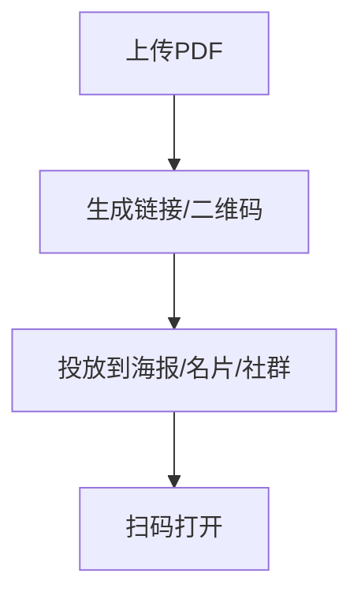

# 二维码分享PDF：3步让对方扫码即看

  
想让对方<strong>最快看到PDF</strong>，扫码就是最省步骤的方式。

## 为什么要分享

- 资料需要快速传给对方（合同/报价/课件）
- 不想发大文件或反复转发
- 希望对方“点一下就看”

## 为什么用二维码分享

- 不用复制粘贴链接，扫一下就到
- 线下场景更自然（海报、名片、展会）
- 传递成本最低、最少沟通

## 三个关键动作

- **生成可访问入口**：上传 PDF 后生成链接/二维码
- **投放二维码**：海报、名片、课堂、展会、包装、社群都能用
- **扫码访问**：手机打开更自然，尤其适合线下场景

## MaiPDF怎么解决

用 MaiPDF，把“分享→扫码→访问”变成一条短链路：

## 小建议（避免翻车）

- 打印前先用 iOS/Android 都扫一遍
- 敏感资料建议配合 **验证/限次/下载控制** 使用

