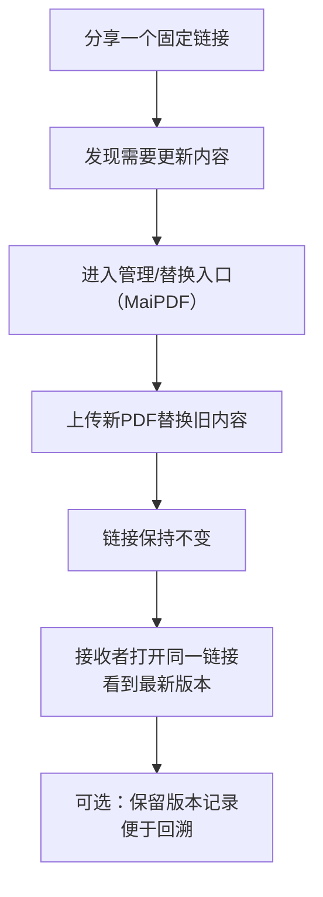

# 替换PDF但不换链接：MaiPDF 的版本更新最佳实践

  
最常见的协作灾难：你更新了 PDF（合同/报价/方案），对方却还在看旧版本。解决方案不是“再发一次新链接”，而是<strong>链接不变，内容更新</strong>。注意：这个“替换文件但链接不变”的能力属于 <strong>MaiPDF</strong>（Maiimg 不提供该功能）。

## 一、替换流程图（Mermaid）

## 二、SVG图解（同一流程更直观）

## 三、什么时候最该用“替换不换链接”

- 合同/报价/方案更新：内容频繁修订但不想反复通知
- 多人共享：销售/法务/客户都只认一个链接
- 反复迭代：一天改多次，最怕旧版到处流传

## 四、实用建议（让替换更安全）

- 对外链接尽量只发一个“主入口”，减少分叉
- 大改动建议在正文/描述里写上版本号或更新点
- 重要交付建议配合：有效期（仅离线版）/访问控制/打开统计，避免旧链接长期传播

