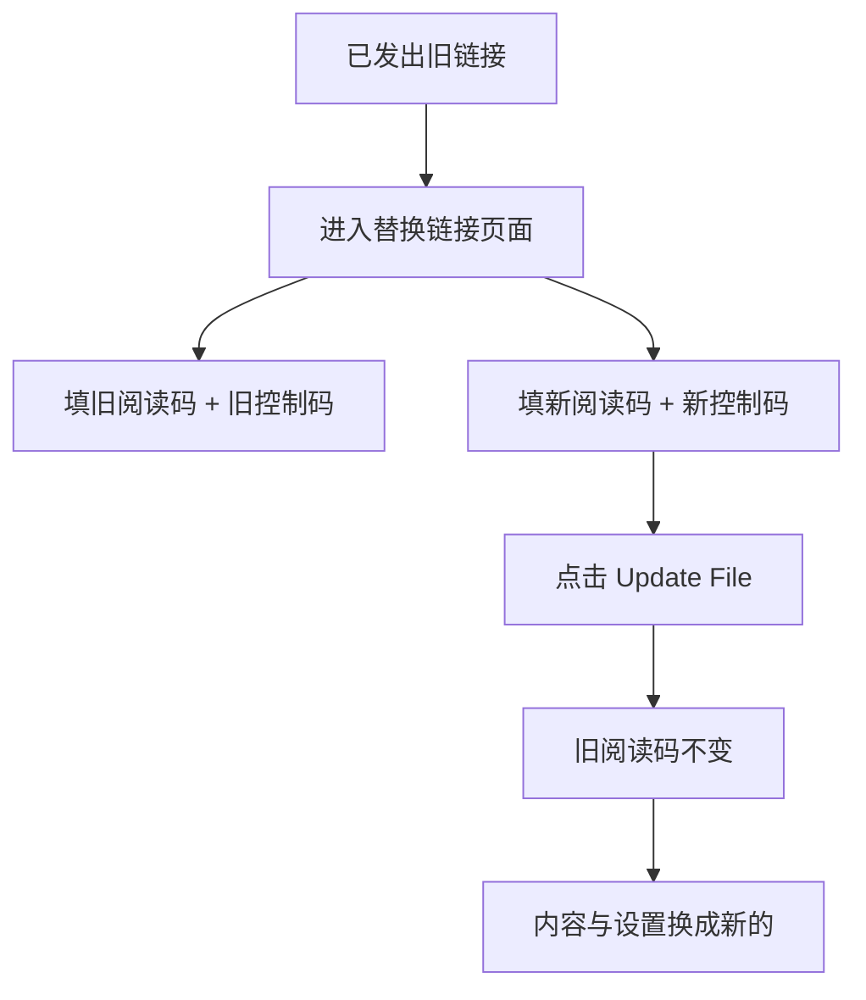

# 替换PDF但不换链接：旧阅读码不变的更新方法

  
想象一下：你已经把PDF链接发给客户了，后来发现文件有错需要修改。传统做法是重新上传、重新发链接，客户还得问"用哪个链接？"

  
<strong>MaiPDF的替换功能：</strong>链接还是那个链接，你只需要在后台把文件换掉。客户继续用原来的链接，打开后自动看到新版本。不用重新发链接，不会搞混。

  
注意：此功能仅限 <strong>MaiPDF</strong>（Maiimg 不支持文件替换）。

## 为什么要替换

- 链接已经发出去了，发现内容有错
- 版本更新了，不想再发新链接
- 想改设置（次数/验证/水印/提醒邮箱）
- 想“撤回内容”（让对方打开空白页）

如果每次都重新发链接，还得重新配置一遍设置，既麻烦又容易乱。

## MaiPDF怎么做

MaiPDF 提供“替换文件”，<strong>一次性打包替换</strong>：

- **链接不变**：已发出去的URL/二维码继续使用
- **内容更新**：旧链接打开的是新文件
- **设置同步**：次数/时长/验证/下载/水印/提醒邮箱跟随新链接

## 正确用法（简版）

在 [替换链接页面](https://maipdf.com/pdf/hahachange.php)：

1. 填 **旧阅读码 + 旧控制码**
2. 填 **新阅读码 + 新控制码**
3. 点 **Update File**：旧阅读码不变，但内容/设置换成新链接的

## 常见场景

- 合同条款修订
- 报价单更新
- 课程资料迭代
- 需要改设置（验证/水印/提醒邮箱等）
- 需要“撤回内容”：先上传空白PDF生成新链接，再替换过去

