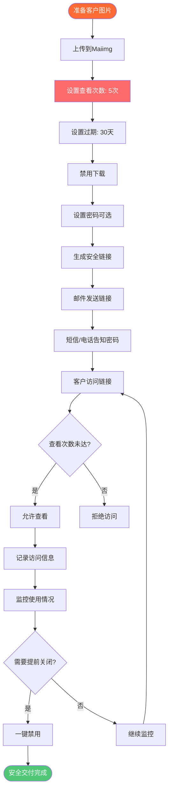

# 给客户发私密图片的安全工具：Maiimg安全图片交付指南

  
<strong>给客户发私密图片用什么工具安全？</strong>Maiimg是专业的客户图片交付工具，提供查看次数限制、过期时间、密码保护、下载控制等安全功能，确保您的客户私密图片安全分享。摄影师、设计师、商务人士都在用。完全免费，无需注册。

## 为什么需要安全的客户图片交付工具？

**传统方式的痛点：**
- ⚠️ **微信/QQ发送** - 图片可能被转发，无法控制
- ⚠️ **邮箱附件** - 文件大小限制，可能被下载保存
- ⚠️ **网盘分享** - 链接可能泄露，无法追踪访问
- ⚠️ **云存储** - 需要注册，隐私风险
- ⚠️ **无控制权** - 无法限制查看次数，无法设置过期

**Maiimg解决方案：**
- ✅ **查看次数限制** - 设置只能看3次、5次，防止无限分享
- ✅ **自动过期** - 7天、30天后自动失效，保护隐私
- ✅ **禁用下载** - 客户只能看不能下载，保护版权
- ✅ **密码保护** - 额外安全层，只有知道密码才能看
- ✅ **访问追踪** - 知道谁看了、什么时候看的
- ✅ **一键禁用** - 随时可以立即关闭链接

## 给客户发私密图片的完整流程

### 安全交付流程图

### 步骤1：上传客户图片

**操作步骤：**
1. 访问 [Maiimg.com](https://maiimg.com)
2. 选择客户图片（最多25张）
3. 一次上传所有图片
4. 等待上传完成

**安全特点：**
- ✅ HTTPS加密上传
- ✅ 安全服务器存储
- ✅ 默认私密，不公开
- ✅ 完全由您控制

### 步骤2：配置安全设置

**关键安全设置：**

**查看次数限制：**
- 🔢 设置最大查看次数（例如：5次）
- 达到次数后链接自动失效
- 防止客户无限分享给他人
- 推荐：客户预览用3-5次，重要文件用1-3次

**过期时间：**
- ⏰ 设置过期日期（例如：30天后）
- 过期后链接自动失效
- 图片无法再访问
- 推荐：客户交付用14-30天，机密文件用1-7天

**下载控制：**
- ⬇️ **必须禁用下载**
- 客户只能在线查看
- 无法保存到本地
- 保护您的版权和隐私

**密码保护（可选但推荐）：**
- 🔑 设置访问密码
- 链接和密码分开发送
- 额外安全层
- 推荐：重要文件必须设置密码

### 步骤3：安全分享给客户

**分享方式：**

**方式1：邮件+电话（最安全）**
1. 通过邮件发送链接
2. 通过电话/短信告知密码
3. 链接和密码分开，更安全

**方式2：邮件+微信**
1. 邮件发送链接
2. 微信单独发送密码
3. 不要在同一封邮件发送

**方式3：面对面交付**
1. 生成二维码
2. 打印或展示给客户
3. 当面告知密码

**重要提醒：**
- ⚠️ **永远不要**在同一封邮件发送链接和密码
- ⚠️ **永远不要**在微信/QQ同时发送链接和密码
- ✅ 使用不同渠道分开发送更安全

## 实际使用场景

### 场景1：摄影师给客户发照片

**情况：** 婚礼摄影师需要给新人交付婚礼照片

**设置：**
- 上传婚礼照片（20-25张）
- 查看次数限制：20次（新人可以多看几次）
- 过期时间：90天（给足够时间下载）
- 下载：**禁用**（保护版权）
- 密码：设置简单密码

**分享：**
- 邮件发送链接
- 微信告知密码
- 提醒客户在过期前查看

**优势：**
- ✅ 保护照片版权
- ✅ 控制分享范围
- ✅ 追踪客户查看情况
- ✅ 专业交付方式

### 场景2：设计师给客户发设计稿

**情况：** 设计师需要给客户预览设计方案

**设置：**
- 上传设计稿图片（5-10张）
- 查看次数限制：**3次**（防止客户反复查看后不付费）
- 过期时间：**7天**（时效性内容）
- 下载：**禁用**（保护设计版权）
- 密码：**必须设置**（重要文件）

**分享：**
- 邮件发送链接
- 电话告知密码
- 提醒客户及时查看

**优势：**
- ✅ 保护设计版权
- ✅ 防止客户截图后不付费
- ✅ 控制查看次数
- ✅ 追踪客户参与度

### 场景3：商务人士发机密文件

**情况：** 需要给客户发送机密商业图片

**设置：**
- 上传机密图片
- 查看次数限制：**1-3次**（高度机密）
- 过期时间：**3-7天**（短期有效）
- 下载：**禁用**
- 密码：**必须设置**
- 邮箱验证：可选（更安全）

**分享：**
- 邮件发送链接
- 电话告知密码
- 提醒客户保密

**优势：**
- ✅ 最大安全性
- ✅ 完全控制访问
- ✅ 追踪所有访问记录
- ✅ 符合合规要求

### 场景4：电商卖家发产品图

**情况：** 给客户发送产品高清图片

**设置：**
- 上传产品图片（10-15张）
- 查看次数限制：10次
- 过期时间：30天
- 下载：禁用（防止盗图）
- 密码：可选

**优势：**
- ✅ 防止产品图被盗用
- ✅ 控制分享范围
- ✅ 追踪客户查看
- ✅ 专业展示

## 安全功能详解

### 1. 查看次数限制 - 防止无限分享

**工作原理：**
- 您设置最大查看次数（例如：5次）
- 客户每打开一次链接，计数+1
- 达到5次后，链接自动失效
- 即使有链接也无法再查看

**为什么重要：**
- 防止客户把链接分享给朋友
- 防止客户反复查看后不付费
- 控制图片传播范围
- 保护您的权益

**推荐设置：**
- 客户预览：3-5次
- 重要文件：1-3次
- 普通交付：10-20次

### 2. 过期时间 - 自动清理

**工作原理：**
- 您设置过期日期（例如：30天后）
- 到期后链接自动失效
- 图片无法再访问
- 自动清理，保护隐私

**为什么重要：**
- 时效性内容自动失效
- 不需要手动删除
- 保护长期隐私
- 符合数据保护要求

**推荐设置：**
- 客户交付：14-30天
- 机密文件：1-7天
- 普通分享：30-90天

### 3. 禁用下载 - 保护版权

**工作原理：**
- 禁用下载按钮
- 防止右键保存
- 阻止截图工具（部分）
- 只能在线查看

**为什么重要：**
- 保护照片/设计版权
- 防止客户保存后不付费
- 控制图片使用
- 维护您的权益

**重要提醒：**
- ⚠️ 给客户发私密图片时**必须禁用下载**
- ⚠️ 否则客户可以保存并分享
- ✅ 禁用下载是最基本的安全措施

### 4. 密码保护 - 额外安全层

**工作原理：**
- 为图册设置访问密码
- 客户需要输入密码才能查看
- 链接和密码分开发送
- 双重保护

**为什么重要：**
- 即使链接泄露，没有密码也无法查看
- 只有知道密码的人才能访问
- 额外安全层
- 适合重要文件

**最佳实践：**
- 重要文件：必须设置密码
- 普通文件：可选
- 密码和链接分开发送

### 5. 访问追踪 - 知道谁看了

**您可以查看：**
- 📊 谁访问了图片（IP地址）
- ⏰ 什么时候访问的
- 📱 用什么设备访问的
- 📈 访问了多少次

**为什么重要：**
- 知道客户是否查看了
- 检测未授权访问
- 追踪客户参与度
- 确保安全

## 安全最佳实践

### 1. 给客户发私密图片的标准流程

**推荐流程：**
1. ✅ 上传图片到Maiimg
2. ✅ 设置查看次数：3-10次
3. ✅ 设置过期：14-30天
4. ✅ **必须禁用下载**
5. ✅ 设置密码（重要文件）
6. ✅ 邮件发送链接
7. ✅ 电话/短信告知密码
8. ✅ 提醒客户及时查看
9. ✅ 定期检查访问记录

### 2. 不同场景的安全设置

**高度机密文件：**
- 查看次数：1-3次
- 过期时间：1-3天
- 下载：禁用
- 密码：必须

**客户交付：**
- 查看次数：5-10次
- 过期时间：14-30天
- 下载：禁用
- 密码：可选

**普通分享：**
- 查看次数：10-20次
- 过期时间：30-90天
- 下载：可选
- 密码：不需要

### 3. 分享时的安全注意事项

**必须遵守：**
- ✅ 链接和密码**永远分开发送**
- ✅ 使用不同渠道（邮件+电话）
- ✅ 提醒客户保密
- ✅ 定期检查访问记录
- ✅ 发现异常立即禁用链接

**避免：**
- ❌ 在同一封邮件发送链接和密码
- ❌ 在微信/QQ同时发送
- ❌ 使用简单密码（如123456）
- ❌ 设置过长的过期时间

## 常见问题

### Q1: 给客户发私密图片真的安全吗？

**A: 非常安全！**
- ✅ HTTPS加密传输
- ✅ 安全服务器存储
- ✅ 查看次数限制
- ✅ 自动过期
- ✅ 禁用下载
- ✅ 密码保护
- ✅ 访问追踪

### Q2: 客户可以下载图片吗？

**A: 您可以控制！**
- 设置时**禁用下载**
- 客户只能在线查看
- 无法保存到本地
- 保护您的版权

### Q3: 链接会过期吗？

**A: 您设置过期时间！**
- 设置过期日期（如30天）
- 到期后自动失效
- 图片无法再访问
- 保护隐私

### Q4: 我可以看到谁看了图片吗？

**A: 可以！完整追踪：**
- 查看次数
- 访问时间
- 设备信息
- IP地址

### Q5: 如果客户把链接分享给别人怎么办？

**A: 有保护措施！**
- 查看次数限制（达到次数失效）
- 过期时间（到期失效）
- 密码保护（没有密码无法查看）
- 可以一键禁用链接

### Q6: 需要注册账号吗？

**A: 不需要！**
- 无需注册
- 无需邮箱
- 直接使用
- 完全免费

## 对比：Maiimg vs 其他方式

### Maiimg安全交付

**优势：**
- ✅ 查看次数限制
- ✅ 自动过期
- ✅ 禁用下载
- ✅ 密码保护
- ✅ 访问追踪
- ✅ 一键禁用
- ✅ 无需注册
- ✅ 完全免费

### 微信/QQ发送

**劣势：**
- ❌ 可能被转发
- ❌ 无法控制
- ❌ 无过期
- ❌ 无追踪

### 邮箱附件

**劣势：**
- ❌ 文件大小限制
- ❌ 可能被下载
- ❌ 无控制
- ❌ 无追踪

### 网盘分享

**劣势：**
- ❌ 链接可能泄露
- ❌ 无查看限制
- ❌ 无过期控制
- ❌ 需要注册

## 结论：给客户发私密图片的安全工具

**Maiimg是给客户发私密图片的最佳安全工具：**

✅ **查看次数限制** - 防止无限分享（设置3-10次）  
✅ **自动过期** - 保护隐私（7-30天自动失效）  
✅ **禁用下载** - 保护版权（客户只能看不能下载）  
✅ **密码保护** - 额外安全（链接和密码分开发送）  
✅ **访问追踪** - 知道谁看了（IP、时间、设备）  
✅ **一键禁用** - 随时关闭（发现异常立即禁用）  
✅ **无需注册** - 直接使用（完全免费）  

**适合人群：**
- ✅ 摄影师（婚礼照片、写真交付）
- ✅ 设计师（设计稿预览、作品集）
- ✅ 商务人士（机密文件、商业图片）
- ✅ 电商卖家（产品图、高清素材）
- ✅ 任何需要安全分享图片的人

**准备安全地给客户发私密图片？**

访问 [Maiimg.com](https://maiimg.com) 立即使用。上传图片，设置安全参数，安全地分享给客户。无需注册，完全免费，专业安全。

---

**相关文章：**
- [一键分享多张图片：图册分享](/blog/cn/one-click-share-multiple-images-gallery-sharing)
- [社交媒体图片图册分享：完整指南](/blog/cn/social-media-image-gallery-sharing-guide)
- [安全私密图片分享：客户图片交付](/blog/cn/secure-private-image-sharing-client-delivery)
