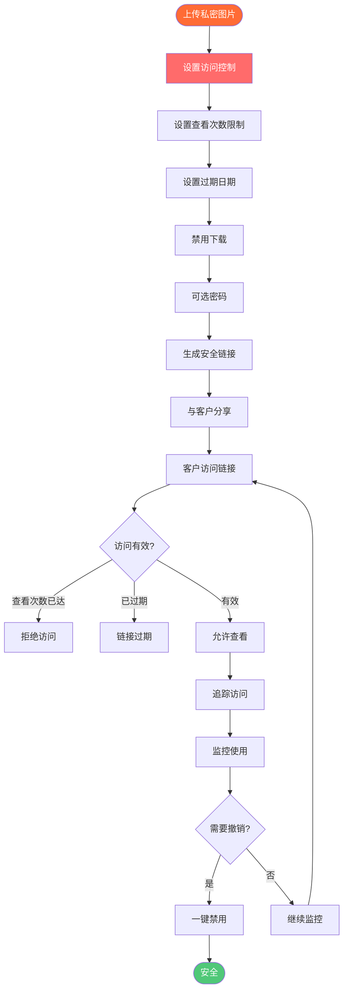

# 安全私密图片分享：使用Maiimg安全交付客户图片

  
需要<strong>安全地与客户分享私密图片</strong>？Maiimg提供安全的图片分享，具有高级访问控制、查看次数限制、过期日期、密码保护和实时追踪功能。适合机密客户交付、私密作品集、婚礼照片和敏感图片分享。保护您的图片私密和安全。

## 为什么安全私密图片分享很重要

**安全担忧：**
- ⚠️ 图片可能被下载和分享
- ⚠️ 无法控制谁查看图片
- ⚠️ 图片永久在线
- ⚠️ 无法追踪访问
- ⚠️ 隐私风险

**Maiimg解决方案：**
- ✅ **访问控制** - 控制谁可以看到图片
- ✅ **查看次数限制** - 限制查看次数
- ✅ **过期日期** - 自动过期链接
- ✅ **下载控制** - 禁用下载
- ✅ **追踪** - 查看谁访问了图片
- ✅ **密码保护** - 可选密码

## 安全私密图片分享如何工作

### 安全流程

### 步骤1：上传私密图片

**上传流程：**
1. 访问 [Maiimg.com](https://maiimg.com)
2. 上传最多25张图片
3. 图片安全存储
4. 配置安全设置

**安全特点：**
- 安全HTTPS上传
- 加密存储
- 默认私密
- 完全控制

### 步骤2：配置安全设置

**安全选项：**
- 🔢 **查看次数限制** - 设置最大打开次数（例如5次）
- ⏰ **过期时间** - 设置过期日期
- ⬇️ **下载控制** - 禁用下载
- 🔑 **密码** - 可选密码保护
- 📧 **邮箱验证** - 需要邮箱

**私密图片推荐设置：**
- 查看次数限制：3-10次
- 过期时间：7-30天
- 下载：禁用
- 密码：启用（可选）

### 步骤3：安全分享

**分享方式：**
- 📧 单独邮件发送链接
- 💬 安全消息
- 🔑 单独分享密码
- 📱 二维码（面对面）

**最佳实践：**
- 链接和密码分开分享
- 使用安全通信
- 设置短期过期
- 监控访问

## 安全功能详解

### 查看次数限制

**工作原理：**
- 设置最大查看次数（例如5次）
- 达到限制后链接停止工作
- 防止无限分享
- 控制分发

**使用场景：**
- 客户预览：3-5次
- 机密文档：1-3次
- 私密作品集：5-10次

### 过期日期

**工作原理：**
- 设置过期日期和时间
- 过期后链接自动禁用
- 图片不再可访问
- 自动清理

**使用场景：**
- 时效性内容：7天
- 客户交付：30天
- 机密材料：1-3天

### 下载控制

**工作原理：**
- 禁用下载按钮
- 防止右键保存
- 阻止文件保存
- 仅查看模式

**使用场景：**
- 机密图片
- 客户预览
- 私密作品集
- 敏感内容

### 密码保护

**工作原理：**
- 为图册设置密码
- 单独分享密码
- 额外安全层
- 访问控制

**使用场景：**
- 高度机密内容
- 客户特定访问
- 私密作品集
- 敏感材料

### 追踪与监控

**您可以追踪：**
- 📊 谁查看了图片
- ⏰ 何时查看图片
- 📱 设备信息
- 🌍 IP地址
- 📈 访问模式

**优势：**
- 监控访问
- 检测未授权访问
- 追踪客户参与度
- 确保安全

## 安全私密分享使用场景

### 1. 客户图片交付

**场景：** 安全地向客户交付照片

**设置：**
- 上传客户照片
- 设置查看次数限制：10次
- 设置过期时间：30天
- 禁用下载
- 分享链接和密码

**优势：**
- 安全交付
- 受控访问
- 隐私保护
- 专业服务

### 2. 婚礼照片交付

**场景：** 向新人交付婚礼照片

**设置：**
- 上传婚礼照片
- 设置查看次数限制：20次
- 设置过期时间：90天
- 可选密码
- 与新人分享

**优势：**
- 私密分享
- 受控访问
- 追踪参与度
- 专业交付

### 3. 机密作品集

**场景：** 与选定客户分享作品集

**设置：**
- 上传作品集图片
- 设置查看次数限制：5次
- 设置过期时间：14天
- 密码保护
- 禁用下载

**优势：**
- 机密分享
- 访问控制
- 隐私保护
- 专业展示

### 4. 敏感商业图片

**场景：** 分享机密商业图片

**设置：**
- 上传商业图片
- 设置查看次数限制：3次
- 设置过期时间：7天
- 需要密码
- 禁用下载
- 追踪所有访问

**优势：**
- 最大安全性
- 完全控制
- 访问追踪
- 合规性

## 安全最佳实践

### 1. 设置适当的限制

**高度机密：**
- 查看次数限制：1-3次
- 过期时间：1-3天
- 密码：必需
- 下载：禁用

**客户交付：**
- 查看次数限制：5-10次
- 过期时间：14-30天
- 密码：可选
- 下载：禁用

### 2. 分开分享凭证

**最佳实践：**
- 通过邮件分享链接
- 通过短信/电话分享密码
- 永远不要一起分享
- 使用安全渠道

### 3. 定期监控访问

**定期检查：**
- 每天查看访问日志
- 检查未授权访问
- 监控查看次数
- 需要时更新设置

### 4. 使用短期过期

**最佳实践：**
- 设置短期过期日期
- 需要时延长
- 自动清理
- 隐私保护

## 对比：安全分享 vs 公开分享

### 安全私密分享（Maiimg）

**优势：**
- ✅ 查看次数限制
- ✅ 过期日期
- ✅ 下载控制
- ✅ 密码保护
- ✅ 访问追踪
- ✅ 一键禁用

### 公开分享（传统）

**劣势：**
- ❌ 无查看次数限制
- ❌ 无过期
- ❌ 下载启用
- ❌ 无密码
- ❌ 无追踪
- ❌ 无控制

## 常见问题

### 安全性如何？

**非常安全：**
- HTTPS加密
- 安全存储
- 访问控制
- 追踪启用
- 一键禁用

### 客户可以下载图片吗？

**您控制：**
- 禁用下载
- 仅查看模式
- 防止保存
- 完全控制

### 图片在线多久？

**您控制：**
- 设置过期日期
- 过期后自动禁用
- 一键删除
- 完全控制

### 我可以看到谁查看了图片吗？

**可以！** 完整追踪：
- 查看次数
- 访问时间
- 设备信息
- IP地址

### 有密码保护吗？

**有！** 可选密码：
- 设置密码
- 分开分享
- 额外安全
- 访问控制

## 结论：安全私密图片分享

Maiimg提供最佳的**安全私密图片分享**功能：
- ✅ 查看次数限制（控制访问）
- ✅ 过期日期（自动清理）
- ✅ 下载控制（仅查看）
- ✅ 密码保护（可选）
- ✅ 实时追踪（监控访问）
- ✅ 一键禁用（即时控制）
- ✅ 无需注册
- ✅ 完全免费

**适合：**
- ✅ 客户图片交付
- ✅ 婚礼照片交付
- ✅ 机密作品集
- ✅ 敏感商业图片
- ✅ 私密分享

**准备安全分享图片？**

访问 [Maiimg.com](https://maiimg.com) 上传图片并配置安全分享设置。保护您的图片私密和安全。无需注册，完全免费。

---

**相关文章：**
- [一键分享多张图片：图册分享](/blog/cn/one-click-share-multiple-images-gallery-sharing)
- [社交媒体图片图册分享：完整指南](/blog/cn/social-media-image-gallery-sharing-guide)
- [免费图片托管：完整指南](/blog/cn/free-image-hosting-maiimg-complete-guide)
