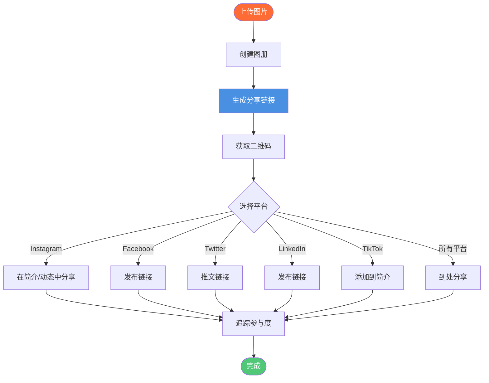

# 社交媒体图片图册分享：在社交媒体分享图片图册

  
需要在<strong>社交媒体分享图片图册</strong>？Maiimg让您创建专业图片图册，生成分享链接，创建二维码，并在Instagram、Facebook、Twitter、LinkedIn、TikTok等平台分享。一次上传最多25张图片，获取一个分享链接，在所有平台分享。适合社交媒体营销、活动推广和内容分享。

## 什么是社交媒体图片图册分享？

**社交媒体图片图册分享**允许您创建专业图片图册，并通过单一链接在所有社交媒体平台分享。无需单独发布每张图片，创建一个图册，分享一个在所有平台都有效的链接。

**优势：**
- ✅ **一个链接全平台** - 在多个平台分享
- ✅ **专业图册** - 精美展示
- ✅ **移动端友好** - 所有设备可用
- ✅ **轻松分享** - 复制粘贴链接
- ✅ **追踪参与度** - 查看访问和参与

## 社交媒体图册分享如何工作

### 完整分享流程

### 步骤1：创建您的图册

**上传流程：**
1. 访问 [Maiimg.com](https://maiimg.com)
2. 上传最多25张图片
3. 自动创建图册
4. 获取分享链接

**图册特点：**
- 专业布局
- 移动端响应式
- 快速加载
- 精美展示

### 步骤2：获取分享链接

**您将获得：**
- ✅ **分享链接** - 所有平台可用
- ✅ **二维码** - 用于离线分享
- ✅ **图册视图** - 专业展示
- ✅ **移动端优化** - 完美适配社交媒体

### 步骤3：在社交媒体分享

**支持的平台：**
- 📷 Instagram
- 👥 Facebook
- 🐦 Twitter/X
- 💼 LinkedIn
- 🎵 TikTok
- 📌 Pinterest
- 以及更多！

## 平台特定分享

### Instagram分享

**方法：**
1. **简介链接** - 在图册链接添加到简介
2. **动态** - 在动态中分享链接
3. **帖子** - 在标题中提及链接
4. **二维码** - 在活动中展示二维码

**最佳实践：**
- 使用简短描述性文字
- 包含行动号召
- 追踪参与度
- 定期更新

### Facebook分享

**方法：**
1. **帖子** - 在帖子中分享链接
2. **群组** - 在群组中分享
3. **活动** - 添加到活动页面
4. **页面** - 在商业页面分享

**最佳实践：**
- 添加吸引人的描述
- 包含图片
- 使用话题标签
- 与评论互动

### Twitter/X分享

**方法：**
1. **推文** - 在推文中分享链接
2. **推文串** - 创建推文串
3. **简介** - 添加到个人简介
4. **置顶推文** - 置顶图册推文

**最佳实践：**
- 保持推文简洁
- 使用相关话题标签
- 包含图片
- 与粉丝互动

### LinkedIn分享

**方法：**
1. **帖子** - 在帖子中分享
2. **文章** - 包含在文章中
3. **公司页面** - 在页面分享
4. **消息** - 在消息中分享

**最佳实践：**
- 专业语调
- 添加上下文
- 与网络互动
- 追踪参与度

### TikTok分享

**方法：**
1. **简介链接** - 添加到个人简介
2. **视频描述** - 包含在描述中
3. **评论** - 在评论中分享
4. **二维码** - 在视频中展示

**最佳实践：**
- 简短吸引人的描述
- 使用热门话题标签
- 与评论互动
- 追踪观看

## 使用场景

### 1. 活动推广

**场景：** 在社交媒体推广活动

**流程：**
1. 上传活动照片
2. 创建图册
3. 在所有平台分享
4. 追踪参与度

**优势：**
- 一致的信息传递
- 专业展示
- 轻松分享
- 追踪效果

### 2. 产品展示

**场景：** 在社交媒体展示产品

**流程：**
1. 上传产品图片
2. 创建图册
3. 在平台分享
4. 追踪查看

**优势：**
- 多个产品，一个链接
- 专业展示
- 轻松分享
- 数据分析

### 3. 内容营销

**场景：** 在社交媒体分享内容

**流程：**
1. 上传内容图片
2. 创建图册
3. 跨平台分享
4. 追踪参与度

**优势：**
- 多平台分享
- 专业展示
- 追踪表现
- 轻松管理

### 4. 网红合作

**场景：** 分享合作内容

**流程：**
1. 上传合作图片
2. 创建图册
3. 与网红分享
4. 追踪分发

**优势：**
- 轻松分享
- 专业展示
- 追踪覆盖
- 管理合作

## 高级功能

### 访问控制

**控制选项：**
- 🔢 查看次数限制
- ⏰ 过期日期
- ⬇️ 下载控制
- ⏱️ 时间限制

**优势：**
- 隐私保护
- 受控分享
- 安全性
- 合规性

### 二维码集成

**二维码特点：**
- 自动生成
- 移动端友好
- 易于打印
- 适合活动

**社交媒体使用：**
- Instagram动态
- Facebook活动
- Twitter活动
- LinkedIn活动

### 追踪与分析

**您可以追踪：**
- 📊 总查看次数
- ⏰ 查看时间
- 📱 设备信息
- 📈 访问趋势
- 🌍 地理数据

**优势：**
- 了解受众
- 追踪参与度
- 衡量效果
- 优化策略

## 最佳实践

### 1. 为每个平台优化

**提示：**
- 使用平台特定格式
- 优化描述
- 包含相关话题标签
- 与受众互动

### 2. 创建吸引人的描述

**最佳实践：**
- 撰写引人入胜的文案
- 包含行动号召
- 使用相关话题标签
- 添加上下文

### 3. 使用二维码

**最佳实践：**
- 生成二维码
- 在活动中展示
- 包含在帖子中
- 轻松移动端访问

### 4. 追踪和分析

**定期检查：**
- 查看分析数据
- 追踪参与度
- 监控趋势
- 优化策略

## 常见问题

### 我可以在多个平台分享吗？

**可以！** 一个链接到处可用：
- Instagram
- Facebook
- Twitter
- LinkedIn
- TikTok
- 以及更多！

### 移动端友好吗？

**是的！** 完全优化：
- 移动端响应式
- 快速加载
- 触摸友好
- 完美适配移动端

### 我可以追踪参与度吗？

**可以！** 完整分析：
- 查看次数
- 访问时间
- 设备信息
- 地理数据

### 包含二维码吗？

**是的！** 自动生成：
- 每个图册都有二维码
- 移动端友好
- 轻松分享
- 适合活动

## 结论：社交媒体图片图册分享

Maiimg让**在社交媒体分享图片图册**变得简单：
- ✅ 上传最多25张图片
- ✅ 所有平台一个链接
- ✅ 包含二维码
- ✅ 移动端优化
- ✅ 访问控制
- ✅ 实时追踪
- ✅ 无需注册
- ✅ 完全免费

**准备在社交媒体分享图册？**

访问 [Maiimg.com](https://maiimg.com) 创建图册，在所有社交媒体平台分享。无需注册，完全免费。

---

**相关文章：**
- [一键分享多张图片：图册分享](/blog/cn/one-click-share-multiple-images-gallery-sharing)
- [安全私密图片分享：客户图片交付](/blog/cn/secure-private-image-sharing-client-delivery)
- [免费图片托管：完整指南](/blog/cn/free-image-hosting-maiimg-complete-guide)
