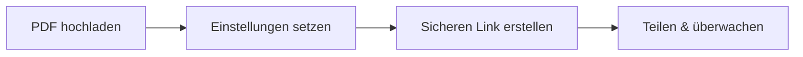

# PDF‑Freigabeeinstellungen

  
Hier erklären wir <strong>die konkreten Optionen</strong> auf dem Upload‑Bildschirm und wofür sie da sind.

## Die 5 Einstellungen

1. **Zugriffslimit**  
   Begrenzt die Gesamtzahl der Öffnungen.

2. **Sitzungsdauer**  
   Begrenzt die Lesezeit pro Sitzung.

3. **Schutztyp**  
   - DynamoWatermark  
   - SecureView (Nur‑Ansicht)  
   - FenceView (Screenshot‑Abschreckung)  
   - Unrestricted  

4. **E‑Mail‑Verifizierung**  
   Zugriff erst nach E‑Mail‑Bestätigung.

5. **Lese‑Benachrichtigung (optional)**  
   E‑Mail, wenn geöffnet wurde.

## Kurzer Ablauf

