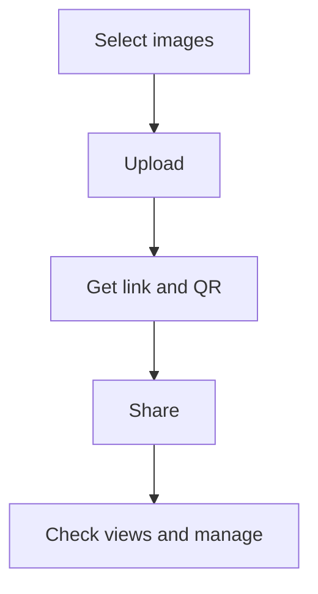

Wenn du Bilder schnell teilen willst (z. B. mit Kunden, im Team oder für ein Event), ist ein Link oft einfacher als Anhänge in Chats.

Maiimg ist für **Bild-Sharing** gedacht (nicht für PDF).

## Kurz-Workflow

1. **Bilder auswählen**
2. **Upload**
3. **Link / QR bekommen**
4. **Teilen**
5. **Ansichten prüfen / verwalten** (optional)

## Screenshots

