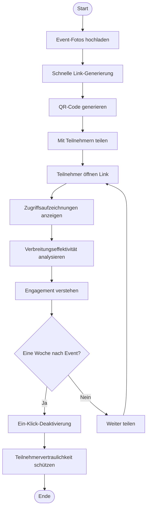
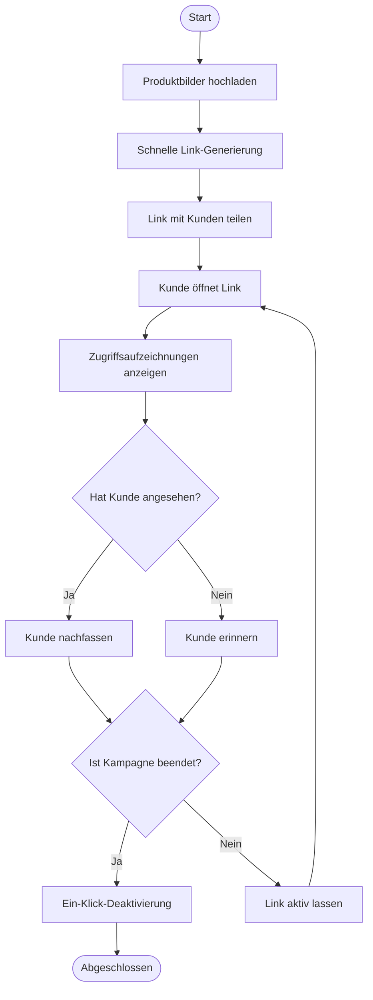
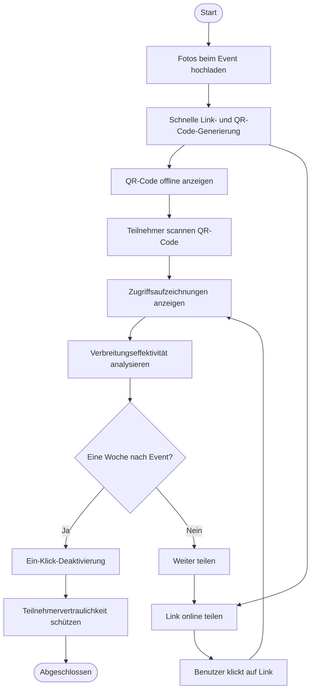

# Maiimg Schnelle Link-Generierung, Ein-Klick-Deaktivierung, Zugriffsaufzeichnungen anzeigen: Drei Kernfunktionen für Bild-Sharing

  
Was braucht man für Bild-Sharing? <strong>Schnelle Link-Generierung</strong>, <strong>Ein-Klick-Deaktivierung</strong>, <strong>Zugriffsaufzeichnungen anzeigen</strong>. Maiimg kombiniert diese drei Kernfunktionen perfekt, um Bild-Sharing einfach, sicher und kontrollierbar zu machen.

## Kernfunktion 1: Schnelle Link-Generierung zum Teilen

### Sofortige Generierung, in Sekunden fertig

**Kein Warten, sofortiges Teilen:**
- Nach dem Hochladen der Bilder wird der Link sofort generiert
- Keine Registrierung, keine Wartezeit auf Genehmigung
- Unterstützt Batch-Upload (bis zu 25 Bilder)
- Automatische QR-Code-Generierung

**Schritte:**
1. Besuchen Sie Maiimg.com
2. Bilder per Drag & Drop oder Auswahl hochladen
3. **Link wird automatisch generiert**, sofort verfügbar
4. Link kopieren oder QR-Code herunterladen zum Teilen

## Kernfunktion 2: Ein-Klick-Deaktivierung

### Jederzeit kontrollieren, sofort wirksam

**Ein-Klick-Betrieb, Link wird sofort ungültig:**
- Auf "Deaktivieren"-Button klicken, Link wird sofort unverfügbar
- Bilder müssen nicht gelöscht werden, nur Link deaktivieren
- Geteilte Links werden sofort ungültig

## Kernfunktion 3: Zugriffsaufzeichnungen anzeigen

### Echtzeit-Tracking, transparente Daten

**Vollständige Zugriffsaufzeichnungen:**
- Gesamtzahl der Öffnungen anzeigen
- Zeitpunkt jeder Öffnung anzeigen
- IP-Adresse des Öffners anzeigen (falls unterstützt)
- Geräteinformationen anzeigen (falls unterstützt)

## Drei Funktionen perfekt kombiniert

### Vollständiger Arbeitsablauf

**Szenario: Event-Fotos teilen**

**Prozess:**

1. **Schnelle Link-Generierung**
   - Event endet, Fotos sofort hochladen
   - Link wird in Sekunden generiert
   - Mit Teilnehmern teilen

2. **Zugriffsaufzeichnungen anzeigen**
   - In Echtzeit prüfen, wer Link geöffnet hat
   - Verbreitungseffektivität der Fotos verstehen
   - Engagement der Teilnehmer analysieren

3. **Ein-Klick-Deaktivierung**
   - Eine Woche nach Event-Ende
   - Link mit einem Klick deaktivieren
   - Teilnehmervertraulichkeit schützen

### Funktionsvergleichstabelle

| Funktion | Traditionelles Bild-Sharing | Maiimg |
|----------|----------------------------|--------|
| Link-Generierungsgeschwindigkeit | Registrierung erforderlich, Wartezeit auf Genehmigung | Generierung in Sekunden, keine Registrierung |
| Link-Kontrolle | Kann nicht deaktiviert werden, nur löschen | Ein-Klick-Deaktivierung, jederzeit kontrollierbar |
| Zugriffsaufzeichnungen | Keine oder unvollständige Aufzeichnungen | Vollständige Aufzeichnungen, Echtzeit-Anzeige |
| Nutzungskosten | Möglicherweise kostenpflichtig | Völlig kostenlos |
| Betriebskomplexität | Komplizierte Schritte | Einfach und intuitiv |

## Praktische Anwendungsfälle

### Fall 1: E-Commerce-Produktbilder teilen

**Bedarf:** Schnell Produktbilder mit Kunden teilen, Ansicht-Situation verstehen, Zugriff nach Kampagne schließen

**Lösung:**
1. Produktbilder hochladen, **schnelle Link-Generierung**
2. Link mit Kunden teilen
3. **Zugriffsaufzeichnungen anzeigen**, Kundenansicht-Situation verstehen
4. Nach Kampagnenende, **Link mit einem Klick deaktivieren**

### Fall 2: Sofortiges Event-Foto teilen

**Bedarf:** Sofort Event-Fotos teilen, Verbreitungseffektivität verfolgen, Vertraulichkeit nach Event schützen

**Lösung:**
1. Fotos beim Event hochladen, **schnelle Link- und QR-Code-Generierung**
2. Teilnehmer scannen QR-Code zum Ansehen
3. **Zugriffsaufzeichnungen anzeigen**, Verbreitungseffektivität der Fotos verstehen
4. Eine Woche nach Event, **Link mit einem Klick deaktivieren**

