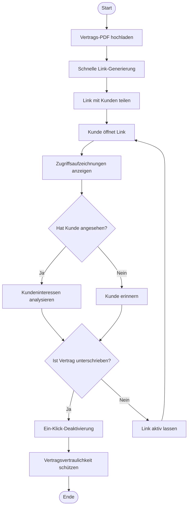
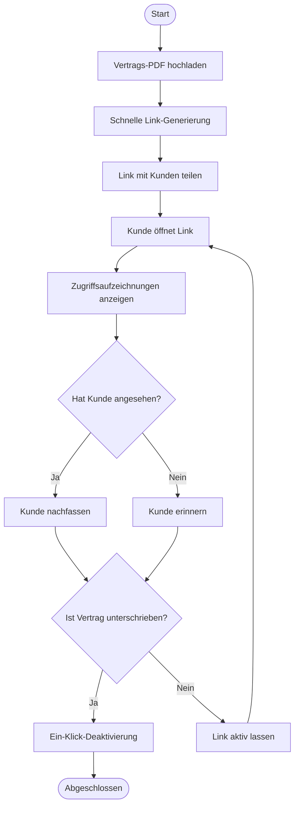
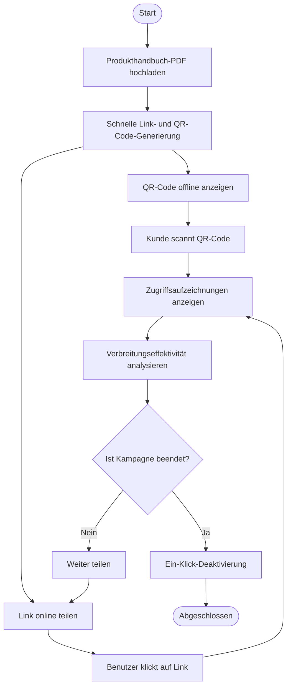

# MaiPDF Schnelle Link-Generierung, Ein-Klick-Deaktivierung, Zugriffsaufzeichnungen anzeigen: Drei Kernfunktionen für PDF-Sharing

  
Was braucht man für PDF-Sharing? <strong>Schnelle Link-Generierung</strong>, <strong>Ein-Klick-Deaktivierung</strong>, <strong>Zugriffsaufzeichnungen anzeigen</strong>. MaiPDF kombiniert diese drei Kernfunktionen perfekt, um PDF-Sharing einfach, sicher und kontrollierbar zu machen.

## Kernfunktion 1: Schnelle Link-Generierung zum Teilen

### Sofortige Generierung, in Sekunden fertig

**Kein Warten, sofortiges Teilen:**
- Nach dem Hochladen des PDFs wird der Link sofort generiert
- Keine Registrierung, keine Wartezeit auf Genehmigung
- Unterstützt Dateien bis zu 100MB
- Automatische QR-Code-Generierung

**Schritte:**
1. Besuchen Sie MaiPDF.com
2. PDF-Datei per Drag & Drop oder Auswahl hochladen
3. **Link wird automatisch generiert**, sofort verfügbar
4. Link kopieren oder QR-Code herunterladen zum Teilen

## Kernfunktion 2: Ein-Klick-Deaktivierung

### Jederzeit kontrollieren, sofort wirksam

**Ein-Klick-Betrieb, Link wird sofort ungültig:**
- Auf "Deaktivieren"-Button klicken, Link wird sofort unverfügbar
- PDF muss nicht gelöscht werden, nur Link deaktivieren
- Geteilte Links werden sofort ungültig
- Kann jederzeit wieder aktiviert werden (falls unterstützt)

## Kernfunktion 3: Zugriffsaufzeichnungen anzeigen

### Echtzeit-Tracking, transparente Daten

**Vollständige Zugriffsaufzeichnungen:**
- Gesamtzahl der Öffnungen anzeigen
- Zeitpunkt jeder Öffnung anzeigen
- IP-Adresse des Öffners anzeigen
- Geräteinformationen anzeigen
- Geografische Position anzeigen

## Drei Funktionen perfekt kombiniert

### Vollständiger Arbeitsablauf

**Szenario: Geschäftsvertrag teilen**

**Prozess:**

1. **Schnelle Link-Generierung**
   - Vertrags-PDF hochladen
   - Link wird in Sekunden generiert
   - Mit Kunden teilen

2. **Zugriffsaufzeichnungen anzeigen**
   - In Echtzeit prüfen, ob Kunde Link geöffnet hat
   - Vertragsansicht-Situation verstehen
   - Kundeninteressen analysieren

3. **Ein-Klick-Deaktivierung**
   - Nach Vertragsunterschrift
   - Link mit einem Klick deaktivieren
   - Vertragsvertraulichkeit schützen

### Funktionsvergleichstabelle

| Funktion | Traditionelles PDF-Sharing | MaiPDF |
|----------|---------------------------|--------|
| Link-Generierungsgeschwindigkeit | Registrierung erforderlich, Wartezeit auf Genehmigung | Generierung in Sekunden, keine Registrierung |
| Link-Kontrolle | Kann nicht deaktiviert werden, nur löschen | Ein-Klick-Deaktivierung, jederzeit kontrollierbar |
| Zugriffsaufzeichnungen | Keine oder unvollständige Aufzeichnungen | Vollständige Aufzeichnungen, Echtzeit-Anzeige |
| Nutzungskosten | Möglicherweise kostenpflichtig | Völlig kostenlos |
| Betriebskomplexität | Komplizierte Schritte | Einfach und intuitiv |
| Dateigrößenlimit | Normalerweise klein | Bis zu 100MB |

## Praktische Anwendungsfälle

### Fall 1: Geschäftsvertrag teilen

**Bedarf:** Schnell Vertrag mit Kunden teilen, Ansicht-Situation verstehen, Zugriff nach Unterschrift schließen

**Lösung:**
1. Vertrags-PDF hochladen, **schnelle Link-Generierung**
2. Link mit Kunden teilen
3. **Zugriffsaufzeichnungen anzeigen**, Kundenansicht-Situation verstehen
4. Nach Unterschrift, **Link mit einem Klick deaktivieren**

### Fall 2: Sofortiges Produkthandbuch teilen

**Bedarf:** Schnell Produkthandbuch mit potenziellen Kunden teilen, Ansichtseffektivität verfolgen, Vertraulichkeit nach Kampagne schützen

**Lösung:**
1. Produkthandbuch-PDF hochladen, **schnelle Link- und QR-Code-Generierung**
2. Kunden scannen QR-Code zum Ansehen
3. **Zugriffsaufzeichnungen anzeigen**, Verbreitungseffektivität des Handbuchs verstehen
4. Eine Woche nach Kampagne, **Link mit einem Klick deaktivieren**

