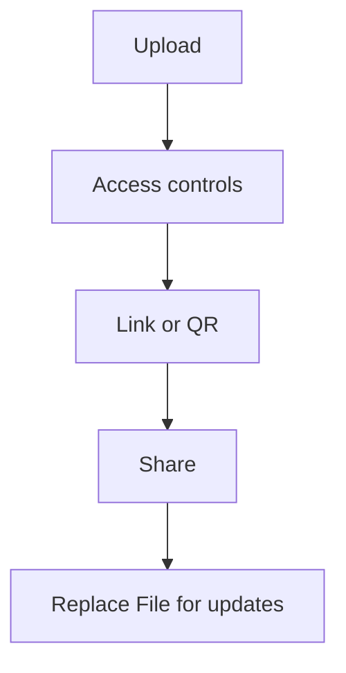

Viele Teams teilen ein PDF, merken später „Wir müssen noch etwas korrigieren“ – und schicken dann einen **neuen** Link herum. Das erzeugt schnell Chaos.

Ein stabilerer Ansatz ist: **Link behalten** und bei Änderungen **Replace File** nutzen (der Link bleibt gleich).

## Empfohlener Ablauf

1. **PDF hochladen**
2. **Zugriffskontrollen setzen** (optional)
3. **Link / QR erstellen**
4. **Teilen**
5. **Bei Updates: Replace File** (Link bleibt gleich)

> Hinweis: Wir setzen keine „Ablaufdatum/Expiration“-Funktion voraus.

## Screenshots

## Updates ohne Link-Wechsel

Wenn der Inhalt aktualisiert werden muss, hilft **Replace File**, die neue Version zu veröffentlichen – **ohne** den geteilten Link zu ändern.

Referenz: `https://sendpdfonline.com/article/replace-pdf-without-changing-link-zh`  
Verwandt: `/blog/en/modify-link`

