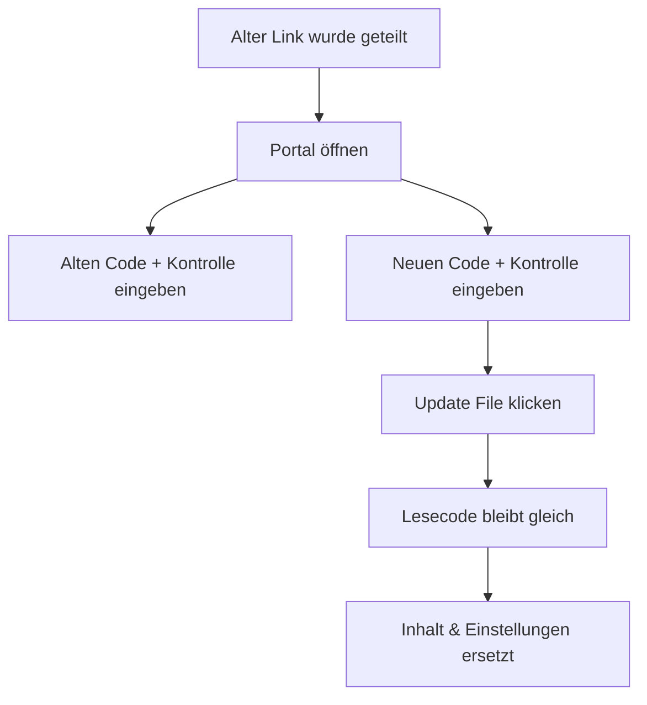

# PDF ersetzen, ohne den Link zu ändern

  
<strong>Der Lesecode bleibt gleich.</strong> Inhalt und Einstellungen werden durch die neue Version ersetzt.

## Warum man Links ersetzt

- Fehler nach dem Teilen korrigieren
- Versionen oder Preise aktualisieren
- Einstellungen anpassen (Aufrufe, Dauer, Verifizierung, Download, Wasserzeichen, Hinweise)
- Inhalte zurückziehen, indem man ein leeres PDF ersetzt

## So hilft MaiPDF

MaiPDF ersetzt alles in einem Schritt:

- **Link bleibt gleich**
- **Inhalt wird aktualisiert**
- **Einstellungen folgen dem neuen Link** (kein manuelles Nachstellen)

## Schnelle Schritte

1. Portal öffnen: https://maipdf.com/pdf/hahachange.php
2. Alten Lesecode + Kontrollcode eingeben
3. Neuen Lesecode + Kontrollcode eingeben
4. **Update File** klicken

## Typische Fälle

- Vertragsänderungen
- Aktualisierte Preislisten
- Schulungsunterlagen
- Notfall‑Rückzug (leeres PDF hochladen, dann ersetzen)
