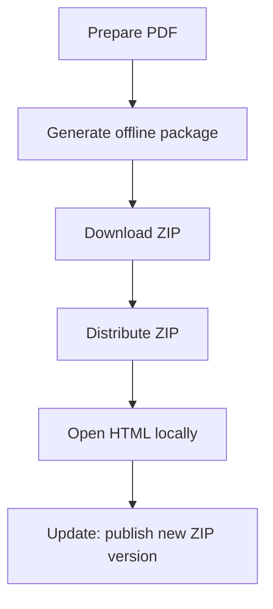

Online-Link-Sharing ist bequem, aber manchmal braucht man ein **offline-fähiges Paket** (z. B. für geschlossene Netzwerke oder Geräte ohne dauerhafte Verbindung).

## Empfohlener Ablauf

1. **Offline-Paket erstellen**
2. **ZIP herunterladen**
3. **ZIP verteilen**
4. **Lokal öffnen (HTML-Datei im ZIP)**
5. **Bei Änderungen: neue Version bereitstellen** (klar benennen)

## Screenshots

## Updates: sauber und nachvollziehbar

Offline-Pakete haben naturgemäß „Kopien“. Damit niemand mit veralteten Dateien arbeitet:

- **Version im Dateinamen** (z. B. `handbuch-v3.zip`)
- **Changelog kurz halten** (was hat sich geändert)
- **Bei Bedarf: neues Paket statt Mischzustand**

Beispiel für Update-Workflow:

