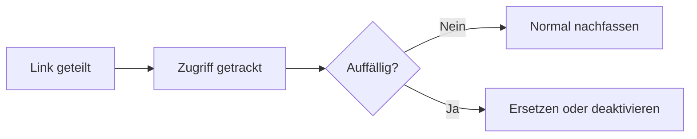

# PDF-Zugriffs-Tracking & Analytics (Quick Start)

  
Wenn du wichtige PDFs teilst, hilft Tracking beim richtigen Follow-up und beim frühen Erkennen ungewöhnlicher Zugriffe.

## Die 3 Signale zuerst

- **Erste Öffnung**
- **Wiederholte Öffnungen**
- **Basis-Signale zu Gerät / IP (ungefähr)**

## Wenn etwas auffällt

- **Datei ersetzen**: gleicher Lesecode, neuer Inhalt & neue Einstellungen
- **Link deaktivieren**: Zugriff sofort stoppen

## Einfacher Use Case

Proposal teilen, erste Öffnung abwarten, dann mit Kontext nachfassen – solange das Dokument noch präsent ist.

