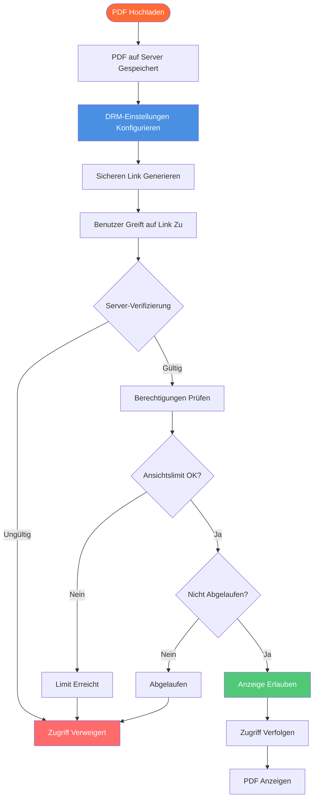

# PDF Online DRM: Vollständiger Leitfaden für Online PDF Digital Rights Management

  
Müssen Sie Ihre PDF-Dokumente online schützen? <strong>PDF Online DRM</strong> (Digital Rights Management) ermöglicht es Ihnen, den Zugriff zu kontrollieren, Downloads zu verhindern, Ansichten zu begrenzen und die Nutzung Ihrer PDFs zu verfolgen. Dieser vollständige Leitfaden erklärt, wie Online-DRM funktioniert, seine Funktionen und wie Sie PDF-Online-DRM-Schutz für Ihre Dokumente implementieren.

## Was ist PDF Online DRM?

**PDF Online DRM** (Digital Rights Management) ist eine Technologie, die PDF-Dokumente schützt, indem sie kontrolliert, wie sie online aufgerufen, angezeigt und verteilt werden können. Im Gegensatz zum traditionellen PDF-Schutz, der auf Passwörtern oder Verschlüsselung basiert, bietet Online-DRM serverbasierte Kontrolle und Echtzeit-Verwaltung.

**Schlüsselmerkmale:**
- ✅ **Serverbasierte Kontrolle** - Berechtigungen werden auf dem Server verwaltet
- ✅ **Echtzeit-Verwaltung** - Einstellungen sofort ändern
- ✅ **Zugriffsverfolgung** - Überwachen, wer Dokumente anzeigt
- ✅ **Keine Software Erforderlich** - Funktioniert in jedem Browser
- ✅ **Widerrufbarer Zugriff** - Links jederzeit deaktivieren

## Wie PDF Online DRM Funktioniert

### Online DRM-Architektur

### Schritt 1: Hochladen und Konfigurieren

**Prozess:**
1. PDF auf Online-Plattform hochladen
2. DRM-Einstellungen konfigurieren
3. Zugriffskontrollen festlegen
4. Sicheren Link generieren

**Verfügbare DRM-Einstellungen:**
- Ansichtslimits
- Ablaufdaten
- Download-Verhinderung
- Druck-Verhinderung
- Zugriffskontrolle

### Schritt 2: Server-Verifizierung

**Wie Es Funktioniert:**
- Benutzer greift auf Link zu
- Server verifiziert Berechtigungen
- Prüft Ansichtslimits
- Validiert Ablaufzeit
- Erzwingt Einschränkungen

**Vorteile:**
- Echtzeit-Kontrolle
- Kann nicht umgangen werden
- Zentrale Verwaltung
- Prüfpfad

### Schritt 3: Zugriffskontrolle

**Kontrollmechanismen:**
- Nur-Anzeige-Modus
- Download-Blockierung
- Druck-Verhinderung
- Kopier-Verhinderung
- Screenshot-Erkennung (begrenzt)

## PDF Online DRM-Funktionen

### 1. Zugriffskontrolle

**E-Mail-Verifizierung:**
- E-Mail vor Zugriff erforderlich
- Auf bestimmte E-Mails beschränken
- Domain-Beschränkungen
- E-Mail-basierte Authentifizierung

**Passwortschutz:**
- Zugriffspasswort festlegen
- Passwort separat teilen
- Zusätzliche Sicherheitsschicht
- Zugriffskontrolle

### 2. Ansichtslimits

**Wie Es Funktioniert:**
- Maximale Ansichten festlegen (z.B. 10)
- Server verfolgt jede Ansicht
- Link funktioniert nach Limit nicht mehr
- Verhindert unbegrenzten Zugriff

**Anwendungsfälle:**
- Vertrauliche Dokumente: 1-3 Ansichten
- Kunden-Vorschau: 5-10 Ansichten
- Schulungsmaterialien: 20-50 Ansichten

### 3. Ablaufkontrolle

**Zeitbasierte Ablaufzeit:**
- Ablaufdatum festlegen
- Nach Datum automatisch deaktivieren
- Zeitlich begrenzter Zugriff
- Automatische Bereinigung

**Vorteile:**
- Temporäres Teilen
- Datenschutz
- Compliance-Unterstützung
- Automatische Verwaltung

### 4. Download-Verhinderung

**Download-Kontrolle:**
- Download-Button deaktivieren
- Rechtsklick-Speichern blockieren
- Dateispeicherung verhindern
- Nur-Anzeige-Modus

**Warum Wichtig:**
- Urheberrecht schützen
- Verteilung verhindern
- Zugriff kontrollieren
- Sicherheit aufrechterhalten

## Fazit: PDF Online DRM

PDF Online DRM bietet leistungsstarken Dokumentenschutz mit:
- ✅ Echtzeit-Zugriffskontrolle
- ✅ Ansichtslimits und Ablaufzeit
- ✅ Download- und Druck-Verhinderung
- ✅ Dynamische Wasserzeichen
- ✅ Umfassende Verfolgung
- ✅ Sofortiger Widerruf
- ✅ Keine Software erforderlich
- ✅ Einfache Verwaltung

**Bereit, Ihre PDFs mit Online-DRM zu schützen?**

MaiPDF bietet kostenloses PDF Online DRM mit all diesen Funktionen. Laden Sie Ihr PDF hoch, konfigurieren Sie DRM-Einstellungen, generieren Sie sichere Links und schützen Sie Ihre Dokumente. Keine Registrierung erforderlich.

---

**Verwandte Artikel:**
- [Offline PDF DRM: Unternehmenslösung](/blog/de/offline-pdf-drm-enterprise-solution)
- [PDF-Zugriffskontrolle: Vollständiger Leitfaden](/blog/de/pdf-access-control-complete-guide)
