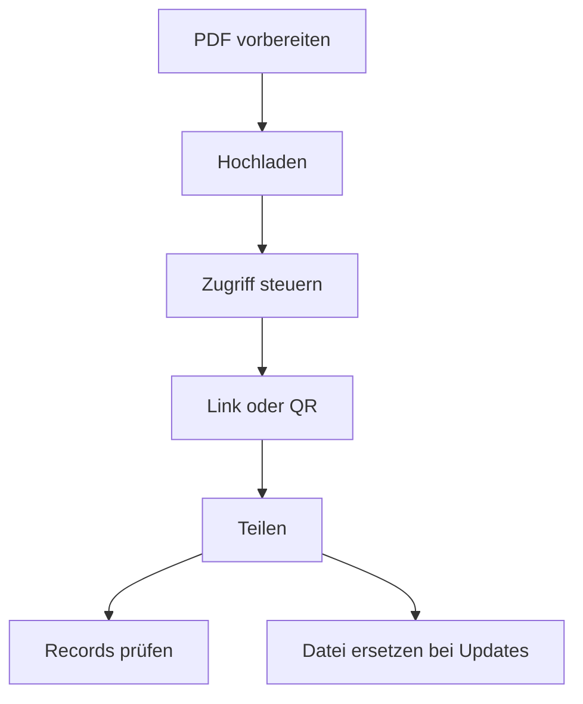

PDF-Sicherheit scheitert selten an fehlenden Features – meist an **unklarem Prozess**. Diese Seite fasst einen einfachen Ablauf zusammen, der in Teams gut funktioniert.

MaiPDF ist für **PDF-Link-Sharing** gedacht (Bild-Galerien gehören zu **Maiimg**).

## Empfohlener Ablauf

1. **PDF hochladen**
2. **Zugriff steuern** (wenn nötig)
3. **Link/QR erstellen und teilen**
4. **Bei Bedarf nachsehen (Records)**
5. **Update über “Datei ersetzen”** (Link bleibt gleich)

> Hinweis: Wir behaupten hier keine “Ablauf-/Expiry”-Funktion.

## Hochladen und Teilen

## Zugriff & Nachvollziehbarkeit (optional)

## Updates sauber ausrollen (Link bleibt gleich)

Wenn sich Inhalte ändern, ist “Datei ersetzen” oft die einfachste Methode, ohne neue Links zu verteilen.

Referenz: `https://sendpdfonline.com/article/replace-pdf-without-changing-link-zh`

