# MaiPDF Komplette Einführung: Professionelle PDF-Sharing-Plattform Einfach und Sicher

  
<strong>MaiPDF</strong> ist eine professionelle Online-PDF-Sharing-Plattform, die es Ihnen ermöglicht, ohne Registrierung schnell Sharing-Links zu generieren, Zugriffsberechtigungen jederzeit zu kontrollieren und Dokumentöffnungen in Echtzeit zu verfolgen. Ob Geschäftsverträge, Produkthandbücher oder Teamberichte, MaiPDF macht Dokument-Sharing einfach, sicher und kontrollierbar.

## Was ist MaiPDF?

### Plattform-Positionierung

MaiPDF ist eine **Online-PDF-Sharing- und Verwaltungsplattform**, die sich auf die Bereitstellung einfacher, sicherer und kontrollierbarer Dokument-Sharing-Lösungen konzentriert.

**Kernmerkmale:**
- ✅ **Keine Registrierung Erforderlich** - Sofort nutzbar, keine Barrieren
- ✅ **Sofortige Generierung** - Link-Generierung innerhalb von 10 Sekunden nach Upload
- ✅ **Völlig Kostenlos** - Alle Grundfunktionen sind kostenlos
- ✅ **Professionelle Sicherheit** - Zugriffskontrolle, Wasserzeichen-Schutz, Datenverfolgung

### MaiPDF vs Traditionelle Methoden

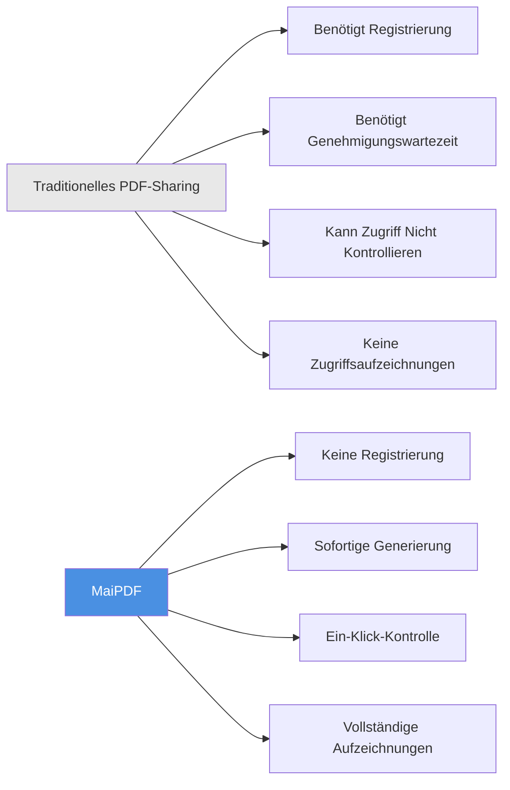

## Kernfunktionen Überblick

### Funktionsarchitektur

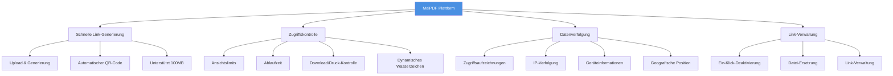

## Vollständiger Nutzungsablauf

### Vollständiger Ablauf vom Upload zum Teilen

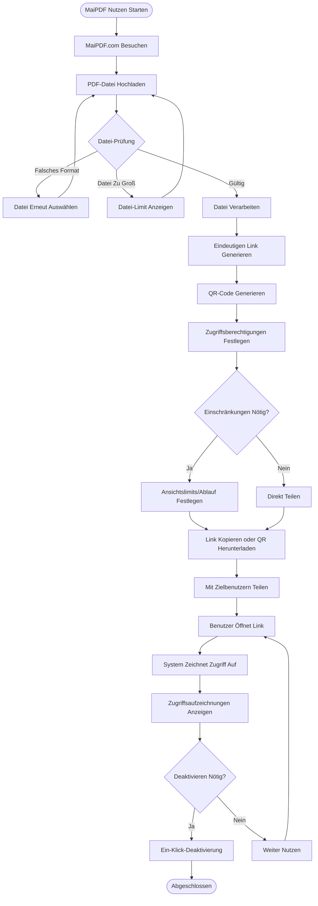

### Drei Schritte zum Starten

**Schritt 1: PDF Hochladen**
- MaiPDF.com besuchen
- PDF-Datei per Drag & Drop oder Auswahl hochladen
- Unterstützt bis zu 100MB

**Schritt 2: Link Generieren**
- Automatische Generierung von Sharing-Link
- Automatische Generierung von QR-Code
- Zugriffsberechtigungen festlegen

**Schritt 3: Teilen und Nutzen**
- Link kopieren zum Teilen
- Oder QR-Code herunterladen zum Teilen
- Zugriffsaufzeichnungen in Echtzeit anzeigen

## Kernfunktionen Erklärt

### Funktion 1: Schnelle Link-Generierung

**Merkmale:**
- ⚡ Sofortige Generierung (normalerweise innerhalb von 10 Sekunden)
- 🔗 Automatische Generierung eindeutiger Links
- 📱 Automatische QR-Code-Generierung
- 💾 Unterstützt bis zu 100MB Dateien

**Flussdiagramm:**

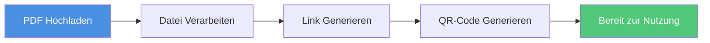

### Funktion 2: Zugriffskontrolle

**Kontrolloptionen:**

| Kontrolle | Beschreibung | Anwendungsfall |
|----------|-------------|----------------|
| Ansichtslimits | Anzahl der PDF-Öffnungen begrenzen | Verträge, vertrauliche Dokumente |
| Ablaufzeit | Automatischen Link-Ablauf festlegen | Temporäres Teilen, Veranstaltungsmaterial |
| Download-Kontrolle | PDF-Download erlauben oder verbieten | Urheberrechtsschutz, Verbreitung verhindern |
| Druck-Kontrolle | PDF-Druck erlauben oder verbieten | Kopieren verhindern, Inhalt schützen |
| Dynamisches Wasserzeichen | Wasserzeichen mit Betrachterinformationen | Leckage verfolgen, Identitätsprüfung |

**Zugriffskontrolle Flussdiagramm:**

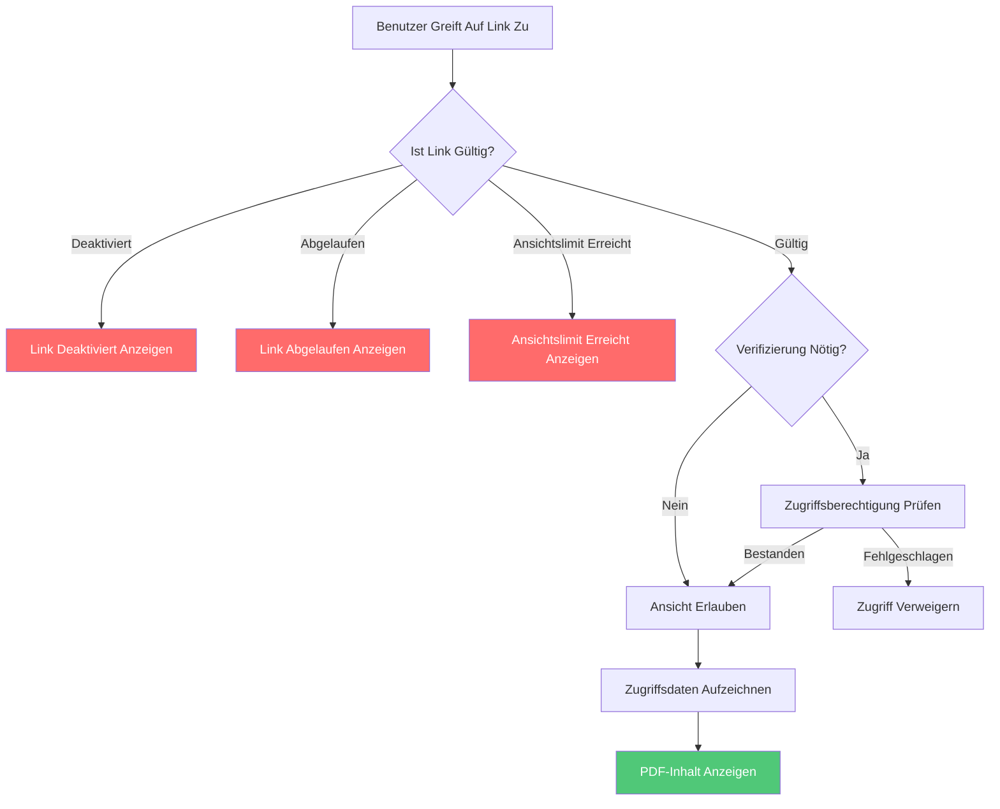

### Funktion 3: Datenverfolgung

**Verfolgungsinhalt:**
- 📊 Gesamtzahl der Öffnungen
- ⏰ Zeitpunkt jeder Öffnung
- 🌐 IP-Adresse des Besuchers
- 📱 Geräteinformationen
- 📍 Geografische Position
- 🔗 Zugriffsquelle

**Datenverfolgung Flussdiagramm:**

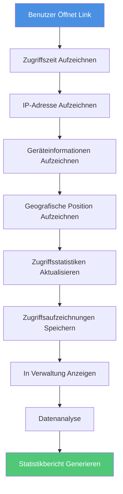

### Funktion 4: Link-Verwaltung

**Verwaltungsfunktionen:**
- 🚫 Ein-Klick-Link-Deaktivierung
- 🔄 PDF-Datei ersetzen
- 📝 Zugriffseinstellungen ändern
- 📊 Verwaltungsinterface anzeigen

**Link-Verwaltung Flussdiagramm:**

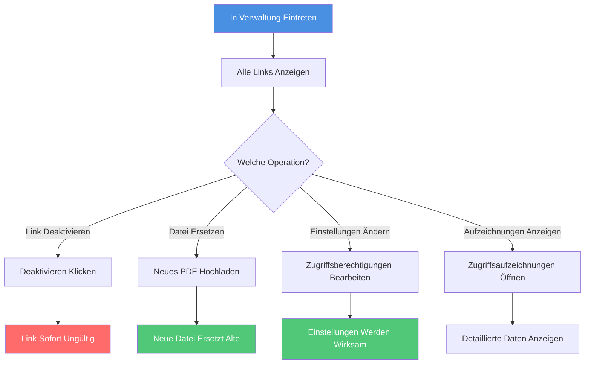

## Anwendungsszenarien

### Szenario-Kategorien

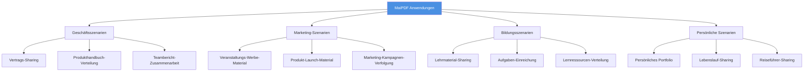

### Typisches Anwendungsszenario-Ablauf

**Szenario: Geschäftsvertrag-Sharing**

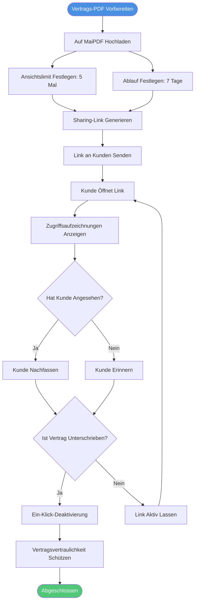

## Funktionsvergleich

### MaiPDF vs Traditionelle Methoden

| Vergleich | Traditionelles PDF-Sharing | MaiPDF |
|-----------|---------------------------|--------|
| **Registrierung** | ❌ Benötigt Konto | ✅ Keine Registrierung |
| **Link-Generierung** | ❌ Benötigt Genehmigungswartezeit | ✅ Sofortig (innerhalb von 10 Sekunden) |
| **Zugriffskontrolle** | ❌ Kann nicht kontrollieren | ✅ Vollständige Kontrolle (Anzahl, Zeit, Download) |
| **Zugriffsverfolgung** | ❌ Keine Aufzeichnungen | ✅ Vollständige Aufzeichnungen (Zeit, IP, Gerät) |
| **Link-Verwaltung** | ❌ Kann nur löschen | ✅ Ein-Klick-Deaktivierung, Datei-Ersetzung |
| **Wasserzeichen-Schutz** | ❌ Nicht unterstützt | ✅ Dynamisches Wasserzeichen (Online-Modus) |
| **Kosten** | 💰 Kann kostenpflichtig sein | ✅ Völlig kostenlos |
| **Dateigröße** | 📦 Normalerweise klein | ✅ Bis zu 100MB |

### Funktionsvorteil-Vergleich

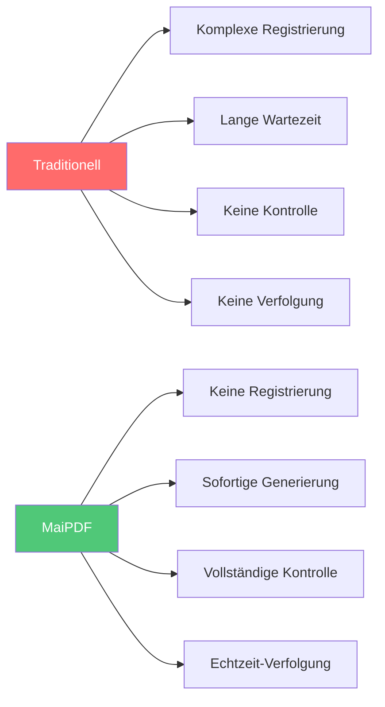

## Vorteile Zusammenfassung

### Kernvorteile

**1. Einfach und Benutzerfreundlich**
- Keine Registrierung, sofort nutzbar
- Drei Schritte: Hochladen → Generieren → Teilen
- Saubere Oberfläche, intuitive Bedienung

**2. Schnell und Effizient**
- Sofortige Link-Generierung (normalerweise innerhalb von 10 Sekunden)
- Automatische QR-Code-Generierung
- Unterstützt große Dateien (bis zu 100MB)

**3. Sicher und Kontrollierbar**
- Vollständige Zugriffskontrolle
- Echtzeit-Zugriffsverfolgung
- Ein-Klick-Link-Deaktivierung
- Dynamischer Wasserzeichen-Schutz (Online-Modus)

**4. Völlig Kostenlos**
- Alle Grundfunktionen kostenlos
- Keine versteckten Gebühren
- Keine Nutzungsbeschränkungen

### Vorteile-Diagramm

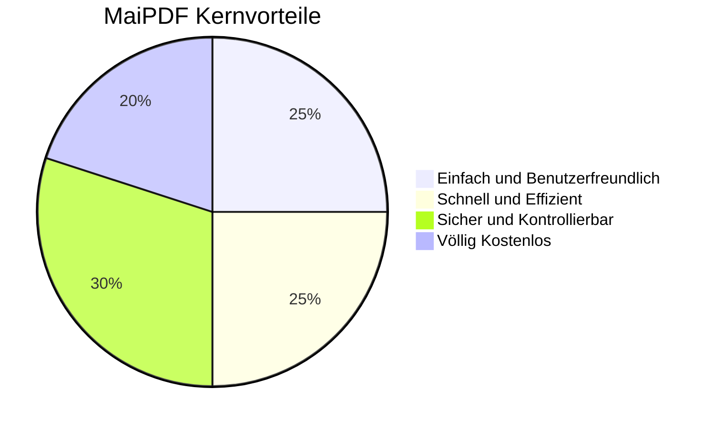

## Schnellstart

### Drei Schritte zum Starten

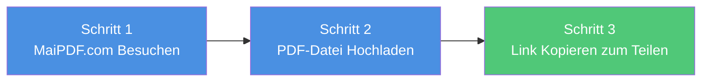

**Jetzt Starten:**
1. [MaiPDF.com](https://maipdf.com) besuchen
2. PDF-Datei per Drag & Drop in Upload-Bereich ziehen
3. Generierten Link kopieren oder QR-Code herunterladen
4. Mit Zielbenutzern teilen

## Zusammenfassung

MaiPDF ist eine **professionelle, einfache, sichere und kostenlose** PDF-Sharing-Plattform, die Dokument-Sharing durch diese Kernfunktionen einfach macht:

- ⚡ **Schnelle Generierung** - Sofortige Link-Generierung, kein Warten
- 🔒 **Sichere Kontrolle** - Vollständige Zugriffskontrolle und Berechtigungsverwaltung
- 📊 **Datenverfolgung** - Echtzeit-Zugriffsaufzeichnungen und Analysen
- 🎯 **Einfach zu Nutzen** - Keine Registrierung, drei Schritte zum Teilen
- 💰 **Völlig Kostenlos** - Alle Grundfunktionen kostenlos nutzbar

Ob Sie Geschäftsprofi, Marketier, Pädagoge oder Privatnutzer sind, MaiPDF bietet professionelle PDF-Sharing-Lösungen.

**Jetzt Nutzen:** [MaiPDF.com Besuchen](https://maipdf.com)

