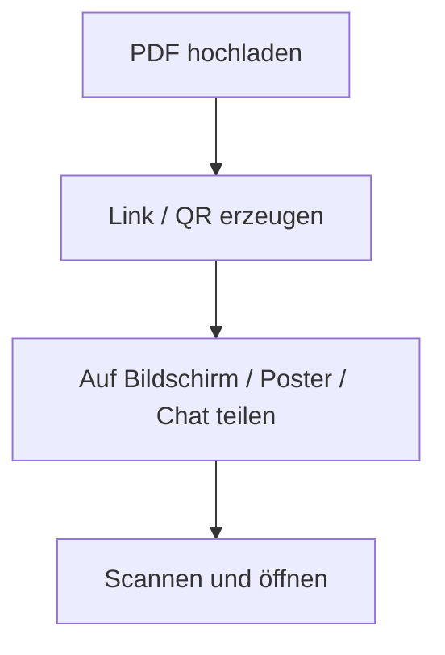

# 📲 PDF-Freigabe mit QR-Codes leicht gemacht

  
Stellen Sie sich vor: Sie stehen vor einem Publikum und möchten Ihr PDF sofort teilen. Keine E-Mail-Listen, keine Anmeldungen, keine umständlichen Dateiübertragungen.

  
Nur ein QR-Code. Scannen, anzeigen, fertig.

  
Willkommen in der Zukunft der PDF-Freigabe—schnell, nahtlos und ohne E-Mail.

## Warum PDFs teilen

- Schnell senden (Angebote, Handouts, Folien)
- Keine großen Anhänge oder erneutes Versenden
- Ein Tipp genügt zum Öffnen

## Warum QR‑Codes

- Kein Kopieren/Einfügen
- Ideal vor Ort (Poster, Messestand, Klassenzimmer)
- Geringste Reibung für Empfänger

## Wie MaiPDF hilft

MaiPDF macht „Teilen → Scannen → Öffnen“ ganz kurz:

## 🧠 Warum auf E-Mail verzichten?

E-Mail ist großartig, aber nicht immer praktisch:

- **Langsam:** Nicht ideal für Live-Veranstaltungen.
- **Datenschutzbedenken:** Legt E-Mail-Adressen der Empfänger offen.
- **Unzuverlässig:** Nachrichten können verloren gehen oder gefiltert werden.
- **Verbindungsprobleme:** Erfordert, dass alle online sind.

Im Gegensatz dazu sind QR-Codes:

- **Sofort:** Teilen in Sekunden.
- **Universell:** Funktioniert auf jedem Gerät mit Kamera.
- **Mühelos:** Einfach zu scannen von Bildschirmen oder gedruckten Materialien.

Perfekt für Konferenzen, Klassenzimmer, Messen und mehr.

## 🔄 Wie die QR-basierte PDF-Freigabe funktioniert

So können Sie PDFs mit QR-Codes teilen:

1. **Laden Sie Ihr PDF hoch**
   - Nutzen Sie einen sicheren Cloud-Dienst zum Hosten Ihrer Datei.

2. **Generieren Sie einen Link**
   - Erstellen Sie einen Nur-Ansicht-Link für Ihr PDF.

3. **Erstellen Sie einen QR-Code**
   - Verwenden Sie einen QR-Code-Generator, um auf Ihre Datei zu verlinken.

4. **Teilen Sie den QR-Code**
   - Zeigen Sie ihn auf einem Bildschirm an oder drucken Sie ihn zum einfachen Scannen aus.

Ihr Publikum scannt den Code und greift sofort auf das PDF zu—keine Downloads, keine Anmeldungen.

## 🧪 Reale Szenarien

### 🎤 Konferenzen und Workshops
Teilen Sie Folien oder Handouts in Echtzeit mit den Teilnehmern.

### 🏫 Klassenzimmer
Bieten Sie Schülern sofortigen Zugriff auf Studienmaterialien.

### 🛍️ Messen
Verteilen Sie Broschüren oder Produktkataloge ohne physische Kopien.

## 🛠 Tools wie MaiPDF machen es einfach

Plattformen wie MaiPDF vereinfachen den Prozess:

- **PDFs hochladen:** Hosten Sie Ihre Dateien sicher.
- **Zugriffsregeln festlegen:** Kontrollieren Sie, wie oft die Datei geöffnet werden kann.
- **QR-Codes generieren:** Verlinken Sie direkt zu Ihrem PDF.
- **Aufrufe verfolgen:** Überwachen Sie den Zugriff mit Zeitstempeln und IP-Adressen.

Sie können sogar Links deaktivieren oder Zugriffseinstellungen später aktualisieren.

## 🔒 Datenschutz und Kontrolle

QR-Code-Freigabe bietet:

- **Anonymität:** Keine Erfassung persönlicher Daten.
- **Zeitlich begrenzter Zugriff:** Deaktivieren Sie den Link, wenn er nicht mehr benötigt wird.
- **Nachverfolgung:** Überwachen Sie, wer wann auf Ihre Datei zugegriffen hat.

## ✅ Wichtige Erkenntnisse

- QR-Codes vereinfachen die PDF-Freigabe für Live-Veranstaltungen.
- Keine E-Mails, keine Downloads, kein Aufwand.
- Perfekt für Präsentationen, Klassenzimmer und mehr.

Nutzen Sie die Zukunft der Dokumentenfreigabe. Probieren Sie noch heute die QR-Code-basierte PDF-Freigabe aus!