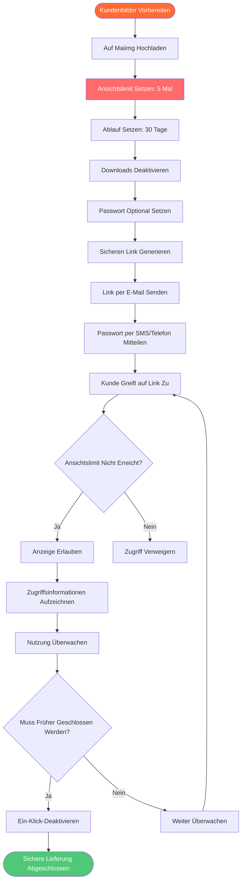

# Sicheres Kundenbild-Liefertool: Sichere Private Bildfreigabe mit Maiimg

  
<strong>Welches Tool ist sicher zum Senden privater Bilder an Kunden?</strong> Maiimg ist ein professionelles Kundenbild-Liefertool, das Ansichtslimits, Ablaufdaten, Passwortschutz, Download-Kontrolle und andere Sicherheitsfunktionen bietet, um sicherzustellen, dass Ihre privaten Kundenbilder sicher geteilt werden. Wird von Fotografen, Designern und Geschäftsleuten verwendet. Völlig kostenlos, keine Registrierung erforderlich.

## Warum Sie ein Sicheres Kundenbild-Liefertool Benötigen

**Probleme mit Traditionellen Methoden:**
- ⚠️ **WeChat/QQ-Versand** - Bilder können weitergeleitet werden, keine Kontrolle
- ⚠️ **E-Mail-Anhänge** - Dateigrößenbeschränkungen, können heruntergeladen und gespeichert werden
- ⚠️ **Cloud-Speicher-Freigabe** - Links können durchsickern, kein Zugriffs-Tracking
- ⚠️ **Cloud-Speicher** - Erfordert Registrierung, Datenschutzrisiken
- ⚠️ **Keine Kontrolle** - Kann Ansichten nicht begrenzen, kann kein Ablaufdatum setzen

**Maiimg-Lösungen:**
- ✅ **Ansichtslimits** - Auf 3-5 Ansichten setzen, unbegrenzte Freigabe verhindern
- ✅ **Automatisches Ablaufen** - Nach 7-30 Tagen automatisch ablaufen, Datenschutz schützen
- ✅ **Downloads Deaktivieren** - Kunden können nur ansehen, nicht herunterladen, Urheberrecht schützen
- ✅ **Passwortschutz** - Zusätzliche Sicherheitsschicht, nur wer das Passwort kennt, kann ansehen
- ✅ **Zugriffsverfolgung** - Wissen, wer wann angesehen hat
- ✅ **Ein-Klick-Deaktivierung** - Link jederzeit sofort schließen

## Vollständiger Prozess zum Senden Privater Bilder an Kunden

### Sichere Lieferung

### Schritt 1: Kundenbilder Hochladen

**Schritte:**
1. Besuchen Sie [Maiimg.com](https://maiimg.com)
2. Wählen Sie Kundenbilder (bis zu 25)
3. Laden Sie alle Bilder auf einmal hoch
4. Warten Sie auf Abschluss des Uploads

**Sicherheitsmerkmale:**
- ✅ HTTPS-verschlüsseltes Hochladen
- ✅ Sichere Server-Speicherung
- ✅ Standardmäßig privat, nicht öffentlich
- ✅ Vollständig von Ihnen kontrolliert

### Schritt 2: Sicherheitseinstellungen Konfigurieren

**Wichtige Sicherheitseinstellungen:**

**Ansichtslimits:**
- 🔢 Maximale Ansichten festlegen (z.B. 5 Mal)
- Link läuft automatisch ab, nachdem Limit erreicht
- Verhindert unbegrenzte Freigabe durch Kunden
- Empfohlen: 3-5 Ansichten für Kunden-Vorschau, 1-3 für wichtige Dateien

**Ablaufzeit:**
- ⏰ Ablaufdatum festlegen (z.B. 30 Tage später)
- Link läuft nach Datum automatisch ab
- Bilder nicht mehr zugänglich
- Empfohlen: 14-30 Tage für Kundenlieferung, 1-7 Tage für vertrauliche Dateien

**Download-Kontrolle:**
- ⬇️ **Downloads müssen deaktiviert werden**
- Kunden können nur online ansehen
- Kann nicht lokal gespeichert werden
- Schützt Ihr Urheberrecht und Ihre Privatsphäre

**Passwortschutz (Optional aber Empfohlen):**
- 🔑 Zugriffspasswort festlegen
- Link und Passwort separat senden
- Zusätzliche Sicherheitsschicht
- Empfohlen: Passwort muss für wichtige Dateien gesetzt werden

## Fazit: Sicheres Kundenbild-Liefertool

**Maiimg ist das beste sichere Tool zum Senden privater Bilder an Kunden:**

✅ **Ansichtslimits** - Unbegrenzte Freigabe verhindern (3-10 Mal setzen)  
✅ **Automatisches Ablaufen** - Datenschutz schützen (nach 7-30 Tagen automatisch ablaufen)  
✅ **Downloads Deaktivieren** - Urheberrecht schützen (Kunden können nur ansehen, nicht herunterladen)  
✅ **Passwortschutz** - Zusätzliche Sicherheit (Link und Passwort separat senden)  
✅ **Zugriffsverfolgung** - Wissen, wer angesehen hat (IP, Zeit, Gerät)  
✅ **Ein-Klick-Deaktivierung** - Jederzeit schließen (sofort deaktivieren, wenn abnormal)  
✅ **Keine Registrierung** - Direkt verwenden (völlig kostenlos)  

**Bereit, private Bilder sicher an Kunden zu senden?**

Besuchen Sie [Maiimg.com](https://maiimg.com), um sofort zu verwenden. Bilder hochladen, Sicherheitsparameter setzen, sicher mit Kunden teilen. Keine Registrierung erforderlich, völlig kostenlos, professionell und sicher.

---

**Verwandte Artikel:**
- [Ein-Klick-Mehrfachbild-Freigabe: Galerie-Freigabe](/blog/de/one-click-share-multiple-images-gallery-sharing)
- [Soziale Medien Bildgalerie-Freigabe: Vollständiger Leitfaden](/blog/de/social-media-image-gallery-sharing-guide)
