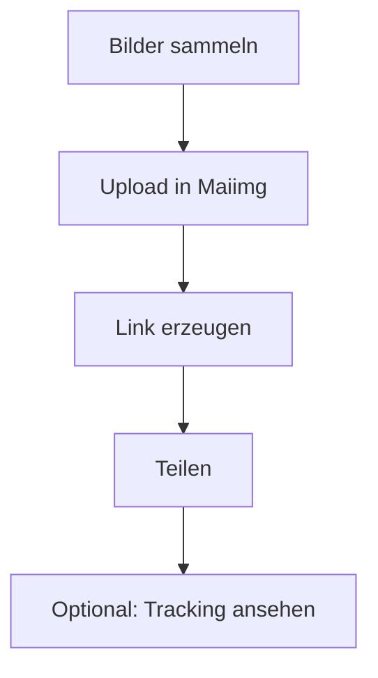

Bei Social-Media-Projekten geht es selten um ein einzelnes Bild. Meist sind es **viele Assets** (Varianten, Formate, Screenshots) – und genau da eskalieren Anhänge in E‑Mails oder Chats.

**Maiimg ist für das Teilen von Bildern** gedacht (nicht PDF).

## Kurzer Ablauf

1. **Bilder hochladen**
2. **Link erzeugen**
3. **Link an Team/Kunden teilen**
4. **Optional: Ergebnisse nachsehen**

## Upload & Link

## Optional: Überblick behalten

