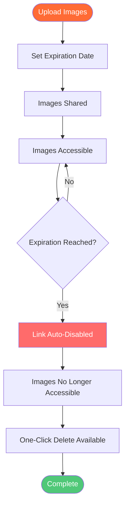

# Auto Delete Images: Image Expiration and Auto-Delete Guide with Maiimg

  
Need to <strong>auto delete images</strong> after a certain time? Maiimg allows you to set image expiration dates, automatically disable links after time periods, and control when images are removed. This complete guide shows you how to use auto-delete and expiration features for temporary image hosting.

## What is Auto Delete Images?

**Auto delete images** is a feature that automatically removes or disables image links after a specified time period. This is useful for temporary image sharing, privacy protection, and managing image storage.

**Benefits of Auto Delete:**
- ✅ **Privacy Protection** - Images removed automatically
- ✅ **Storage Management** - No manual cleanup needed
- ✅ **Temporary Sharing** - Perfect for time-limited content
- ✅ **Security** - Automatic link deactivation
- ✅ **Compliance** - Meet data retention requirements

## How Auto Delete Works

### Expiration Process Flow

### Step 1: Upload Images

**Upload Process:**
1. Visit [Maiimg.com](https://maiimg.com)
2. Upload images (up to 25 at once)
3. Wait for upload completion
4. Configure expiration settings

**Supported Formats:**
- 📸 PNG
- 🖼️ JPG/JPEG
- 🎭 GIF
- 🌐 WebP

### Step 2: Set Expiration Date

**Expiration Options:**
- ⏰ **Specific Date** - Set exact expiration date
- ⏱️ **Time Period** - Set days/hours until expiration
- 🔢 **View Limits** - Expire after X views
- 🔄 **Manual Control** - One-click disable anytime

**How to Set:**
1. Open settings after upload
2. Find "Expiration" option
3. Set expiration date/time
4. Save settings

### Step 3: Automatic Deletion

**What Happens:**
- Link becomes inactive after expiration
- Images no longer accessible
- Access attempts show expiration message
- One-click permanent delete available

## Expiration Options

### 1. Date-Based Expiration

**Use Case:** Images expire on specific date

**Setup:**
- Set exact date and time
- Auto-disable after date
- Perfect for events
- Time-limited sharing

**Example:**
- Event photos expire after event ends
- Temporary promotions expire on deadline
- Time-sensitive content expires automatically

### 2. Time Period Expiration

**Use Case:** Images expire after X days/hours

**Options:**
- Hours (1-24 hours)
- Days (1-30 days)
- Weeks (1-4 weeks)
- Months (1-6 months)

**Example:**
- Share photos for 7 days
- Temporary access for 24 hours
- Limited-time offers

### 3. View Limit Expiration

**Use Case:** Expire after X views

**Setup:**
- Set maximum views (e.g., 100)
- Link expires after limit
- Control distribution
- Prevent unlimited access

**Example:**
- Event photos: 200 views
- Product previews: 50 views
- Limited sharing: 10 views

### 4. Manual Deletion

**Use Case:** Delete immediately when needed

**Features:**
- One-click disable
- Instant link deactivation
- Permanent deletion option
- Full control

## Comparison: Auto Delete Options

### Maiimg Auto Delete

**Advantages:**
- ✅ **Flexible Expiration** - Date, time, or view limits
- ✅ **Automatic** - No manual intervention
- ✅ **One-Click Delete** - Instant removal
- ✅ **Access Control** - Combined with other controls
- ✅ **Tracking** - See when images expire
- ✅ **Free** - No cost

**Features:**
- Date-based expiration
- Time period expiration
- View limit expiration
- Manual deletion
- Combined controls

### Traditional Auto Delete Services

**Limitations:**
- ❌ Limited options (often only time-based)
- ❌ Fixed periods (5 min to 6 months)
- ❌ No view limit expiration
- ❌ Less flexible
- ❌ May require account
- ❌ May have fees

## Use Cases for Auto Delete

### 1. Temporary Image Sharing

**Scenario:** Share images for limited time

**Setup:**
- Upload images
- Set 7-day expiration
- Share with recipients
- Auto-delete after week

**Benefits:**
- Automatic cleanup
- Privacy protection
- No manual deletion
- Time-limited access

### 2. Event Photo Distribution

**Scenario:** Share event photos temporarily

**Setup:**
- Upload event photos
- Set expiration after event
- Share with attendees
- Auto-delete when done

**Benefits:**
- Temporary access
- Automatic removal
- Privacy protection
- Event-specific sharing

### 3. Product Previews

**Scenario:** Share product images temporarily

**Setup:**
- Upload preview images
- Set short expiration (24 hours)
- Share with select group
- Auto-delete after preview

**Benefits:**
- Time-limited access
- Automatic removal
- Privacy protection
- Controlled distribution

### 4. Privacy-Conscious Sharing

**Scenario:** Share images with auto-delete

**Setup:**
- Upload private images
- Set expiration date
- Share securely
- Auto-delete automatically

**Benefits:**
- Privacy protection
- Automatic cleanup
- No permanent storage
- Secure sharing

## Advanced Auto Delete Features

### Combined Controls

**Multiple Expiration Methods:**
- Date + View Limits
- Time Period + View Limits
- All controls combined

**Example:**
- Expire after 7 days OR 100 views (whichever comes first)
- Maximum security and control
- Flexible expiration rules

### Tracking Expiration

**What You Can Track:**
- 📊 Views before expiration
- ⏰ Time until expiration
- 📈 Access patterns
- 🔔 Expiration notifications

**Benefits:**
- Monitor usage
- Track engagement
- Plan expiration
- Optimize timing

### One-Click Delete

**Manual Deletion:**
- Disable link instantly
- Permanent deletion option
- Immediate removal
- Full control

**Use Cases:**
- Delete immediately when needed
- Remove after sharing
- Privacy protection
- Instant control

## Best Practices

### 1. Set Appropriate Expiration

**For Temporary Sharing:**
- Short expiration (1-7 days)
- View limits
- Automatic cleanup

**For Long-Term Sharing:**
- Longer expiration (30+ days)
- Or no expiration
- Manual control

### 2. Combine with View Limits

**Best Practice:**
- Set both expiration and view limits
- Maximum control
- Flexible expiration
- Better security

### 3. Monitor Before Expiration

**Tips:**
- Check access records
- Review view counts
- Adjust if needed
- Plan expiration

### 4. Use Manual Delete When Needed

**Situations:**
- Immediate removal required
- Privacy concerns
- Content changes
- Instant control

## Common Questions

### How Do I Set Auto Delete?

**Simple Process:**
1. Upload images
2. Open settings
3. Set expiration date/time
4. Save settings

### Can I Change Expiration Date?

**Yes!** Full control:
- Modify expiration anytime
- Extend or shorten
- Remove expiration
- Full flexibility

### What Happens After Expiration?

**Automatic Process:**
- Link becomes inactive
- Images no longer accessible
- Access attempts show expiration message
- One-click delete available

### Can I Delete Before Expiration?

**Yes!** Manual control:
- One-click disable
- Permanent deletion
- Instant removal
- Full control

### Is Auto Delete Free?

**Yes!** Completely free:
- No registration required
- No hidden fees
- All features free
- Unlimited use

## Comparison: Auto Delete vs Manual Delete

### Auto Delete

**Advantages:**
- ✅ Automatic
- ✅ No manual work
- ✅ Scheduled removal
- ✅ Time-based control

**Use Cases:**
- Temporary sharing
- Event photos
- Time-limited content
- Privacy protection

### Manual Delete

**Advantages:**
- ✅ Immediate control
- ✅ On-demand removal
- ✅ Flexible timing
- ✅ Full control

**Use Cases:**
- Immediate removal
- Content changes
- Privacy concerns
- Instant control

## Conclusion: Auto Delete Images

Maiimg provides the best **auto delete images** features with:
- ✅ Flexible expiration options
- ✅ Date-based expiration
- ✅ Time period expiration
- ✅ View limit expiration
- ✅ Manual deletion
- ✅ Combined controls
- ✅ Real-time tracking
- ✅ Completely free
- ✅ No registration

**Ready to use auto delete?**

Visit [Maiimg.com](https://maiimg.com) to upload images and set expiration dates. Automatic deletion, privacy protection, and full control. No registration required.

  <h2 class="solution-title">🚀 Ready to Start?</h2>
  
Experience the power of <strong>Maiimg</strong> - Upload, share, and track your images with complete control!

  <a href="https://maiimg.com" class="solution-button">Try Maiimg Now</a>

---

**Related Articles:**
- [Free Image Hosting: Complete Guide](/blog/en/free-image-hosting-maiimg-complete-guide)
- [Image Upload Without Account: Complete Guide](/blog/en/image-upload-without-account-maiimg-guide)
- [Image Embed Code Generator: How to Embed Images](/blog/en/image-embed-code-generator-maiimg-guide)
