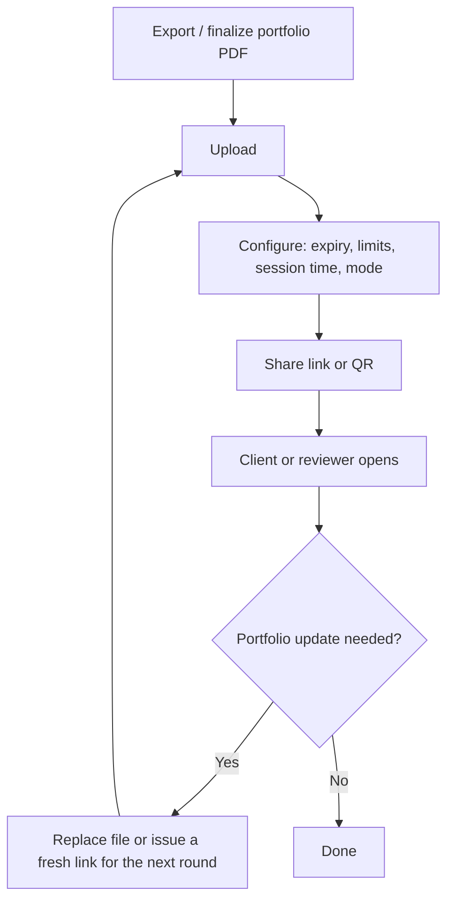

Art directors and clients rarely want another heavy email attachment. A short link to your portfolio PDF keeps the first impression clean: one tap opens your work on a phone or laptop, and you keep control of **who** can open it, **for how long**, and **how** it displays.

[MaiPDF](https://maipdf.com/pdf/maipdf2026.html) turns that PDF into a link in three steps: **Upload**, **Configure**, **Share**. Set **link expiration**, **access limits**, **reading duration per session**, optional **email verification** or **Telegram read alerts**, and a viewing mode (**SecureView**, **FenceView**, or **Unrestricted**). Add **dynamic watermark** if you need the viewer’s context visible on screen.

## Upload your portfolio PDF

Use the same polished PDF you would send—but deliver it as a link instead of an attachment.

## Configure how the link behaves

Tighten limits for competitive pitches or NDA-heavy work; stay lighter for public reels or open calls.

### Flow: portfolio PDF to the viewer

## Make the share feel intentional

A link or QR card reads more “portfolio” than a raw file name in email—especially when you follow up after interviews or fairs.

For public reels, **Unrestricted** or modest limits are often enough. For **client-specific** or **NDA** work, **SecureView** or **FenceView** plus **dynamic watermark** reduces casual copying while people still review on screen.

**Large access limits:** If **Access limit** is higher than **10,000**, the system may treat the link as effectively open. Keep caps realistic and rotate the link when a round of reviews is done.

Your site can still have a static “work” page; the PDF link is what you refresh when you add pieces or swap a reel—no re-sending huge attachments.

---

**Related:** [Transform PDFs into shareable links in 3 steps](/en/transform-pdfs-shareable-links-3-steps) · [Instant PDF link generation](/en/instant-pdf-link-generation) · [Restrict number of views for a shared PDF](/en/restrict-number-of-views-for-shared-pdf)
