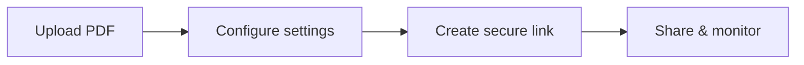

# PDF Sharing Settings Explained

  
This page explains the <strong>actual settings you see on the upload screen</strong>—what they do and when to use them.

## The 5 settings you can configure

1. **Access Limit**  
   Limit total opens to prevent unlimited sharing.

2. **Each Session**  
   Limit reading time per session (useful for sensitive files).

3. **Protection Type**  
   - DynamoWatermark: dynamic watermark  
   - SecureView: view-only  
   - FenceView: screenshot deterrent (not a full block)  
   - Unrestricted: no restrictions

4. **Email Verification**  
   Require the viewer to verify email before access.

5. **Read Notification (optional)**  
   Get an email when the document is opened.

## Quick flow

