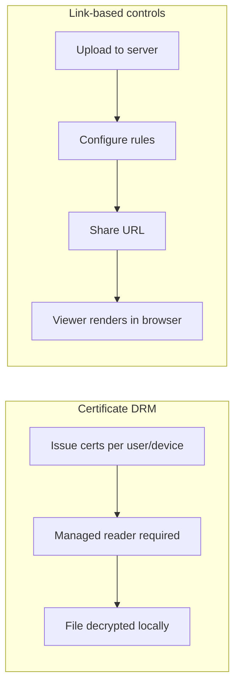

"DRM digital certificate" covers at least four different things depending on who is selling: PKI certificates, device-bound licenses, signed PDF containers, or managed reader apps. Know which problem you are solving before you buy.

## Two fundamentally different models

### Certificate-based DRM

Document encrypted; opens only with a certificate tied to user or device.

**Strengths:** identity binding, offline after authorize, strict compliance narratives.

**Costs:** cert lifecycle, managed reader on every device, IT onboarding, typical $5–20/user/month enterprise pricing.

### Link-based access controls

Document on server; browser viewer; rules enforced server-side.

**Strengths:** zero install, minutes to set up, instant revoke.

**Costs:** needs internet, cannot prevent OS screenshots, not for air-gapped file handoff.

## Decision matrix

| | Certificate DRM | Link-based (maipdf.com) |
|---|---|---|
| Setup | Days; app install | Minutes; browser |
| Offline viewing | After authorize | No |
| Revoke | Infra-dependent | Disable link |
| Screenshot | App-dependent | Watermark only |
| Cost | High per seat | Free / low |

## When certificate DRM fits

All of these are true:

1. Compliance mandates device-bound access
2. Recipients will install managed software
3. Offline after authorize is required
4. IT can run cert lifecycle

## When link-based is enough

- Cap opens on a forwarded link
- Auto-expire old URLs
- Verify recipient identity
- Watermark + protected viewer for leak tracing

## MaiPDF in 2026 — three tiers (not one product)

| Tier | What | Screenshot |
|---|---|---|
| Online link | [maipdf.com](https://www.maipdf.com) | No |
| Web file pack | [pack.html](https://drm.maipdf.com/pack.html) — PDF→HTML→ZIP, browser | No |
| Native `.maipdf` | MaiPDF Secure **desktop app** — separate pipeline | Yes (OS-level) |

Web pack and `.maipdf` share a license server but are **not the same security class**. Do not pick web HTML pack expecting native DRM results.

→ [Prevent screenshot](/blog/en/prevent-screenshot-pdf-drm-native-app) · [Web pack guide](/blog/en/how-to-create-offline-pdf-package-complete-guide)
